## php基本语法形式

### 1.php的标记符

> 有以下形式：

- 形式1（推荐）：
```PHP
<?php
这里要写符合php语法的语句
?>
```

- 形式2：
```
<script  language=”php”>
这里要写符合php语法的语句
</script>
```

- 形式3（不推荐）：
```
<?
这里要写符合php语法的语句
?>
```
它依赖于php.ini中的一个设置项：<br>
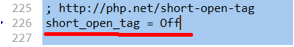

    将其改为On，则上述形式就可以用了<br>
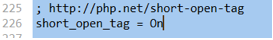

> php的结束标记（比如 ?>  ），在如下情况可以省略：
php的语句之后，再没有了html代码部分


### 2.php的区分大小写特性

- 变量区分大小写；

- 常量通常默认也区分,如:$_POST[],$_GET[]，但可以人为设定为不区分（但这种做法不推荐）

- 其他场合的关键字都不区分，比如函数名，系统关键字（for，if，return....）


### 3.一条语句使用一个分号结束

- 在一个php的语句标记中的最后一个分号可省略
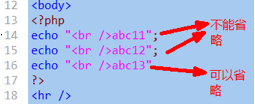

- php结束标记省略则不能省略最后一个分号
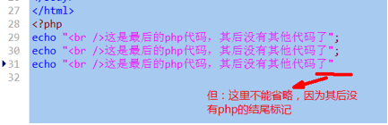


### 4.php的注释

- 单行注释：
        形式1： //注释内容
        形式2： #注释内容

- 多行注释：
            /*  注释内容，可以多行 */

- 2个多行注释的技巧：<br>
有时候，我们因为测试或别的原因，需要将一大段代码多次进行“注释”或“反注释”；，则此时，可以使用如下2个技巧来方便实现：<br>

技巧1：<br>
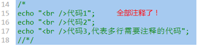

反注释：<br>
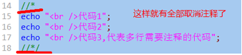

技巧2：<br>
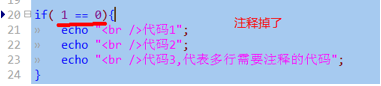

反注释：<br>
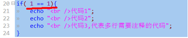


## 变量

### 1.基本理解

变量可以理解为只是一个代表一定存储空间及其中的数据的一个“标识符”——也就是一个名字。
引用关系/指代关系

椭圆: 数据空间：
$v1  =  1;        这一行代码，图示如下：


这表明，`使用该变量，就是在使用该数据空间的数据值！`比如：
```php
echo  $v1;                    ///输出的是数据1
$v2 = $v1 + 3;               //此时，其实进行的是1+3的计算！
```

- 使用形式：<br>
    每个变量名前面必须以$开头。

- 定义形式：<br>
    php中，不支持“单纯定义”一个变量，而是，在第一次一个变量赋值的时候，就算是定义变量！


###2.变量的基本操作

只有4个操作：
####赋值：

等号（=）的左边放变量名，右边放“数据”，就是赋值；
$v1 = 1;

####取值：

任何需要一个数据的语句中使用一个变量，此时就是指从该变量取得该变量的值——取值；<br>
概括来说，大约有如下情形：
```php
echo  $v1;             //取出v1的值并输出
$v2  =  $v1;           //取出v1的值并给其他变量赋值；
$v2  =  $v1 + 3;       //取出v1的值并与3进行运算！
$v2  =   round( $v1 ); //取出v1的值并并使用函数round()对其进行四舍五入运算
```
####判断isset(变量名)：

作用：判断该变量是否存在，或该变量是否有数据值！存在或有数据值，就是true，否则就是false
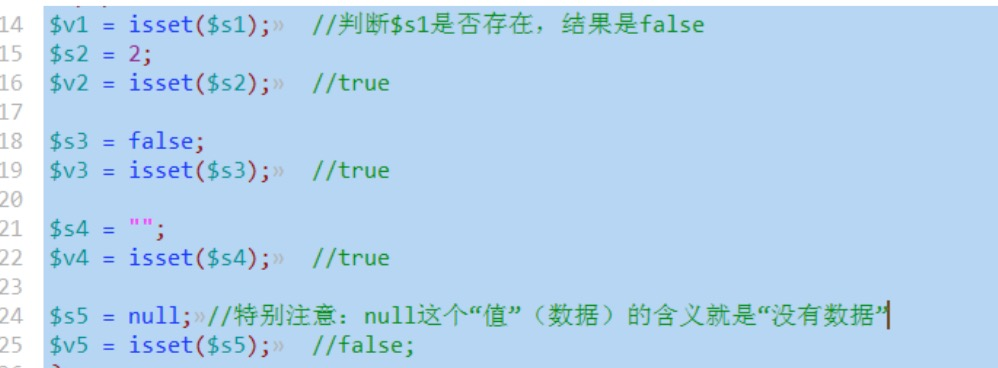


####删除unset(变量名)：

含义：删除一个变量，并不是指将该变量从程序中删掉，而是，“断开”该变量名跟该变量原有的数据值之间的“引用关系”（联系）！，此时，会有这样的结果：
- 1，该变量名已经不指向（引用）任何数据了，则此时其isset()判断的结果就是false

- 2，该数据（可能）没有任何变量指向它了，就成为“无法使用的数据”——通常就被自动回收了
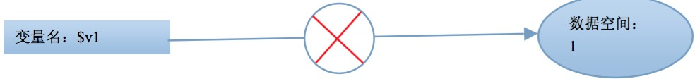
```php
$v1 = 1;
unset($v1);
$s1 = isset($v1);             //false
```

###3.变量命名规则

####基本规则——保证程序的正确性

- 以字母或下划线开头
- 后跟任意数量（含０个）的字母，数字和下划线

####行业规则——保证程序的可读性

有3种常见的命名法：
- 1，骆驼命名法：首单词小写，其后每个单词首字母大写
<br>举例：
$name &nbsp;&nbsp;$myName&nbsp;&nbsp;$myFatherName

- 2，帕斯卡命名法：每个单词首字母大写
<br>举例：$Name&nbsp;&nbsp;$MyName&nbsp;&nbsp;$MyFatherName

- 3，下划线分割法：每个单词小写，并且之间用下划线分开
<br>举例：$name&nbsp;&nbsp;$my_name&nbsp;&nbsp;$my_father_name


###4.变量的传值方式

1，变量的传值方式，是指“一个变量，传给另一个变量”的内部细节形式——单对单；

2，变量的传值方式，只有2中：值传递，引用传递；

####值传递
```php
$v1 = 1;
$v2 = $v1; //这就是值传递
```
简单理解：将$v1的值取出来（注意：$v1中的值还在），然后再用该值给$v2赋值。
椭圆: 数据空间：1
引用关系/指代关系

图示理解：
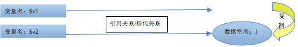

可见，值传递，就是变量v1的值进行了复制，然后在给另一个变量v2赋值。<br>
注意：
- 这两个变量此时是值相等的；
- 这两个变量又是互相独立的——互不影响；
即$v1 = 10;         则echo  $v2 ；//输出1


####引用传递

`php中，只有一种语法形式可以实现变量的引用传值方式：&符号。`

举例如下：
```php
$m1  =  1;
$m2  =  & $m1;                  //引用传值方式
```
简单理解：       将变量$m1跟其数据值之间的“引用关系”，复制一份，再给予变量$m2，即，此时，变量$m2也同样具有跟原来数据的一个“引用关系”（指向关系）；

图示理解：
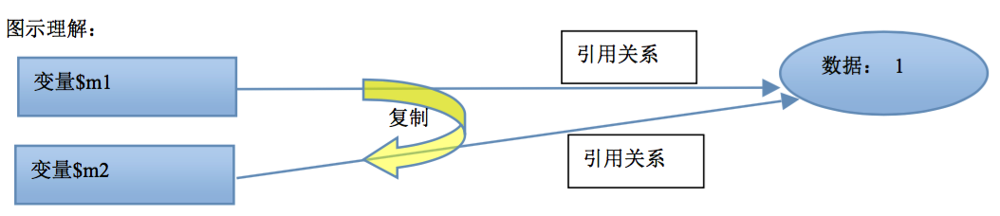


结果是：
- 此时仍然有了2个变量，但只有一个数据值（数据空间），2个变量都共同指向该数据空间。
- 对其中任何一个变量的操作，其实都是在操作数据值（空间）；

代码对比演示：
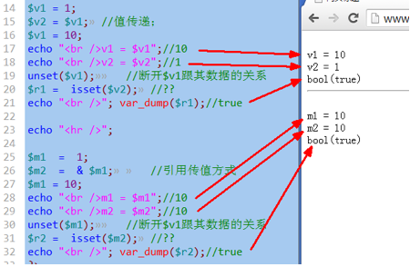


###5.可变变量
```php
$s1 = “abc”;    //这是一个变量，里面存储的是字符串”abc”
$abc  =  10;    //
echo   $$s1;    //???，输出10
```
理解：
- 在php中，一个”$”后面，总是跟着一个变量名！
- 这里，echo输出的这个变量(以第一个$为标识）的名字是：$s1, 即”abc”
- 所以，这里输出的是 $abc,  即 10
- 这种连续出现“$”的变量形式，就是所谓的“可变变量”；

###6.预定义变量

所谓预定义变量，其实指，php这个语言工具中，预先就定义好的变量；<br>
我们只是“拿来使用”。
####综述

- 主要有：$_GET, $_POST, $_REQUEST, $_SERVER, $GLOBALS，
- 均是数组
- 系统定义与维护——即我们不应该其给其赋值或销毁其值，只应该去“用其值”。
- 具有超全局作用域——哪里都可以使用。
- 不同情形下可能具有不同的值

###7.$_POST变量

含义：<br>
它代表用户通过表单以post方式（ method=”post” ）提交的时候所提交的所有数据——这个称为post数据。

基本演示：<br>
7form_post.html页面：
```html
<!--
以下表单的数据，点击提交后，会将所有表单数据提交给
8post_data.php这个页面（文件），并在该文件中去处理
其实就是指：程序进入该文件中运行。
-->
<form  action="8post_data.php" method="post">
	数据1：<input type="text"  name="data1" />
	<br />
	数据2：<input type="text"  name="data2" />
	<br />
	<input type="submit" value="提交" />
</form>
```
8post_data.php页面及输出结果为：
```php
<?php
//先一个一个获取数据：
if( !empty($_POST) ){
	$d1 = $_POST['data1'];
	$d2 = $_POST['data2'];
	//然后输出，看看：
	echo "d1 = $d1, d2 = $d2";

	echo "<hr />";
	//再来看看整个$_POST这个数组数据！
	print_r($_POST);
}
else{
	echo "非法的页面访问";
}
?>
```

- isset(变量)：
    - 判断变量是否存在，或变量是否为空（null）；如果存在，就是true，否则就是false

- empty(变量): 判断变量的“内容”是否为空的（不是null的空，而是没有内容）.
    - 基本上，是一些硬性规定，如下数据都是“空的”： 0, “”,  “0”,  false,  null
    - array()空数组也是空<br>
    - 如果一个变量内容是空的，empty()返回的结果是true，否则是false


小案例：php页面计算器：

html

```html
<!--当action为空字符串的时候，是提交到本页面！
	表单中的所有数据，要想提交，都必须有name
-->
<form  action="" method="post">
	<input type="text"  name="data1" value="<?php echo $num1; ?>" />
	<select name="yunsuanfu" >
		<option value="+" <?php if($fuhao=="+"){ echo  'selected="selected"';} ?> >+</option>
		<option value="-" <?php if($fuhao=="-"){ echo  'selected="selected"';} ?> >-</option>
		<option value="*" <?php if($fuhao=="*"){ echo  'selected="selected"';} ?> >*</option>
		<option value="/" <?php if($fuhao=="/"){ echo  'selected="selected"';} ?> >/</option>
	</select>
	<input type="text"  name="data2" value="<?php echo $num2; ?>" />
	<input type="submit" value="=" />
	<input type="text"  name="result" value="<?php echo $jieguo; ?>" />
	<br /><input type="reset" value="重置" />
</form>
```

php
```php
<?php
if(!empty($_POST)){
	$num1 = $_POST['data1'];
	$num2 = $_POST['data2'];

	$fuhao = $_POST['yunsuanfu'];
	//echo "符号为：$fuhao";

	if( $fuhao == '+' ){
		$jieguo = $num1 + $num2;
	}
	else if( $fuhao == '-' ){
		$jieguo = $num1 - $num2;
	}
	else if( $fuhao == '*' ){
		$jieguo = $num1 * $num2;
	}
	else if( $fuhao == '/' ){
		$jieguo = $num1 / $num2;
	}
}
else{
	//当第一次进来是（没有post数据），
	//设定这4个变量，保证后面的变量使用不会出错
	$jieguo = "";
	$num1 = "";
	$num2 = "";
	$fuhao = "";
}
?>
```

###8.$_GET变量

- 含义：
  - 它代表用户通过get方式（ 有5种get形式 ）提交的时候所提交的所有数据——这个称为get数据。

小提示：get，post没有翻译！

> 提交get数据有5种形式：

> 形式1：

```html
<form  action="目标文件.php" method="get">
           <input type="text"  name="data1" />
           <input type="text"  name="data2" />
           <input type="submit" value="提交" />
</form>
```
> 这种形式的get数据，跟post数据类似，数据内容由用户填写或选择而得到！

> 形式2：

```html
<a   href=”目标文件.php？data1=5&data2=cctv&age=18”>链接文字</a>
```
说明：
- 它只是一个链接而已，只是在链接文件名的后面加上“？”，然后一个一个“串接数据”；
- 数据形式为：数据项名称=数据值， 相互之间用“&”符号隔开
- 这种形式的数据也同样是“点击链接”就提交的get数据，但用户只能选择点还是不点，而不能修改数据。

> 形式3：

```script
<script>
           location.href = “目标文件.php？data1=5&data2=cctv&age=18”;
</script>
```
说明：
- 该语句可以看做是通过js技术实现的页面跳转功能，跟a标签的连接功能完全一样！
- 其中该语句，通常都是放在一个函数中，然后因为某个事件发生而去调用该函数！

> 形式4：

```script
<script>
           location.assign( “目标文件.php？data1=5&data2=cctv&age=18”);
</script>
```
说明：
- 该语句其实跟形式3完全一样功能，只是location这个对象实现页面跳转的另一个语法形式而已！

> 形式5：php的跳转语法

```php
<?php
//语法形式： header(“location: 目标网页地址”);

header(“location: 目标文件.php？data1=5&data2=cctv&age=18”);
?>
```

> 小结：

上述多种get形式提交数据，都要理解为：<br>
跳转到某个页面，并“同时”携带（提交）一定的get数据过去！

不管哪种形式的get数据提交，接收get数据，都只有一种形式，跟post类似：
```php
$v1 = $_GET[‘数据项名称’];     //取得一个get数据项的值；比如$_GET[‘data1’],  $_GET[“age”];
也可以“输出”所有get数据：
print_r($_GET);  或  var_dump($_GET);
```

###9.$_REQUEST变量

> 含义：

一句话，它是$_GET变量和$_POST变量数据的“合集”：即，它里面同时存储了这两种数据。
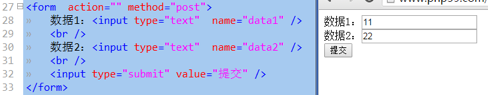

结果为：

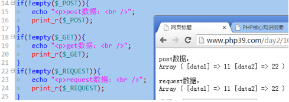

如果表单为get提交方式：

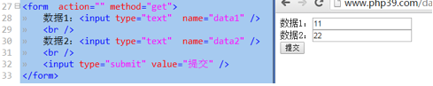

结果为：

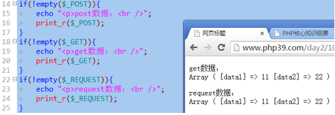

怎么能同时具有get和post数据呢？<br>
只有一个方式：
```php
<!--以下action中的？号后面的数据都会以get方式提交-->
<form   action=”目标文件.php？data1=5&data2=cctv&age=18”   method=”post”>
<!--以下表单项的数据都会以post方式提交-->
<input type=”text”  name=”n1” />
<input type=”text”  name=”n1” />
<input  type=”submit”  value=”提交” />
</form>
```

request数据取值时，跟get数据和post也完全一样！<br>
$_REQUEST[‘数据项名称’];<br>
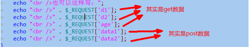

当post数据和get数据的数据项名称相同时（其实我们反对这么做），默认是post数据覆盖了get数据。<br>
不过这个状况同样可以在php.ini中设置：<br>
默认时：<br>

<br>可修改为：<br>


###10.$_SERVER变量

- 含义：
    - 它代表在一次浏览网页的过程中的浏览器端的一些信息或服务器端的一些信息。
    - 我们只是在程序中可以拿到这些信息，并用于编程所需！比如：取得用户的访问IP地址。
- 注意：
    - 这种信息，随着不同的页面，和不同的服务器，以及不同的时刻，都可能不同！
- 要求：
    - 大约有30个左右的信息，我们只要知道其中5个左右！主要有：
    - $_SERVER[‘REMOTE_ADDR’]：获取访问者的ip地址
    - $_SERVER[‘SERVER_ADDR’]：获取服务器所在的ip地址
    - $_SERVER[‘SERVER_NAME’]：获取服务器的名字，其实就是站点设置中的servername
    - $_SERVER[‘DOCUMENT_ROOT’]：获取站点的真实物理地址，其实就是站点设置中的documentroot
    - $_SERVER[‘PHP_SELF’]：获取当前网页地址（不含域名部分）
    - $_SERVER[‘SCRIPT_FILENAME’]：获取当前网页地址物理路径
    - $_SERVER[‘QUERY_STRING’]获取当前网页地址中的所有get数据（就是？号后面部分），但只是一个整体的字符串而已。

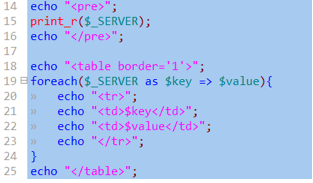

### 11.$GLOBALS变量

- 含义：
    - 它也是一个“重复性数据”，它里面存储了我们自己定义的所有“全局变量”。

举例：
```php
$v1 = 1;      //定义了一个全局变量，
//此时，就有了这样一个数据：$GLOBALS[‘v1’]，其值就是1

echo $v1 ;  //输出1
echo $GLOBALS[‘v1’]；  //输出1
```
这个变量，主要是用于在局部范围不可以使用全局变量的时候，又需要该全局变量的值，此时就可以用它来取得该全局变量的值。<br>
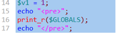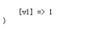<br>
再定义一个新的变量：<br>
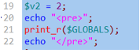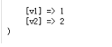

