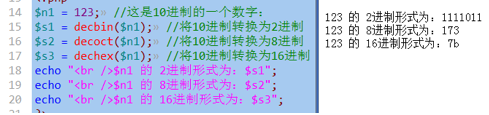
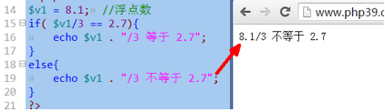
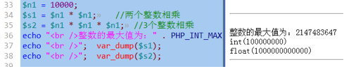
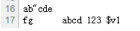
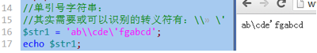
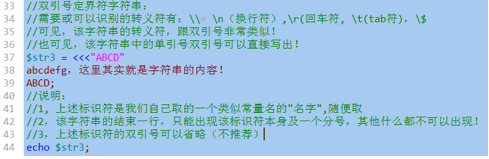

## 常量

常量是相对于变量来说的：是一个其中存储的数据不会也不应该改变的“标识符”。<br>
常量的使用，就2个方面：定义，取值。

### 常量的定义
```php
//常量定义语法1：
//define("常量名",  常量值);
define("PI",  3.14);
define("SCHOOL", "传智播客");
//定义形式2：
//const  常量名  = 常量值;
const  CC1 = 1234;
const  CC2 = 'abcd';
```

### 常量的使用——取值

也有两种形式：直接使用名字，或通过constant()函数取得其值；

```php
//使用形式1：直接使用其名字
echo "<br />常量PI的值是：" . PI;	//注意，不能写在引号中
echo "<br />常量SCHOOL为：" . SCHOOL;
$s1 = PI * 3 * 3;	//求半径为3的圆面积
//使用形式2：使用函数constant()获得一个常量的值：
//形式： constant("常量名");//注意：常量名是一个字符串
$s2 = constant("PI") * 3 * 3;
echo "<br />s1= $s1, s2 = $s2";
echo "<br />" .  SCHOOL . constant("CC1") . constant("CC2");
```

```php
//取得常量值的灵活性语法：
$i = 1;
$c1 = "CC" . $i;
echo "<br />常量 $c1 的值为：" . constant($c1);//输出1234
```

### 常量变量的区别

1. 定义形式不同：
2. 使用形式不同：常量无需$符号
3. 可变程度不同：常量的值不可以改变，常量也不可以销毁
4. 作用范围不同：常量具有超全局作用域 （函数内外都可以直接使用）
5. 可用类型不同：常量只能存储标量类型（整数，浮点数，字符串，布尔）

### 判断常量是否存在

- 使用defined()函数：
    - 如果存在：返回结果是true，
    - 如果不存在：返回结果是false


### 使用一个未定义的常量：

先看2个对比代码：
```php
echo  “v1的值为”  .  $v1;  //注意，该变量v1未定义过
echo  “C1的值为”  .  C1;   //注意，该常量C1未定义过
```

`注意：在php中，当使用一个未定义的常量的时候，系统会直接将该常量当做“有值”的常量去使用，并且其值就是该常量名——虽然也会报错！`


### 预定义常量

就是系统中预先定义好的一些常量，大约有几百个，我们只要知道几个就行：

* M_PI:                    就是圆周率的常量值；
* PHP_OS:              就是php运行所在的操作系统
* PHP_VERSION:就是php的版本号
* PHP_INT_MAX: php中的最大的整数值
* ......更多可参考：php手册>附录>保留字列表>预定义常量


### 魔术常量

其实只是常量的形式，但没有常量的“恒常”的含义：其值其实会变化的，只有很少的几个：
```
__FILE__  :代表当前网页文件的完整物理路径
__DIR__   :代表当前网页文件所在的文件夹
__LINE__  :代表当前这个常量名所在的”行号”
```


## 数据类型

### 总体划分

有8种数据类型：

### 基本类型（标量类型）：

* 整数类型：                 int， integer
* 浮点数类型：  float，double， real
* 字符串类型：  string
* 布尔类型：                 bool，  boolean         这种类型，只有2个数据：ｔｒｕｅ，ｆａｌｓｅ

### 复合类型：

* 数组：      array
* 对象：      object

### 特殊类型

* 空类型：null , 这种类型中，只有一个数据，那就是null
* 资源类型：resource

### 整数类型

整数类型的4种写法：

* $n1 = 123;     //10进制数字写法
* $n2 = 0123;    //8进制数字写法，实际n2中存储的数字比123小
* $n3 = 0x123;   //16进制数字写法，实际n3中存储的数字比123大
* $n4 = 0b1010;  //2进制数字写法(目前不学）


### 进制转换问题

首先记住这几个单词：<br>
bin：2进制<br>
oct：8进制<br>
dec：10进制<br>
hex：16进制<br>

进制转换主要分2种情况：<br>
1. 10进制转换为其他3种进制：decbin(), decoct(), dechex();
2. 其他3种进制，转换为10进制：

### 进制转换的系统函数——必须会用

进制转换主要分2种情况：

1. 10进制转换为其他3中进制：

* decbin(一个10进制数字)：      结果返回的是该数字的2进制数字形式的字符串！！！
* decoct(一个10进制数字)：      结果返回的是该数字的8进制数字形式的字符串！！！
* dechex(一个10进制数字)：     结果返回的是该数字的16进制数字形式的字符串！！！



2. 其他3种进制，转换为10进制：
* bindec(一个2进制数字字符串)：    结果返回的是该2进制数字字符串对应的10进制数字！！！
* octdec(一个8进制数字字符串)：    结果返回的是该8进制数字字符串对应的10进制数字！！！
* hexdec(一个16进制数字字符串)：           结果返回的是该16进制数字字符串对应的10进制数字！！！

对于输入的字符串中的字符，如果不是对应进制的数字，会被忽略。

那么，有没有这个转换呢？hexbin()????           ——没有！


### 浮点类型

浮点数的2种表示形式

1. 常规写法：带小数点。
```php
$v1 = 123.456;
```

2. 科学计数法：带一个特殊符号“E”
```php
$v1 = 123.456E2;                  //含义为：123.456乘以10的2次方；
$v2 = 123.456E3;                  //含义为：123.456乘以10的3次方，虽然结果是123456，但仍然是“浮点型”
$v3 = 123E4;                           //含义为：123乘以10的4次方，还是浮点数。
```

### 点数使用的细节知识

#### `1.浮点数不应进行大小比较`



因为：<br>
1. 所有数字，最终的表示形式，都是2进制！！！
2. 大多数浮点数的2进制形式，不能完全表达准确，最终只能“以很高的精度接近理论值”
3. 因此，浮点数比较是不可靠。

再从另一个角度证明浮点数的不准确性：


说明： php中输出其实是做了一定的处理之后的显示结果，而js的输出是该计算结果的“真实反映”。

* 那应该怎么办？<br>
考虑实际应用所需的精度的情况下，去将要比较的浮点数，转换为整数之后再比较。<br>
比如：<br>
要求精度为3为小数，则都乘以1000，然后取整后比较；<br>
要求精度为4为小数，则都乘以10000，然后取整后比较；<br>
....


#### `2.当整数运算的结果超出整数的范围后，会自动转换为浮点数（了解）`

获取一个数据（变量）的类型的函数有：
- getType($变量);                     返回的是该类型的名字（字符串）；
- var_dump($变量):                 会输出该变量的类型，数据内容，（以及长度)；



### 字符串

有如下4形式：

形式1：双引号字符串：
```php
$str1 = “字符串内容.....”;
```

形式2：单引号字符串：
```php
$str2 = ‘字符串内容.....’;
```

形式3：双引号定界符字符串：
```php
$str3 = <<<”标识符A”
字符串内容....
标识符A;
```

形式4：单引号定界符字符串：
```php
$str4 = <<<’标识符B’
字符串内容...
标识符B;
```

### 双引号字符串


输出内容为：



### 单引号字符串：



说明：<br>
实际上，单引号字符串中，只有最后一个“\”才是必须进行转义的。

### 双引号定界符字符串（heredoc）



结果为：


### 单引号定界符字符串（nowdoc）


结果为:


### 布尔类型

- 单词是bool，boolean。<br>
- 其只有2个数据：true，false；<br>
- 布尔类型的一个常见应用情形是：
    - 对一个变量直接进行判断，比如if判断，示例如下：<br>
    <br>
    这里的判断，永远是指：判断该变量（数据）“是否为真”。

对于这种情况，只有如下数据是被当做“假”（false）：<br>
- 0,   0.0,   “”,   “0”,   null,   array(),   false,   还有一个是“未定义的变量”,
其余都是真。<br>

参考：
手册》附录》PHP类型比较表》<br>
<br>

### 类型转换

### 1. 自动转换：

在任何运算中，如果需要某种类型的数据，而给出的数据不是该类型，通常都会发生自动转换：将该类型转换为目标需要的类型。<br>
比如：
```php
octdec($x), bindec($x),  hexdec($x);   //这里就要求$x必须是字符串，如果不是，就会转换；
$v1 = 1 + “2”;                //此时也发生了自动转换。
```

<br>

### 2.强制转换：

自动类型转换是由“运算符”或类似运算符的语句来决定的。<br>
而：<br>
强制类型转换，仅仅是一个简单的语法：<br>
- 形式：（目标类型)数据；
- 含义： 将该数据转换为设定的目标类型；

例子：<br>
<br>

通常的转换目标类型有：<br>
(int),  (float),  (string),  (bool),  (array),  (object)

上述强制类型转换，并不改变该变量的本身数据或类型。<br>
对应，有一个语法是直接改变改变本的数据（及类型）：<br>
```php
settype( $变量名,  “目标类型”);
```
<br>

### 3.类型相关的函数

* var_dump()：用于输出变量的“完整信息”，几乎只用于调试代码。
* getType($变量名)：获取该变量的类型名字，返回的是一个表示该类型名字的字符串，比如：“string”，“bool”，“double”，“int”
* setType($变量名，“目标类型”)：将该变量强制改变为目标类型；
* isset(), empty(), unset();。。。。省略！
* is_XX类型() 系列函数：判断某个数据是否为某种类型，有如下一些：
    * is_int($x);       判断$x是否是一个整数类型；
    * is_float($x);
    * is_string($x);
    * is_bool($x);
    * is_array($x);
    * is_object($x);
    * is_null($x);
    * is_numeric($x);          判断$x是否是一个数字！
    * is_scalar($x);        判断$x是否是一个“标量类型”