# 运算符

## 算术运算符

### 基础：

符号有：+&nbsp;&nbsp;   -&nbsp;&nbsp;   *&nbsp;&nbsp;   /&nbsp;&nbsp;   %<br>
说明：<br>
1. 他们都是针对数字进行的运算；
2. 如果他们的两边有不是数字的数据，就会（自动）转换为数字；
3. 其中取余运算（取模运算）%，它只针对“整数”进行运算，如果不是，会自动截取为整数。
    - 11. 3  %  3      相当于 11  % 3;
    - 11.8  %  3. 8  相当于 11 % 3;

### 自增自减运算符：

* 常规：对数字进行自加1或自减1。
* 字符串： 只能自增，且自增的效果就是“下一个字符”，其只能针对字母或数字进行自加：
* 布尔值递增递减无效
* null递减无效，递增结果为1

字符串自增的例子：

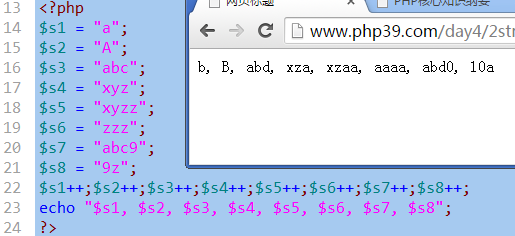

### 前自增和后自增的区别（自减类似）

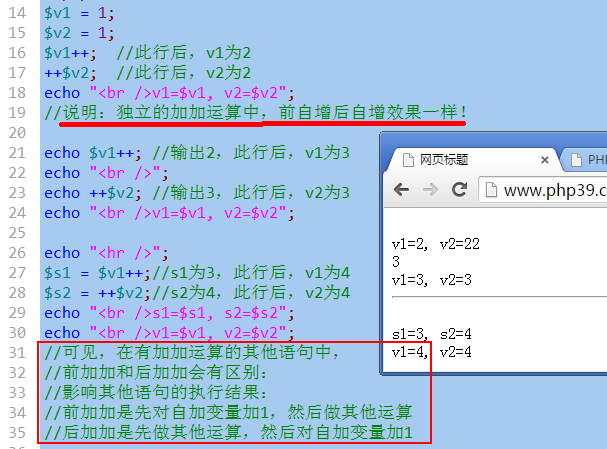

> 通常，我们在循环中，推荐使用前加加(效率稍高)，比如：
for($i = 1;  $i < 10000;  ++$i){ ....... }

演示前加加后加加进行1千万次的“效率比较”：

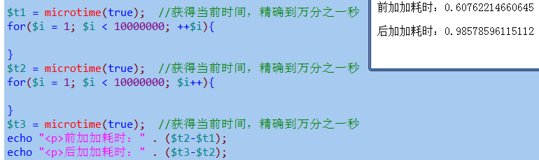

## 比较运算符

- 符号：>&nbsp;&nbsp;  >=&nbsp;&nbsp;  <&nbsp;&nbsp;   <=&nbsp;&nbsp;  ==&nbsp;&nbsp;  !=&nbsp;&nbsp;   ===&nbsp;&nbsp;  !==
- 一般比较：是针对数字进行的大小比较
- ==和===比较：前者通常叫做模糊相等的比较，后者叫做精确相等的比较（只有数据的类型和数据的值/内容，都相等，才是全等的）。
- 不要对浮点数直接进行大小比较

必须能够找到手册的“类型比较表”：附录》php类型比较表：

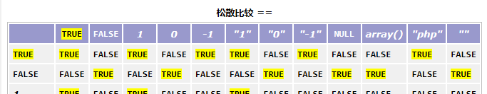

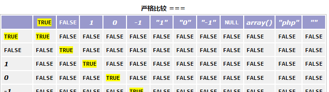

### 常见不同类型（标量类型）数据之间的比较规律：

* 如果比较的数据中，有布尔值，转为布尔值比较，布尔值比较只有一个规则：true>false
* 否则，如果有数字值，就转为数字值比较：这就是常规比较。
* 否则，如果两边都是“纯数字字符串”，转为数字比较
* 否则，就按字符串比较。字符串比较的规则是：
   - 对两边的字符串，一个一个从前往后取出字符并进行比较，谁“先大”，结果就是它大。

```php
“abc” > true  //? false
“abc” > false  //true
“0”  > false  //false
3  >  “12”;       //false
3  >  “12abc”; //false
“3”  > “12”   //false
“abc”  > “c”;  //false，后者大
“abc”  > “ab123cde”; //true  因为这里”c”大于”1”
“3abc” > “12abc”;           //true, 因为”3”大于“1”
1 > “a”;                             //? true
“1” > “a”                          //? false
```

## 逻辑运算符

* 逻辑运算符都是针对“布尔值”进行的运算。
* 如果不是布尔值，就会转换为布尔值进行；
* 布尔值只有2个：true，false

### 基本运算规则（真值表）：

- 逻辑与规则：
    - true  &&  true  ==>> true
    - true  &&  false  ==>>false
    - false  &&  true  ==>>false
    - false  &&  false  ==>>false<br>
    - 总结：只有2个都是true，结果才是true<br>
    只要有一个是false，结果就是false

- 逻辑或规则：
    * true  ||  true  ==>> true
    * true  ||  false  ==>>true
    * false  ||  true  ==>>true
    * false  ||  false  ==>>false
    * 总结：只有2个都是false，结果才是false<br>
    只要有一个是true，结果就是true

- 逻辑非规则：
    * !true  ==>> false
    * !false  ==>> true

### 辑运算符的“短路现象”：

- 逻辑与短路：

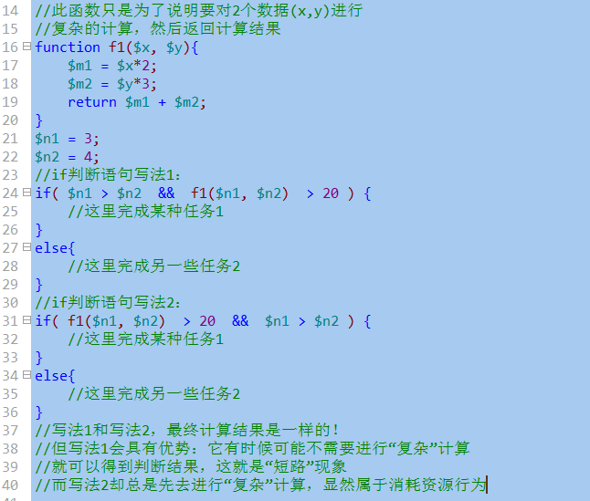

结果：如果一个语句中，通过与运算需要进行多项判断，而且不同的判断具有明显不同的“复杂程度”，则我们应该将简单的判断放在前面，这时候我们就可以利用短路现象以达到提高效率的目的。

- 逻辑或短路：

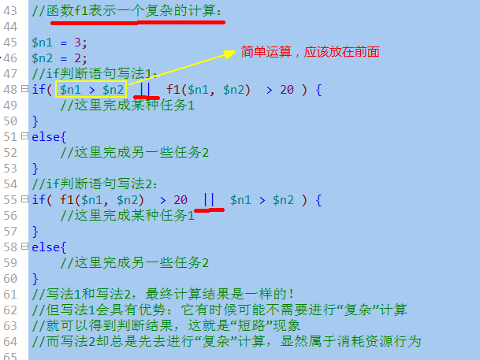

结果：如果一个语句中，通过或运算需要进行多项判断，而且不同的判断具有明显不同的“复杂程度”，则我们应该将简单的判断放在前面，这时候我们就可以利用短路现象以达到提高效率的目的。

## 字符串运算符

1. 符号只有一个：&nbsp;.  &nbsp;也衍生出另一个：  .=
2. 含义：就是将这个符号两边的字符串连接起来；
3. 如果两边不是字符串，就会自动转换为字符串，然后连接起来。

```php
“ab”  .   3                  ==>> “ab3”;
“12”  .   3                ==>>”123”
12  .  3         ==>> “123”
```

## 赋值运算符：

- 一个基本赋值运算符：  =
    - 形式：  $变量名  =  值；
    - 理解：  将右边的值（不管做了多少运算），赋值给左边的变量。
- 若干个衍生的赋值运算符：
    - += 加等：   形式：  $变量名  +=  值；
        - 理解：  相当于： $变量名  =  $变量名 + 值；
    - -= 加等：   形式：  $变量名  -=  值；
        - 理解：  相当于： $变量名  =  $变量名 - 值；
    - *=&nbsp;   /=&nbsp;    %=&nbsp;    .=&nbsp;   其都可以认为是上述形式的一种简化版。

## 条件（三目，三元）运算符

- 只有一个，形式如下：
    - 数据值１　？　数据值２　：　数据值３
- 含义：
    - 对数据值１进行判断，如果为“真”，则该运算符的运算结果就是数据值２，否则就是数据值３；

- 它是这样一个流程控制（逻辑判断）语句的简写形式：
```
ｉｆ（　数据值１　）｛
＄变量名　＝　数据值２；
｝
ｅｌｓｅ｛
＄变量名　＝　数据值３；
｝
```
注意：如果数据值１不是布尔值，也会转换为布尔值；
```php
$score = 66;                    //分数
$valuation = $score >= 60 ?  “及格”  :  “不及格”；           //结果为“及格”

$score = 56;                    //分数
$valuation = $score >= 60 ?  “及格”  :  “不及格”；           //结果为“不及格”

$score = 56;                    //分数
$valuation =  $score  ?  “及格”  :  “不及格”；    //结果为“及格”，这里可能就偏离的本意！！
```

## 位运算符

### 基础规定

1. 位是什么？就是2进制数字的每一个“位”，一个整数数字，有（由）32个位构成！
2. 位运算符是仅仅针对整数进行的运算符；
3. 位运算符有如下几个
    - &：  按位与；
    - |：     按位或；
    - ~：   按位非；按位取反；
    - ^：    按位异或；
4. 位运算符的基本语法规则：
- 按位与基本规则：
    * 1  &  1  ==>>  1
    * 1  &  0  ==>>  0
    * 0  &  1  ==>>  0
    * 0  &  0  ==>>  0

- 按位或基本规则：
    * 1  |  1  ==>>  1
    * 1  |  0  ==>>  1
    * 0  |  1  ==>>  1
    * 0  |  0  ==>>  0
- 按位非基本规则：
    * ~1  ==>>  0
    * ~0  ==>>　1

- 按位异或基本规则：
    * 1  ^  1  ==>>  0
    * 1  ^  0  ==>>  1
    * 0  ^  1  ==>>  1
    * 0  ^  0  ==>>  0
        - 可见，按位异或的规则是：相同为0，不同为1

### 整数的按位与运算（&)

- 形式：
    - $n1  &  $n2;  //n1，n2是2个任意整数；
- 含义：
    - 将该2个整数的二进制数字形式（注意，都是32位）的每一个对应位上的数字进行基本按位与运算之后的结果！
- 注意：他们运算的结果，其实仍然是一个普通的数字（10进制）。

示例图示（只用8个位来演示）:

$r1 = 10 & 20;
<table class="MsoTableGrid" border="1" cellspacing="0" cellpadding="0" style="border-collapse:collapse;mso-table-layout-alt:fixed;border:none;
 mso-border-alt:solid windowtext .5pt;mso-padding-alt:0cm 5.4pt 0cm 5.4pt">
 <tbody><tr style="mso-yfti-irow:0;mso-yfti-firstrow:yes">
  <td width="55" valign="top" style="width:55.3pt;border:solid windowtext 1.0pt;
  mso-border-alt:solid windowtext .5pt;padding:0cm 5.4pt 0cm 5.4pt">
  <p class="MsoNormal"><span lang="EN-US">10</span><span style="font-family:宋体;
  mso-ascii-font-family:&quot;Times New Roman&quot;;mso-hansi-font-family:&quot;Times New Roman&quot;">的</span><span lang="EN-US">2</span><span style="font-family:宋体;mso-ascii-font-family:&quot;Times New Roman&quot;;
  mso-hansi-font-family:&quot;Times New Roman&quot;">进制</span></p>
  </td>
  <td width="55" valign="top" style="width:55.35pt;border:solid windowtext 1.0pt;
  border-left:none;mso-border-left-alt:solid windowtext .5pt;mso-border-alt:
  solid windowtext .5pt;padding:0cm 5.4pt 0cm 5.4pt">
  <p class="MsoNormal"><span lang="EN-US">0</span></p>
  </td>
  <td width="55" valign="top" style="width:55.35pt;border:solid windowtext 1.0pt;
  border-left:none;mso-border-left-alt:solid windowtext .5pt;mso-border-alt:
  solid windowtext .5pt;padding:0cm 5.4pt 0cm 5.4pt">
  <p class="MsoNormal"><span lang="EN-US">0</span></p>
  </td>
  <td width="55" valign="top" style="width:55.35pt;border:solid windowtext 1.0pt;
  border-left:none;mso-border-left-alt:solid windowtext .5pt;mso-border-alt:
  solid windowtext .5pt;padding:0cm 5.4pt 0cm 5.4pt">
  <p class="MsoNormal"><span lang="EN-US">0</span></p>
  </td>
  <td width="55" valign="top" style="width:55.35pt;border:solid windowtext 1.0pt;
  border-left:none;mso-border-left-alt:solid windowtext .5pt;mso-border-alt:
  solid windowtext .5pt;padding:0cm 5.4pt 0cm 5.4pt">
  <p class="MsoNormal"><span lang="EN-US">0</span></p>
  </td>
  <td width="55" valign="top" style="width:55.35pt;border:solid windowtext 1.0pt;
  border-left:none;mso-border-left-alt:solid windowtext .5pt;mso-border-alt:
  solid windowtext .5pt;padding:0cm 5.4pt 0cm 5.4pt">
  <p class="MsoNormal"><span lang="EN-US">1</span></p>
  </td>
  <td width="55" valign="top" style="width:55.35pt;border:solid windowtext 1.0pt;
  border-left:none;mso-border-left-alt:solid windowtext .5pt;mso-border-alt:
  solid windowtext .5pt;padding:0cm 5.4pt 0cm 5.4pt">
  <p class="MsoNormal"><span lang="EN-US">0</span></p>
  </td>
  <td width="55" valign="top" style="width:55.35pt;border:solid windowtext 1.0pt;
  border-left:none;mso-border-left-alt:solid windowtext .5pt;mso-border-alt:
  solid windowtext .5pt;padding:0cm 5.4pt 0cm 5.4pt">
  <p class="MsoNormal"><span lang="EN-US">1</span></p>
  </td>
  <td width="55" valign="top" style="width:55.35pt;border:solid windowtext 1.0pt;
  border-left:none;mso-border-left-alt:solid windowtext .5pt;mso-border-alt:
  solid windowtext .5pt;padding:0cm 5.4pt 0cm 5.4pt">
  <p class="MsoNormal"><span lang="EN-US">0</span></p>
  </td>
 </tr>
 <tr style="mso-yfti-irow:1">
  <td width="55" valign="top" style="width:55.3pt;border:solid windowtext 1.0pt;
  border-top:none;mso-border-top-alt:solid windowtext .5pt;mso-border-alt:solid windowtext .5pt;
  padding:0cm 5.4pt 0cm 5.4pt">
  <p class="MsoNormal"><span lang="EN-US">20</span><span style="font-family:宋体;
  mso-ascii-font-family:&quot;Times New Roman&quot;;mso-hansi-font-family:&quot;Times New Roman&quot;">的</span><span lang="EN-US">2</span><span style="font-family:宋体;mso-ascii-font-family:&quot;Times New Roman&quot;;
  mso-hansi-font-family:&quot;Times New Roman&quot;">进制</span></p>
  </td>
  <td width="55" valign="top" style="width:55.35pt;border-top:none;border-left:
  none;border-bottom:solid windowtext 1.0pt;border-right:solid windowtext 1.0pt;
  mso-border-top-alt:solid windowtext .5pt;mso-border-left-alt:solid windowtext .5pt;
  mso-border-alt:solid windowtext .5pt;padding:0cm 5.4pt 0cm 5.4pt">
  <p class="MsoNormal"><span lang="EN-US">0</span></p>
  </td>
  <td width="55" valign="top" style="width:55.35pt;border-top:none;border-left:
  none;border-bottom:solid windowtext 1.0pt;border-right:solid windowtext 1.0pt;
  mso-border-top-alt:solid windowtext .5pt;mso-border-left-alt:solid windowtext .5pt;
  mso-border-alt:solid windowtext .5pt;padding:0cm 5.4pt 0cm 5.4pt">
  <p class="MsoNormal"><span lang="EN-US">0</span></p>
  </td>
  <td width="55" valign="top" style="width:55.35pt;border-top:none;border-left:
  none;border-bottom:solid windowtext 1.0pt;border-right:solid windowtext 1.0pt;
  mso-border-top-alt:solid windowtext .5pt;mso-border-left-alt:solid windowtext .5pt;
  mso-border-alt:solid windowtext .5pt;padding:0cm 5.4pt 0cm 5.4pt">
  <p class="MsoNormal"><span lang="EN-US">0</span></p>
  </td>
  <td width="55" valign="top" style="width:55.35pt;border-top:none;border-left:
  none;border-bottom:solid windowtext 1.0pt;border-right:solid windowtext 1.0pt;
  mso-border-top-alt:solid windowtext .5pt;mso-border-left-alt:solid windowtext .5pt;
  mso-border-alt:solid windowtext .5pt;padding:0cm 5.4pt 0cm 5.4pt">
  <p class="MsoNormal"><span lang="EN-US">1</span></p>
  </td>
  <td width="55" valign="top" style="width:55.35pt;border-top:none;border-left:
  none;border-bottom:solid windowtext 1.0pt;border-right:solid windowtext 1.0pt;
  mso-border-top-alt:solid windowtext .5pt;mso-border-left-alt:solid windowtext .5pt;
  mso-border-alt:solid windowtext .5pt;padding:0cm 5.4pt 0cm 5.4pt">
  <p class="MsoNormal"><span lang="EN-US">0</span></p>
  </td>
  <td width="55" valign="top" style="width:55.35pt;border-top:none;border-left:
  none;border-bottom:solid windowtext 1.0pt;border-right:solid windowtext 1.0pt;
  mso-border-top-alt:solid windowtext .5pt;mso-border-left-alt:solid windowtext .5pt;
  mso-border-alt:solid windowtext .5pt;padding:0cm 5.4pt 0cm 5.4pt">
  <p class="MsoNormal"><span lang="EN-US">1</span></p>
  </td>
  <td width="55" valign="top" style="width:55.35pt;border-top:none;border-left:
  none;border-bottom:solid windowtext 1.0pt;border-right:solid windowtext 1.0pt;
  mso-border-top-alt:solid windowtext .5pt;mso-border-left-alt:solid windowtext .5pt;
  mso-border-alt:solid windowtext .5pt;padding:0cm 5.4pt 0cm 5.4pt">
  <p class="MsoNormal"><span lang="EN-US">0</span></p>
  </td>
  <td width="55" valign="top" style="width:55.35pt;border-top:none;border-left:
  none;border-bottom:solid windowtext 1.0pt;border-right:solid windowtext 1.0pt;
  mso-border-top-alt:solid windowtext .5pt;mso-border-left-alt:solid windowtext .5pt;
  mso-border-alt:solid windowtext .5pt;padding:0cm 5.4pt 0cm 5.4pt">
  <p class="MsoNormal"><span lang="EN-US">0</span></p>
  </td>
 </tr>
 <tr style="mso-yfti-irow:2;mso-yfti-lastrow:yes">
  <td width="55" valign="top" style="width:55.3pt;border:solid windowtext 1.0pt;
  border-top:none;mso-border-top-alt:solid windowtext .5pt;mso-border-alt:solid windowtext .5pt;
  padding:0cm 5.4pt 0cm 5.4pt">
  <p class="MsoNormal"><span lang="EN-US">&amp;</span><span style="font-family:
  宋体;mso-ascii-font-family:&quot;Times New Roman&quot;;mso-hansi-font-family:&quot;Times New Roman&quot;">运算结果：</span></p>
  </td>
  <td width="55" valign="top" style="width:55.35pt;border-top:none;border-left:
  none;border-bottom:solid windowtext 1.0pt;border-right:solid windowtext 1.0pt;
  mso-border-top-alt:solid windowtext .5pt;mso-border-left-alt:solid windowtext .5pt;
  mso-border-alt:solid windowtext .5pt;padding:0cm 5.4pt 0cm 5.4pt">
  <p class="MsoNormal"><span lang="EN-US">0</span></p>
  </td>
  <td width="55" valign="top" style="width:55.35pt;border-top:none;border-left:
  none;border-bottom:solid windowtext 1.0pt;border-right:solid windowtext 1.0pt;
  mso-border-top-alt:solid windowtext .5pt;mso-border-left-alt:solid windowtext .5pt;
  mso-border-alt:solid windowtext .5pt;padding:0cm 5.4pt 0cm 5.4pt">
  <p class="MsoNormal"><span lang="EN-US">0</span></p>
  </td>
  <td width="55" valign="top" style="width:55.35pt;border-top:none;border-left:
  none;border-bottom:solid windowtext 1.0pt;border-right:solid windowtext 1.0pt;
  mso-border-top-alt:solid windowtext .5pt;mso-border-left-alt:solid windowtext .5pt;
  mso-border-alt:solid windowtext .5pt;padding:0cm 5.4pt 0cm 5.4pt">
  <p class="MsoNormal"><span lang="EN-US">0</span></p>
  </td>
  <td width="55" valign="top" style="width:55.35pt;border-top:none;border-left:
  none;border-bottom:solid windowtext 1.0pt;border-right:solid windowtext 1.0pt;
  mso-border-top-alt:solid windowtext .5pt;mso-border-left-alt:solid windowtext .5pt;
  mso-border-alt:solid windowtext .5pt;padding:0cm 5.4pt 0cm 5.4pt">
  <p class="MsoNormal"><span lang="EN-US">0</span></p>
  </td>
  <td width="55" valign="top" style="width:55.35pt;border-top:none;border-left:
  none;border-bottom:solid windowtext 1.0pt;border-right:solid windowtext 1.0pt;
  mso-border-top-alt:solid windowtext .5pt;mso-border-left-alt:solid windowtext .5pt;
  mso-border-alt:solid windowtext .5pt;padding:0cm 5.4pt 0cm 5.4pt">
  <p class="MsoNormal"><span lang="EN-US">0</span></p>
  </td>
  <td width="55" valign="top" style="width:55.35pt;border-top:none;border-left:
  none;border-bottom:solid windowtext 1.0pt;border-right:solid windowtext 1.0pt;
  mso-border-top-alt:solid windowtext .5pt;mso-border-left-alt:solid windowtext .5pt;
  mso-border-alt:solid windowtext .5pt;padding:0cm 5.4pt 0cm 5.4pt">
  <p class="MsoNormal"><span lang="EN-US">0</span></p>
  </td>
  <td width="55" valign="top" style="width:55.35pt;border-top:none;border-left:
  none;border-bottom:solid windowtext 1.0pt;border-right:solid windowtext 1.0pt;
  mso-border-top-alt:solid windowtext .5pt;mso-border-left-alt:solid windowtext .5pt;
  mso-border-alt:solid windowtext .5pt;padding:0cm 5.4pt 0cm 5.4pt">
  <p class="MsoNormal"><span lang="EN-US">0</span></p>
  </td>
  <td width="55" valign="top" style="width:55.35pt;border-top:none;border-left:
  none;border-bottom:solid windowtext 1.0pt;border-right:solid windowtext 1.0pt;
  mso-border-top-alt:solid windowtext .5pt;mso-border-left-alt:solid windowtext .5pt;
  mso-border-alt:solid windowtext .5pt;padding:0cm 5.4pt 0cm 5.4pt">
  <p class="MsoNormal"><span lang="EN-US">0</span></p>
  </td>
 </tr>
</tbody></table>

代码验证：

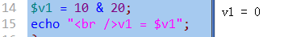

### 整数的按位或运算：

- 形式：
    - $n1  |  $n2;     //n1，n2是2个任意整数；
- 含义：
    - 将该2个整数的二进制数字形式（注意，都是32位）的每一个对应位上的数字进行基本按位或运算之后的结果！
- 注意：他们运算的结果，其实仍然是一个普通的数字（10进制）。

示例图示（只用8个位来演示）：

$r1 = 10 | 20;
<table class="MsoTableGrid" border="1" cellspacing="0" cellpadding="0" style="border-collapse:collapse;mso-table-layout-alt:fixed;border:none;
 mso-border-alt:solid windowtext .5pt;mso-padding-alt:0cm 5.4pt 0cm 5.4pt">
 <tbody><tr style="mso-yfti-irow:0;mso-yfti-firstrow:yes">
  <td width="55" valign="top" style="width:55.3pt;border:solid windowtext 1.0pt;
  mso-border-alt:solid windowtext .5pt;padding:0cm 5.4pt 0cm 5.4pt">
  <p class="MsoNormal"><span lang="EN-US">10</span><span style="font-family:宋体;
  mso-ascii-font-family:&quot;Times New Roman&quot;;mso-hansi-font-family:&quot;Times New Roman&quot;">的</span><span lang="EN-US">2</span><span style="font-family:宋体;mso-ascii-font-family:&quot;Times New Roman&quot;;
  mso-hansi-font-family:&quot;Times New Roman&quot;">进制</span></p>
  </td>
  <td width="55" valign="top" style="width:55.35pt;border:solid windowtext 1.0pt;
  border-left:none;mso-border-left-alt:solid windowtext .5pt;mso-border-alt:
  solid windowtext .5pt;padding:0cm 5.4pt 0cm 5.4pt">
  <p class="MsoNormal"><span lang="EN-US">0</span></p>
  </td>
  <td width="55" valign="top" style="width:55.35pt;border:solid windowtext 1.0pt;
  border-left:none;mso-border-left-alt:solid windowtext .5pt;mso-border-alt:
  solid windowtext .5pt;padding:0cm 5.4pt 0cm 5.4pt">
  <p class="MsoNormal"><span lang="EN-US">0</span></p>
  </td>
  <td width="55" valign="top" style="width:55.35pt;border:solid windowtext 1.0pt;
  border-left:none;mso-border-left-alt:solid windowtext .5pt;mso-border-alt:
  solid windowtext .5pt;padding:0cm 5.4pt 0cm 5.4pt">
  <p class="MsoNormal"><span lang="EN-US">0</span></p>
  </td>
  <td width="55" valign="top" style="width:55.35pt;border:solid windowtext 1.0pt;
  border-left:none;mso-border-left-alt:solid windowtext .5pt;mso-border-alt:
  solid windowtext .5pt;padding:0cm 5.4pt 0cm 5.4pt">
  <p class="MsoNormal"><span lang="EN-US">0</span></p>
  </td>
  <td width="55" valign="top" style="width:55.35pt;border:solid windowtext 1.0pt;
  border-left:none;mso-border-left-alt:solid windowtext .5pt;mso-border-alt:
  solid windowtext .5pt;padding:0cm 5.4pt 0cm 5.4pt">
  <p class="MsoNormal"><span lang="EN-US">1</span></p>
  </td>
  <td width="55" valign="top" style="width:55.35pt;border:solid windowtext 1.0pt;
  border-left:none;mso-border-left-alt:solid windowtext .5pt;mso-border-alt:
  solid windowtext .5pt;padding:0cm 5.4pt 0cm 5.4pt">
  <p class="MsoNormal"><span lang="EN-US">0</span></p>
  </td>
  <td width="55" valign="top" style="width:55.35pt;border:solid windowtext 1.0pt;
  border-left:none;mso-border-left-alt:solid windowtext .5pt;mso-border-alt:
  solid windowtext .5pt;padding:0cm 5.4pt 0cm 5.4pt">
  <p class="MsoNormal"><span lang="EN-US">1</span></p>
  </td>
  <td width="55" valign="top" style="width:55.35pt;border:solid windowtext 1.0pt;
  border-left:none;mso-border-left-alt:solid windowtext .5pt;mso-border-alt:
  solid windowtext .5pt;padding:0cm 5.4pt 0cm 5.4pt">
  <p class="MsoNormal"><span lang="EN-US">0</span></p>
  </td>
 </tr>
 <tr style="mso-yfti-irow:1">
  <td width="55" valign="top" style="width:55.3pt;border:solid windowtext 1.0pt;
  border-top:none;mso-border-top-alt:solid windowtext .5pt;mso-border-alt:solid windowtext .5pt;
  padding:0cm 5.4pt 0cm 5.4pt">
  <p class="MsoNormal"><span lang="EN-US">20</span><span style="font-family:宋体;
  mso-ascii-font-family:&quot;Times New Roman&quot;;mso-hansi-font-family:&quot;Times New Roman&quot;">的</span><span lang="EN-US">2</span><span style="font-family:宋体;mso-ascii-font-family:&quot;Times New Roman&quot;;
  mso-hansi-font-family:&quot;Times New Roman&quot;">进制</span></p>
  </td>
  <td width="55" valign="top" style="width:55.35pt;border-top:none;border-left:
  none;border-bottom:solid windowtext 1.0pt;border-right:solid windowtext 1.0pt;
  mso-border-top-alt:solid windowtext .5pt;mso-border-left-alt:solid windowtext .5pt;
  mso-border-alt:solid windowtext .5pt;padding:0cm 5.4pt 0cm 5.4pt">
  <p class="MsoNormal"><span lang="EN-US">0</span></p>
  </td>
  <td width="55" valign="top" style="width:55.35pt;border-top:none;border-left:
  none;border-bottom:solid windowtext 1.0pt;border-right:solid windowtext 1.0pt;
  mso-border-top-alt:solid windowtext .5pt;mso-border-left-alt:solid windowtext .5pt;
  mso-border-alt:solid windowtext .5pt;padding:0cm 5.4pt 0cm 5.4pt">
  <p class="MsoNormal"><span lang="EN-US">0</span></p>
  </td>
  <td width="55" valign="top" style="width:55.35pt;border-top:none;border-left:
  none;border-bottom:solid windowtext 1.0pt;border-right:solid windowtext 1.0pt;
  mso-border-top-alt:solid windowtext .5pt;mso-border-left-alt:solid windowtext .5pt;
  mso-border-alt:solid windowtext .5pt;padding:0cm 5.4pt 0cm 5.4pt">
  <p class="MsoNormal"><span lang="EN-US">0</span></p>
  </td>
  <td width="55" valign="top" style="width:55.35pt;border-top:none;border-left:
  none;border-bottom:solid windowtext 1.0pt;border-right:solid windowtext 1.0pt;
  mso-border-top-alt:solid windowtext .5pt;mso-border-left-alt:solid windowtext .5pt;
  mso-border-alt:solid windowtext .5pt;padding:0cm 5.4pt 0cm 5.4pt">
  <p class="MsoNormal"><span lang="EN-US">1</span></p>
  </td>
  <td width="55" valign="top" style="width:55.35pt;border-top:none;border-left:
  none;border-bottom:solid windowtext 1.0pt;border-right:solid windowtext 1.0pt;
  mso-border-top-alt:solid windowtext .5pt;mso-border-left-alt:solid windowtext .5pt;
  mso-border-alt:solid windowtext .5pt;padding:0cm 5.4pt 0cm 5.4pt">
  <p class="MsoNormal"><span lang="EN-US">0</span></p>
  </td>
  <td width="55" valign="top" style="width:55.35pt;border-top:none;border-left:
  none;border-bottom:solid windowtext 1.0pt;border-right:solid windowtext 1.0pt;
  mso-border-top-alt:solid windowtext .5pt;mso-border-left-alt:solid windowtext .5pt;
  mso-border-alt:solid windowtext .5pt;padding:0cm 5.4pt 0cm 5.4pt">
  <p class="MsoNormal"><span lang="EN-US">1</span></p>
  </td>
  <td width="55" valign="top" style="width:55.35pt;border-top:none;border-left:
  none;border-bottom:solid windowtext 1.0pt;border-right:solid windowtext 1.0pt;
  mso-border-top-alt:solid windowtext .5pt;mso-border-left-alt:solid windowtext .5pt;
  mso-border-alt:solid windowtext .5pt;padding:0cm 5.4pt 0cm 5.4pt">
  <p class="MsoNormal"><span lang="EN-US">0</span></p>
  </td>
  <td width="55" valign="top" style="width:55.35pt;border-top:none;border-left:
  none;border-bottom:solid windowtext 1.0pt;border-right:solid windowtext 1.0pt;
  mso-border-top-alt:solid windowtext .5pt;mso-border-left-alt:solid windowtext .5pt;
  mso-border-alt:solid windowtext .5pt;padding:0cm 5.4pt 0cm 5.4pt">
  <p class="MsoNormal"><span lang="EN-US">0</span></p>
  </td>
 </tr>
 <tr style="mso-yfti-irow:2;mso-yfti-lastrow:yes">
  <td width="55" valign="top" style="width:55.3pt;border:solid windowtext 1.0pt;
  border-top:none;mso-border-top-alt:solid windowtext .5pt;mso-border-alt:solid windowtext .5pt;
  padding:0cm 5.4pt 0cm 5.4pt">
  <p class="MsoNormal"><span lang="EN-US">|</span><span style="font-family:宋体;
  mso-ascii-font-family:&quot;Times New Roman&quot;;mso-hansi-font-family:&quot;Times New Roman&quot;">运算结果：</span></p>
  </td>
  <td width="55" valign="top" style="width:55.35pt;border-top:none;border-left:
  none;border-bottom:solid windowtext 1.0pt;border-right:solid windowtext 1.0pt;
  mso-border-top-alt:solid windowtext .5pt;mso-border-left-alt:solid windowtext .5pt;
  mso-border-alt:solid windowtext .5pt;padding:0cm 5.4pt 0cm 5.4pt">
  <p class="MsoNormal"><span lang="EN-US">0</span></p>
  </td>
  <td width="55" valign="top" style="width:55.35pt;border-top:none;border-left:
  none;border-bottom:solid windowtext 1.0pt;border-right:solid windowtext 1.0pt;
  mso-border-top-alt:solid windowtext .5pt;mso-border-left-alt:solid windowtext .5pt;
  mso-border-alt:solid windowtext .5pt;padding:0cm 5.4pt 0cm 5.4pt">
  <p class="MsoNormal"><span lang="EN-US">0</span></p>
  </td>
  <td width="55" valign="top" style="width:55.35pt;border-top:none;border-left:
  none;border-bottom:solid windowtext 1.0pt;border-right:solid windowtext 1.0pt;
  mso-border-top-alt:solid windowtext .5pt;mso-border-left-alt:solid windowtext .5pt;
  mso-border-alt:solid windowtext .5pt;padding:0cm 5.4pt 0cm 5.4pt">
  <p class="MsoNormal"><span lang="EN-US">0</span></p>
  </td>
  <td width="55" valign="top" style="width:55.35pt;border-top:none;border-left:
  none;border-bottom:solid windowtext 1.0pt;border-right:solid windowtext 1.0pt;
  mso-border-top-alt:solid windowtext .5pt;mso-border-left-alt:solid windowtext .5pt;
  mso-border-alt:solid windowtext .5pt;padding:0cm 5.4pt 0cm 5.4pt">
  <p class="MsoNormal"><span lang="EN-US">1</span></p>
  </td>
  <td width="55" valign="top" style="width:55.35pt;border-top:none;border-left:
  none;border-bottom:solid windowtext 1.0pt;border-right:solid windowtext 1.0pt;
  mso-border-top-alt:solid windowtext .5pt;mso-border-left-alt:solid windowtext .5pt;
  mso-border-alt:solid windowtext .5pt;padding:0cm 5.4pt 0cm 5.4pt">
  <p class="MsoNormal"><span lang="EN-US">1</span></p>
  </td>
  <td width="55" valign="top" style="width:55.35pt;border-top:none;border-left:
  none;border-bottom:solid windowtext 1.0pt;border-right:solid windowtext 1.0pt;
  mso-border-top-alt:solid windowtext .5pt;mso-border-left-alt:solid windowtext .5pt;
  mso-border-alt:solid windowtext .5pt;padding:0cm 5.4pt 0cm 5.4pt">
  <p class="MsoNormal"><span lang="EN-US">1</span></p>
  </td>
  <td width="55" valign="top" style="width:55.35pt;border-top:none;border-left:
  none;border-bottom:solid windowtext 1.0pt;border-right:solid windowtext 1.0pt;
  mso-border-top-alt:solid windowtext .5pt;mso-border-left-alt:solid windowtext .5pt;
  mso-border-alt:solid windowtext .5pt;padding:0cm 5.4pt 0cm 5.4pt">
  <p class="MsoNormal"><span lang="EN-US">1</span></p>
  </td>
  <td width="55" valign="top" style="width:55.35pt;border-top:none;border-left:
  none;border-bottom:solid windowtext 1.0pt;border-right:solid windowtext 1.0pt;
  mso-border-top-alt:solid windowtext .5pt;mso-border-left-alt:solid windowtext .5pt;
  mso-border-alt:solid windowtext .5pt;padding:0cm 5.4pt 0cm 5.4pt">
  <p class="MsoNormal"><span lang="EN-US">0</span></p>
  </td>
 </tr>
</tbody></table>

则结果该数据值大小为： 1 * 2^4  +  1 * 2^3  +  1 * 2^2  + 1 * 2^1  + 0  =  16 + 8 + 4 + 2 = 30

 代码验证：

 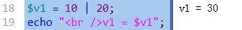

### 整数的按位左移运算

- 形式：
    - $n1  <<  $m
- 含义：
    - 将十进制数字n1的二进制数字形式（也是32位的）的每一个位上的数字都一次性往左边移动m位，<br>
并将右边空出来的位置补0，左边冒出去的不管，这样操作之后得到的结果。

示例图示（只用8个位来演示）：

$r1 = 10 <<  2;

<table class="MsoTableGrid" border="1" cellspacing="0" cellpadding="0" style="border-collapse:collapse;mso-table-layout-alt:fixed;border:none;
 mso-border-alt:solid windowtext .5pt;mso-padding-alt:0cm 5.4pt 0cm 5.4pt">
 <tbody><tr style="mso-yfti-irow:0;mso-yfti-firstrow:yes">
  <td width="69" valign="top" style="width:69.35pt;border:solid windowtext 1.0pt;
  mso-border-alt:solid windowtext .5pt;padding:0cm 5.4pt 0cm 5.4pt">
  <p class="MsoNormal"><span lang="EN-US">10</span><span style="font-family:宋体;
  mso-ascii-font-family:&quot;Times New Roman&quot;;mso-hansi-font-family:&quot;Times New Roman&quot;">的</span><span lang="EN-US">2</span><span style="font-family:宋体;mso-ascii-font-family:&quot;Times New Roman&quot;;
  mso-hansi-font-family:&quot;Times New Roman&quot;">进制</span></p>
  </td>
  <td width="41" valign="top" style="width:41.3pt;border:solid windowtext 1.0pt;
  border-left:none;mso-border-left-alt:solid windowtext .5pt;mso-border-alt:
  solid windowtext .5pt;background:#969696;padding:0cm 5.4pt 0cm 5.4pt">
  <p class="MsoNormal"><span lang="EN-US">0</span></p>
  </td>
  <td width="55" valign="top" style="width:55.35pt;border:solid windowtext 1.0pt;
  border-left:none;mso-border-left-alt:solid windowtext .5pt;mso-border-alt:
  solid windowtext .5pt;background:#969696;padding:0cm 5.4pt 0cm 5.4pt">
  <p class="MsoNormal"><span lang="EN-US">0</span></p>
  </td>
  <td width="55" valign="top" style="width:55.35pt;border:solid windowtext 1.0pt;
  border-left:none;mso-border-left-alt:solid windowtext .5pt;mso-border-alt:
  solid windowtext .5pt;background:#FF9900;padding:0cm 5.4pt 0cm 5.4pt">
  <p class="MsoNormal"><span lang="EN-US">0</span></p>
  </td>
  <td width="55" valign="top" style="width:55.35pt;border:solid windowtext 1.0pt;
  border-left:none;mso-border-left-alt:solid windowtext .5pt;mso-border-alt:
  solid windowtext .5pt;background:#FF9900;padding:0cm 5.4pt 0cm 5.4pt">
  <p class="MsoNormal"><span lang="EN-US">0</span></p>
  </td>
  <td width="55" valign="top" style="width:55.35pt;border:solid windowtext 1.0pt;
  border-left:none;mso-border-left-alt:solid windowtext .5pt;mso-border-alt:
  solid windowtext .5pt;background:#FF9900;padding:0cm 5.4pt 0cm 5.4pt">
  <p class="MsoNormal"><span lang="EN-US">1</span></p>
  </td>
  <td width="55" valign="top" style="width:55.35pt;border:solid windowtext 1.0pt;
  border-left:none;mso-border-left-alt:solid windowtext .5pt;mso-border-alt:
  solid windowtext .5pt;background:#FF9900;padding:0cm 5.4pt 0cm 5.4pt">
  <p class="MsoNormal"><span lang="EN-US">0</span></p>
  </td>
  <td width="55" valign="top" style="width:55.35pt;border:solid windowtext 1.0pt;
  border-left:none;mso-border-left-alt:solid windowtext .5pt;mso-border-alt:
  solid windowtext .5pt;background:#FF9900;padding:0cm 5.4pt 0cm 5.4pt">
  <p class="MsoNormal"><span lang="EN-US">1</span></p>
  </td>
  <td width="55" valign="top" style="width:55.35pt;border:solid windowtext 1.0pt;
  border-left:none;mso-border-left-alt:solid windowtext .5pt;mso-border-alt:
  solid windowtext .5pt;background:#FF9900;padding:0cm 5.4pt 0cm 5.4pt">
  <p class="MsoNormal"><span lang="EN-US">0</span></p>
  </td>
 </tr>
 <tr style="mso-yfti-irow:1">
  <td width="69" valign="top" style="width:69.35pt;border:solid windowtext 1.0pt;
  border-top:none;mso-border-top-alt:solid windowtext .5pt;mso-border-alt:solid windowtext .5pt;
  padding:0cm 5.4pt 0cm 5.4pt">
  <p class="MsoNormal"><span style="font-family:宋体;mso-ascii-font-family:&quot;Times New Roman&quot;;
  mso-hansi-font-family:&quot;Times New Roman&quot;">左移</span><span lang="EN-US">2</span><span style="font-family:宋体;mso-ascii-font-family:&quot;Times New Roman&quot;;mso-hansi-font-family:
  &quot;Times New Roman&quot;">位后</span></p>
  </td>
  <td width="41" valign="top" style="width:41.3pt;border-top:none;border-left:none;
  border-bottom:solid windowtext 1.0pt;border-right:solid windowtext 1.0pt;
  mso-border-top-alt:solid windowtext .5pt;mso-border-left-alt:solid windowtext .5pt;
  mso-border-alt:solid windowtext .5pt;background:#FF9900;padding:0cm 5.4pt 0cm 5.4pt">
  <p class="MsoNormal"><span lang="EN-US">0</span></p>
  </td>
  <td width="55" valign="top" style="width:55.35pt;border-top:none;border-left:
  none;border-bottom:solid windowtext 1.0pt;border-right:solid windowtext 1.0pt;
  mso-border-top-alt:solid windowtext .5pt;mso-border-left-alt:solid windowtext .5pt;
  mso-border-alt:solid windowtext .5pt;background:#FF9900;padding:0cm 5.4pt 0cm 5.4pt">
  <p class="MsoNormal"><span lang="EN-US">0</span></p>
  </td>
  <td width="55" valign="top" style="width:55.35pt;border-top:none;border-left:
  none;border-bottom:solid windowtext 1.0pt;border-right:solid windowtext 1.0pt;
  mso-border-top-alt:solid windowtext .5pt;mso-border-left-alt:solid windowtext .5pt;
  mso-border-alt:solid windowtext .5pt;background:#FF9900;padding:0cm 5.4pt 0cm 5.4pt">
  <p class="MsoNormal"><span lang="EN-US">1</span></p>
  </td>
  <td width="55" valign="top" style="width:55.35pt;border-top:none;border-left:
  none;border-bottom:solid windowtext 1.0pt;border-right:solid windowtext 1.0pt;
  mso-border-top-alt:solid windowtext .5pt;mso-border-left-alt:solid windowtext .5pt;
  mso-border-alt:solid windowtext .5pt;background:#FF9900;padding:0cm 5.4pt 0cm 5.4pt">
  <p class="MsoNormal"><span lang="EN-US">0</span></p>
  </td>
  <td width="55" valign="top" style="width:55.35pt;border-top:none;border-left:
  none;border-bottom:solid windowtext 1.0pt;border-right:solid windowtext 1.0pt;
  mso-border-top-alt:solid windowtext .5pt;mso-border-left-alt:solid windowtext .5pt;
  mso-border-alt:solid windowtext .5pt;background:#FF9900;padding:0cm 5.4pt 0cm 5.4pt">
  <p class="MsoNormal"><span lang="EN-US">1</span></p>
  </td>
  <td width="55" valign="top" style="width:55.35pt;border-top:none;border-left:
  none;border-bottom:solid windowtext 1.0pt;border-right:solid windowtext 1.0pt;
  mso-border-top-alt:solid windowtext .5pt;mso-border-left-alt:solid windowtext .5pt;
  mso-border-alt:solid windowtext .5pt;background:#FF9900;padding:0cm 5.4pt 0cm 5.4pt">
  <p class="MsoNormal"><span lang="EN-US">0</span></p>
  </td>
  <td width="55" valign="top" style="width:55.35pt;border-top:none;border-left:
  none;border-bottom:solid windowtext 1.0pt;border-right:solid windowtext 1.0pt;
  mso-border-top-alt:solid windowtext .5pt;mso-border-left-alt:solid windowtext .5pt;
  mso-border-alt:solid windowtext .5pt;background:#FFCC99;padding:0cm 5.4pt 0cm 5.4pt">
  <p class="MsoNormal"><span lang="EN-US">0</span></p>
  </td>
  <td width="55" valign="top" style="width:55.35pt;border-top:none;border-left:
  none;border-bottom:solid windowtext 1.0pt;border-right:solid windowtext 1.0pt;
  mso-border-top-alt:solid windowtext .5pt;mso-border-left-alt:solid windowtext .5pt;
  mso-border-alt:solid windowtext .5pt;background:#FFCC99;padding:0cm 5.4pt 0cm 5.4pt">
  <p class="MsoNormal"><span lang="EN-US">0</span></p>
  </td>
 </tr>
 <tr style="mso-yfti-irow:2;mso-yfti-lastrow:yes">
  <td width="69" valign="top" style="width:69.35pt;border:solid windowtext 1.0pt;
  border-top:none;mso-border-top-alt:solid windowtext .5pt;mso-border-alt:solid windowtext .5pt;
  padding:0cm 5.4pt 0cm 5.4pt">
  <p class="MsoNormal"><span style="font-family:宋体;mso-ascii-font-family:&quot;Times New Roman&quot;;
  mso-hansi-font-family:&quot;Times New Roman&quot;">则结果为：</span></p>
  </td>
  <td width="41" valign="top" style="width:41.3pt;border-top:none;border-left:none;
  border-bottom:solid windowtext 1.0pt;border-right:solid windowtext 1.0pt;
  mso-border-top-alt:solid windowtext .5pt;mso-border-left-alt:solid windowtext .5pt;
  mso-border-alt:solid windowtext .5pt;padding:0cm 5.4pt 0cm 5.4pt">
  <p class="MsoNormal"><span lang="EN-US"><o:p>&nbsp;</o:p></span></p>
  </td>
  <td width="55" valign="top" style="width:55.35pt;border-top:none;border-left:
  none;border-bottom:solid windowtext 1.0pt;border-right:solid windowtext 1.0pt;
  mso-border-top-alt:solid windowtext .5pt;mso-border-left-alt:solid windowtext .5pt;
  mso-border-alt:solid windowtext .5pt;padding:0cm 5.4pt 0cm 5.4pt">
  <p class="MsoNormal"><span lang="EN-US"><o:p>&nbsp;</o:p></span></p>
  </td>
  <td width="55" valign="top" style="width:55.35pt;border-top:none;border-left:
  none;border-bottom:solid windowtext 1.0pt;border-right:solid windowtext 1.0pt;
  mso-border-top-alt:solid windowtext .5pt;mso-border-left-alt:solid windowtext .5pt;
  mso-border-alt:solid windowtext .5pt;padding:0cm 5.4pt 0cm 5.4pt">
  <p class="MsoNormal"><span lang="EN-US">2<sup>5</sup></span></p>
  </td>
  <td width="55" valign="top" style="width:55.35pt;border-top:none;border-left:
  none;border-bottom:solid windowtext 1.0pt;border-right:solid windowtext 1.0pt;
  mso-border-top-alt:solid windowtext .5pt;mso-border-left-alt:solid windowtext .5pt;
  mso-border-alt:solid windowtext .5pt;padding:0cm 5.4pt 0cm 5.4pt">
  <p class="MsoNormal"><span lang="EN-US">0</span></p>
  </td>
  <td width="55" valign="top" style="width:55.35pt;border-top:none;border-left:
  none;border-bottom:solid windowtext 1.0pt;border-right:solid windowtext 1.0pt;
  mso-border-top-alt:solid windowtext .5pt;mso-border-left-alt:solid windowtext .5pt;
  mso-border-alt:solid windowtext .5pt;padding:0cm 5.4pt 0cm 5.4pt">
  <p class="MsoNormal"><span lang="EN-US">2<sup>3</sup></span></p>
  </td>
  <td width="55" valign="top" style="width:55.35pt;border-top:none;border-left:
  none;border-bottom:solid windowtext 1.0pt;border-right:solid windowtext 1.0pt;
  mso-border-top-alt:solid windowtext .5pt;mso-border-left-alt:solid windowtext .5pt;
  mso-border-alt:solid windowtext .5pt;padding:0cm 5.4pt 0cm 5.4pt">
  <p class="MsoNormal"><span lang="EN-US">0</span></p>
  </td>
  <td width="55" valign="top" style="width:55.35pt;border-top:none;border-left:
  none;border-bottom:solid windowtext 1.0pt;border-right:solid windowtext 1.0pt;
  mso-border-top-alt:solid windowtext .5pt;mso-border-left-alt:solid windowtext .5pt;
  mso-border-alt:solid windowtext .5pt;padding:0cm 5.4pt 0cm 5.4pt">
  <p class="MsoNormal"><span lang="EN-US">0</span></p>
  </td>
  <td width="55" valign="top" style="width:55.35pt;border-top:none;border-left:
  none;border-bottom:solid windowtext 1.0pt;border-right:solid windowtext 1.0pt;
  mso-border-top-alt:solid windowtext .5pt;mso-border-left-alt:solid windowtext .5pt;
  mso-border-alt:solid windowtext .5pt;padding:0cm 5.4pt 0cm 5.4pt">
  <p class="MsoNormal"><span lang="EN-US">0</span></p>
  </td>
 </tr>
</tbody></table>

可见，结果为：25  +  23  =  32 + 8  = 40

代码验证：

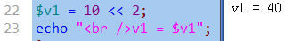

### 补充知识：原码，反码，补码

- 原码：
    - 就是一个二进制数字，从“数学观念”上来表达出的形式。其中，我们规定：
    - 一个数字的最左边一位是“符号位”，0表示正数，1表示负数；

    比如：

    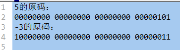


- 反码：
    - 正数的反码就是其本身（即不变）；
    - 负数的反码是：符号位不变，其他位取反；

    比如：

    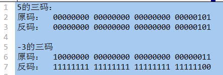

- 补码：
    - 正数的补码就是其本身（即不变）；
    - 负数的补码是：符号位不变，其他位取反后+1——即反码+1

    比如:

    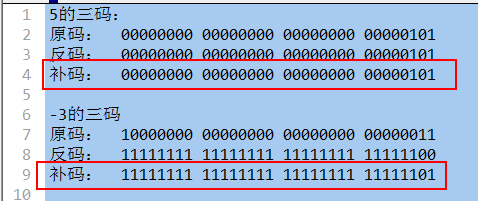

一个小提示：计算机内部的运算，实际全都是使用补码进行的，而且运算的时候，符号位不再区分，直接也当做“数据”参与运算：

- 示例1: 5+3<<br>
    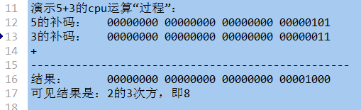

- 示例2： 5-3：
    - 实际上，cpu内部，会将“减法”运算，转换为“加法运算”，即：5 + （-3）<br>
    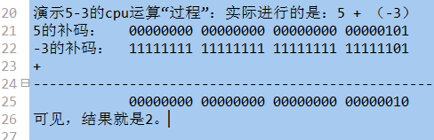


### 位运算符的应用：管理一组事物的开关状态

- 什么是开关状态？
    - 现实中，有很多数据都是只有2种结果（值）的，对应的其实就是我们的布尔类型的值。
    - 这里，所谓管理一组事物的开关状态，应该理解为其实就是管理若干个只有2个状态的“数据符号”。
    - 比如：有5个灯泡，对应5个状态数据。
    - 这5个灯泡，就有 25  种状态呢？

- 这里的管理目标是：使用一个变量，就可以表达若干个数据的“当前状态”。具体有3个任务：
    1. 通过该变量，可以获知任何一个数据（灯泡）的当前状态。
    2. 通过该变量，可以将一个一个数据的状态“关闭”；
    3. 通过该变量，可以将一个一个数据的状态“开启”；


## 数组运算符

有这些：

- +: 数组联合，也可以理解为“数组串联”。

将右边的数组项合并到左边数组的后面，得到一个新数组。如有重复键，则结果以左边的为准

```php
$arr1 = array(5=>10,  8=>20,  10=>30);
$arr2 = array(3=>33,  2=>22);
$r1 = $arr1 + $arr2;      //结果为：array(5=>10,  8=>20,  10=>30， 3=>33,  2=>22)
另一个有重复键的例子：
$arr1 = array(5=>10,  8=>20,  10=>30);
$arr2 = array(8=>33,  2=>22);
$r1 = $arr1 + $arr2;      //结果为：array(5=>10,  8=>20,  10=>30， 2=>22)
```

- ==

如果两个数组具有相同的键名和键值（可以顺序不同，或类型不同），则返回true

```php
$arr1 = array(3=>33,  2=>22);
$arr2 = array(2=>”22”， 3=>”33” );
此时，$arr1,和 $arr2是相等的（ = = ）
```

- !=
- ===： 如果两个数组具有相同的键名和键值且顺序和类型都一样，则返回true
- != =

## 错误控制运算符@：

通常就用在一个地方：

```php
$link  =  @mysql_connect(“数据库服务器地址”, “用户名”,  “密码”);
```

作用是：<br>
如果该连接数据的语句失败（比如连接不上），则屏蔽该失败的错误提示！

## 运算符的优先级

运算符，都有优先级问题！

记住以下几条就可以了：
* 要意识到运算符有优先级问题
* 括号最优先，赋值最落后（通常）
* 先乘除后加减
* 大致：单目运算符〉算术运算符〉比较运算符〉逻辑运算符（除了“非”运算）

能查到手册： 语言参考》运算符》运算符的优先级。

# 流程控制

## 流程图基本符号：

只是人们习惯上使用的一些图形符号，以代表一定的含义，帮组别人理解流程过程。

流程走向：

开始结束： 

语句（块）：

判断:


输入输出：


### if分支结构

基本语法形式如下：

```php
if (条件判断1）{
    分支1；
}
else  if (条件判断2）{
    分支2；
}
else  if (条件判断3）{
    分支3；
}
......
else {
    //else分支
}
```

### switch分支结构

形式：

```php
switch ( 表达式 ){
    case  条件值1：
        分支1；
        【break；】      //是可以省略部分，不是语法所必须；
    case  条件值2：
        分支2；
        【break；】      //是可以省略部分，不是语法所必须；
    ........
    default ：
        default 分支；
}
```

举例如下:

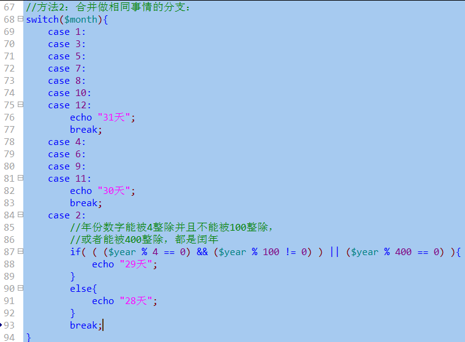

### for循环结构

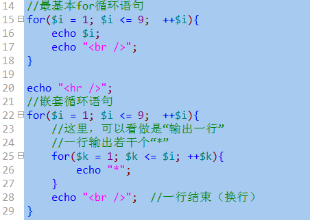
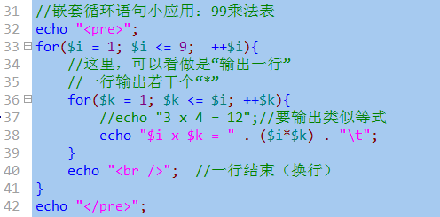