# 流程控制

## 循环结构

## 循环的中断

循环中，有两种中断语句可以使用：

- break：
用于完全终止某个循环，让执行流程进入到循环语句后面的语句；

- continue：
用于停止当前正在进行的当次循环，而进入到循环的“下一次”过程中去（通常就是循环的开始位置）；

在php中，该两个循环有更强的能力：中断“更多层”的循环，语法如下：
```php
break  正整数n;                            //比如1,2，3；
continue  正整数n;             //比如1,2，3；
```

循环的“层”，指的是从当前中断语句（break或continue）算起，往代码的“外部”数循环的个数，就是层数。比如：
```php
for(...){                  //循环1
    for(...){                  //循环2
        for(...){                  //循环3
            break  2;  //此时会中断循环2：其实指中断“2层”
                       //对此break语句，循环3是其“第一层”，循环2是其第2层，循环1是其第3层
        }
    contine  2;          //此时会中断循环12：其实指中断“2层”
                        //对此contine语句，循环2是其“第1层”，循环1是其第2层，
    }
}
```

## 流程控制的替代语法

* if ( ... ) :   。。。。  endif;
* if ( ... ) :  。。。else: 。。。 endif;
* if ( ... ): 。。。elseif( ... ) : 。。。 elseif( ... ): 。。。 else: 。。。 endif;
* switch( ... ) : case ... case ... endSwitch;
* while(...): 。。。endwhile;
* for(...; ...; ...): 。。。 endfor;

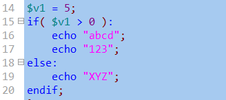
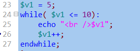

## 控制脚本执行顺序

- die(字符串)/exit(字符串)

输出该字符串后，立即停止php的执行！即后续程序不再执行，包括后续的其他所有php和html代码部分。

exit是die的同义词。他们也可以不加字符串，而是直接停止。

## sleep($n)

让程序停止运行指定的秒数。然后等待过了那个时间后，就继续运行！

注意，其单位是“秒”；

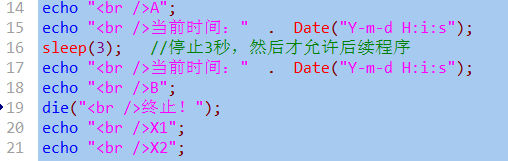

# 文件加载

## 综述和基本语法：

1. 有4个文件加载语句：include, require, include_once, require_once
2. 他们的使用形式完全一样，比如： include  “要加载的文件路径”; 或： include (“要加载的文件路径”);
3. 他们的含义也几乎完全一样：只是在加载失败时或是否重复加载这种情况，有所不同。
4. 他们可以载入php或html文件；

## 文件加载的路径问题：

前提说明：以下的说明举例，以include为例，也适用于其他3个加载语句；

有3中路径形式可以使用：

### 相对路径
是相对于当前网页文件所在的位置来定位某个被加载的文件位置，主要依赖以下2个特殊的路径符号：
- ./         ：表示当前位置，即当前网页文件所在的位置（目录）；
- ../        ：表示上一级位置，即当前网页文件所在的位置的上一级位置（目录）；

我们需要用这2个符号来表达位置信息，比如：
```php
include  ‘./page1.php’;      //表示当前网页文件所在位置的page1.php文件；
include  ‘../page2.php’;
include  ‘../ab/page3.html’;
```

### 绝对路径：

绝对路径又分2种：

- 本地绝对路径：

    比如：
    ```php
    include  “c:/d1/d2/p1.php”;
    include  “f:/f1/abc/p2.html”;
    ```
特别注意：我们其实几乎都不应该在代码中直接写这种本地绝对路径！
但，其实我们这种本地绝对路径的写法是很常用的！
那怎么做？示例如下：

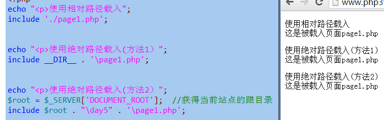


- 网络绝对路径：

    比如：
    ```php
    include  “http://www.abc.com/p1.php”;
    include  “http://www.baidu.com/index.php”;
    ```

- 无路径”（不推荐）：

    形式就是没有给出路径信息，而只给出文件名，我们不推荐。

    比如：
    ```php
    include  ‘page1.php’; //此时通常其实php语言引擎会在当前网页目录下找该文件
    ```

## 文件载入和执行过程详解

* 第1步：从include语句处退出php脚本模式（进入html代码模式）
* 第2步：载入include语句所设定的文件中的代码，并执行之（如同在当前文件中一样）
* 第3步：退出html模式重新进入php脚本模式，继续执行之后的代码

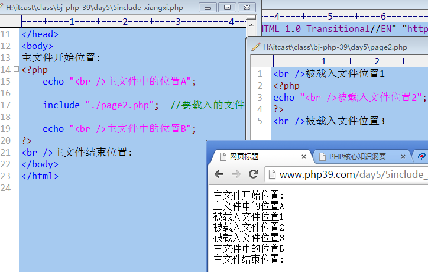

相当于:

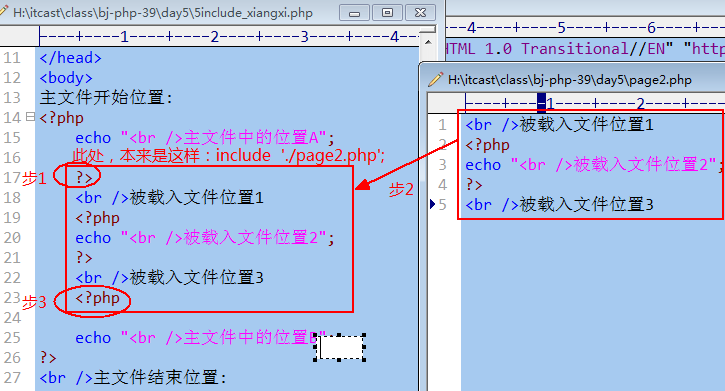

## 4个载入语句的区别

### include和require的区别：

* include载入文件失败时（即没有找到该文件），报一个“提示错误”，然后继续执行后续代码；
* requre载入文件失败时，报错并立即终止执行。
* 通常，require用于在程序中，后续的代码依赖于载入的文件的时候。

### include_once和require_once的区别：

* 同include和require的区别：


### include和include_once的区别：

* include载入的文件不判断是否重复，只要有include语句，就会载入一次——即此时可能导致重复载入。

* include_once载入的文件会有内部判断机制是否“前面代码”已经载入过，如果载入过，就不再载入。

### require和require_once的区别：

* 同include和include_once的区别。

## 在被载入文件中return语句的作用

* 一个载入语句，如果载入成功，其实是有返回值的，为1，如果载入失败，则返回的是false。
（虽然我们通常不去使用该返回值）。

    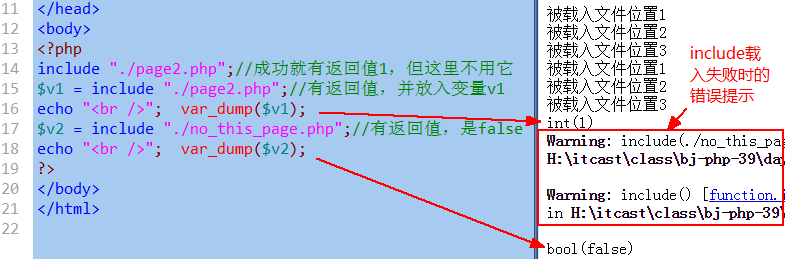

    但是，如果被载入文件中有return语句，此时就有另外的机制和作用：

* return语句此时的作用是终止载入过程——该return语句的后续被载入文件的代码不再载入。

    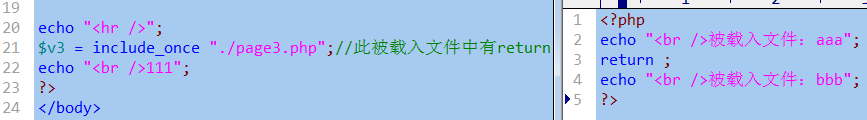

    运行结果为

    

* return语句也可以用于该被载入文件载入时返回一个数据，形式为：return  XX数据；

    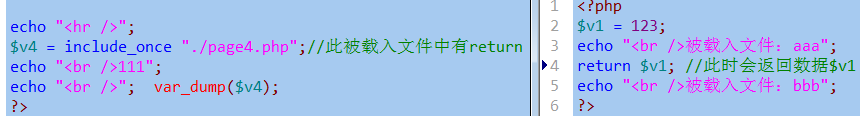

    运行结果为：

    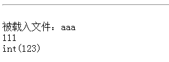

# 错误处理

## 错误的分类

通常分3种：

- 语法错误：

    程序运行之前，都要先检查语法。如果语法有错误，就会立即报错，并且不会去执行程序。

- 运行时错误：

    就是在程序语法检查通过后，开始运行程序并在此过程中遇到的错误。常见的有3中：
    * 提示性错误：
    * 警告性错误：
    * 致命错误：

- 逻辑错误：

    指的是，程序本身可以正常执行，没有报错——但“计算结果”却错了。

## 错误的分级

php语言中，将各种错误进行了不同级别的分类归纳，并形成大约有10几个级别的错误，这就是技术层面的错误分级。

每一级别的错误，都有一个“代号”，这个代号其实也就是一个系统内部的“常量而已”。比如：

系统常见错误：

* E_ERROR：                致命错误
* E_WARNING:   警告性错误
* E_NOTICE:                  提示性错误

用户可自定义的错误：

* E_USER_ERROR：             自定义致命错误
* E_USER_WARNING:                    自定义警告性错误
* E_USER_NOTICE:               自定义提示性错误

 其他：

* E_STRICT:                    严谨性语法检查错误
* E_ALL                           代表“所有错误”。

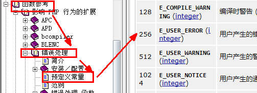

下面来看看这些错误代号的实际值：

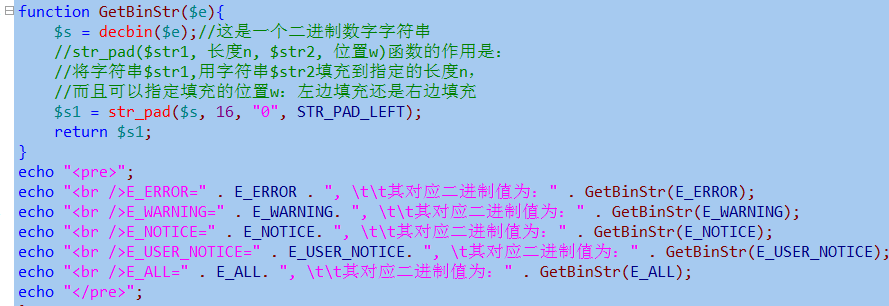

运行结果为：

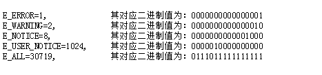

## 错误的触发

错误的触发，就是让错误“发生”。

有两种方式会触发错误：

### 系统触发

程序运行到某行代码，确实出现了某种错误，此时系统就会报错——这就是触发了系统错误。

系统触发的典型错误有这3种：
- E_NOTICE:                   提示性错误：会输出错误提示，并继续执行后续代码；

    比如使用不存在的变量或常量：

    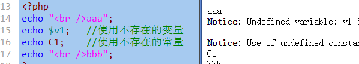


- E_WARNING:   警告性错误：会输出错误提示，并继续执行后续代码（也可能看具体情况，比如require)

    比如include载入一个不存在的文件：

    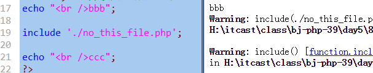

- E_ERROR：                 致命错误：导致程序无法执行后续语句；

    比如调用一个不存在的函数！

    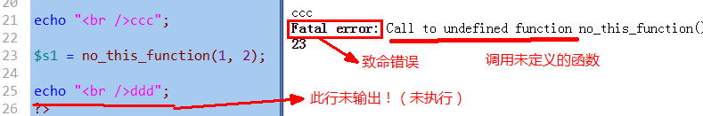

### 自定义触发：

当我们处理某些数据的时候，本来数据本身是没有错误的，但根据具体应用（业务）的需要，会要求数据满足某种条件，而该数据并不满足的时候，我们就可以在程序中“主动”去触发（创建）一个错误，以表明该数据的“非法性”。

语法形式：

trigger_error(“错误提示信息内容”,  3中用户错误代号之一);

其中触发了用户的致命错误(E_USER_ERROR）,也会终止程序的后续执行。

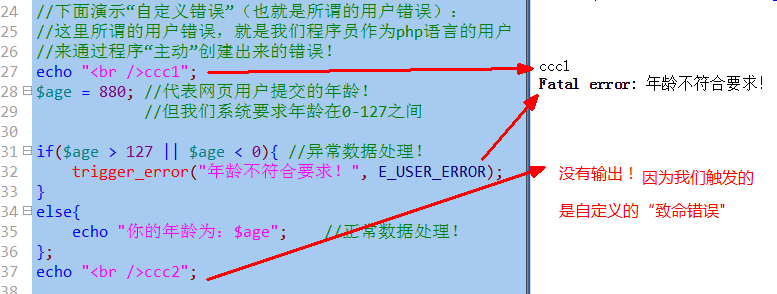

### 错误报告的显示问题

所谓错误报告，就是显示在网页上的错误提示内容！

有关错误报告，有2个问题需要处理：

### 是否显示错误报告（display_errors)：

有2种做法可以来设定是否显示：

- 做法1：

    在php.ini文件中，设定display_erros的值，为on（显示），或为off（不显示）

    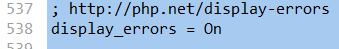

    可以修改为：

    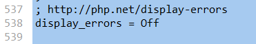

    当然，作为开发阶段，我们都应该显示错误信息。

    注意：前提条件都是我们apache已经装载了php.ini文件——这一点，需要在apache的配置文件httpd.config中加入如下一行：
PHPIniDir  “php.ini文件的了位置（路径）”
    比如：

    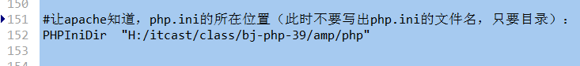

- 方法2：

    直接在php的脚本文件中设使用函数ini_set()来对其进行设置：

    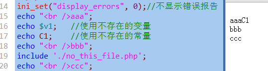

    当然，如果设置为1，就是显示！

注意：

1. 不管哪种形式，该单词是一样的：display:errors
2. 使用php.ini配置，影响的是全局（即所有php网页）；
3. 在某个脚本代码中使用ini_set()设置，就只影响该脚本代码本身——这是常用的方式。
4. 脚本中的设置优先于php.ini中的设置。

### 显示哪些级别的错误报告（error_reporting)：

显然，前提是“display_errors”设置为On(或1），表示可以显示。

显示哪些级别的错误报告，也有2个做法：

- 做法1：在php.ini文件中；

    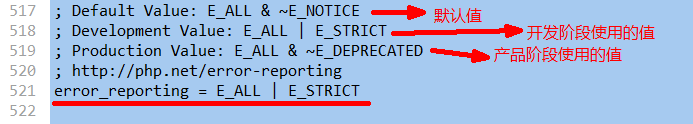

    这个值目前代表“所有错误”，都显示。

    修改为：

    

    此时就只显示E_NOTICE级别的错误

    更多示例为：

    * error_reporting = E_NOTICE | E_WARING | E_ERROR                   //显示该3种；
    * error_reporting = E_ERROR | E_USER_ERROR                                  //显示该2种严重错误

    要想代表真正的“所有错误”，应该写为：E_ERROR | E_STRICT，图示如下：

    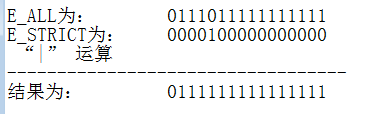

- 做法2：在当前的脚本代码中：

    跟php.ini中设置其实是一样，举一些例子如下：
    ```php
    ini_set(“error_reporting”,  E_NOTICE);       //就显示该一个级别的错误
    ini_set(“error_reporting”,  E_NOTICE | E_WARNING),        //显示2个级别
    ini_set(“error_reporting”,  E_NOTICE | E_WARNING | E_ERROR),     //显示3个级别
    ini_set(“error_reporting”,  E_ALL | E_STRICT), //这才代表显示所有错误！
    ```

## 错误日志的记录问题

错误日志其实就是错误报告，只是它会“写入文件中”，此时就称为错误日志！

也有2个问题，每个问题也有2种做法：

### 是否记录log_errors：

- php.ini中：

    log_errors = On    或 Off

- 脚本中：

    ini_set(“log_erros”,  1);   或 0

补充一句：

1. ini_set(“php配置项”， 值)； //用于脚本中设置php.ini中是某项的值。
2. $v1 = ini_get(“php配置项”)；          //用于获取php.ini中是某项的值

### 记录到哪里error_log：

一般就只有2个写法：

- 写法1：直接使用一个文件名，此时系统会自动在每个文件夹下都建立该文件名，并用其记录该文件夹下的所有网页文件发生的错误信息。

    

    然后执行一个有错误的网页，并可以观察到：

    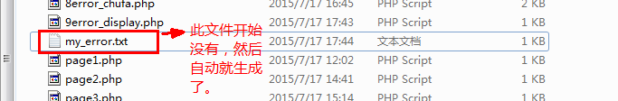

    其中的内容大约为：

    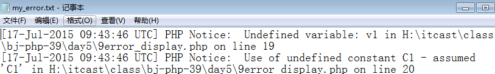

- 写法2：使用一个特殊的名字“syslog”，则此时所有错误信息都会记录到系统的“日志文件”中。

    系统日志文件在这里：控制面板》管理工具》事件查看器》window日志》应用程序：

    

    然后执行一个有错误的网页，并可以观察到：

    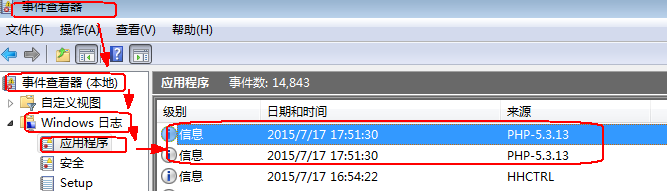

## 自定义错误处理器

- 什么叫错误处理器？

    就是一旦发生错误，用来处理该错误的一种“机器”——其实就是一个函数。

- 自定义错误处理，就是指：

    让系统不要去处理错误了，而完全由我们（开发者）来对错误进行处理：显示和记录。

- 做法，其实非常简单，就2步：

    - 第一步：

        设定要用于处理错误的函数名！

        set_error_handler(“f1”);

    - 第二步：

        去定义该函数！

        function f1(){

            //这里可以任意写代码：自然正常是去显示错误报告，和记录错误日志。
        }

    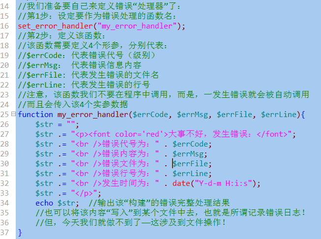