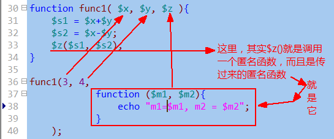

# 函数

## 函数的定义：

形式：

function  函数名 ( 【$形参1】 【，$形参2】 【，.... 】  ){

    //函数体。。。。。。
}

说明：

1. 定义时使用的形参，其实就是一个变量——只能在该函数内部使用的变量
2. 形参作为变量，其名字是“自己定义”——自然应该遵循命名规范；

## 函数的调用：

函数名（$实参1， $实参2， ..... ）；

说明：

1. 实参应该跟要调用的函数的形参“一一对应”；
2. 实参就是“数据值”，可能是直接值（比如5，”abc”），也可能是变量值(比如$v1)


## 函数调用详细过程

1. 首先，将函数调用时的实参数据，传递（赋值）给函数的形参（变量）；
2. 程序的执行流程，进入到函数内部——此时可以认为是一个跟外界“隔离” 的“独立运行空间”。
3. 在函数内部，按正常的流程顺序，执行其中的代码；
4. 直到函数结束，则退出该运行空，而返回到原来调用函数的位置，继续执行后续代码！
5. 如果在函数内部执行的过程中，有return语句，则也会立即终止函数，并回到函数调用位置。

    

## 函数的参数问题

## 函数形参的默认值问题

我们可以给一个函数定义时的形参，赋值一个“默认值”，则这个函数调用的时候，该形参对应的实参，可以不给值。


函数形参的默认值，可以只给部分形参设置默认值，但设置默认值性的形参，都要放在“右边”（后边）：


## 形参的传值问题

一句话：形参的传值问题，其实就是“变量之间的传值问题”：

其实无非就是实参变量，传值给形参变量的问题。

即：

此时，也同样有两种传值方式：
- 值传递：

    这是默认值。如果没有特别设定，参数传值都是值传递。
- 引用传递：

    需要在形参的前面加 &符号：

    

## 函数参数的数量问题

1. 通常，函数调用时的实参数量，应该跟函数定义时的形参数量保持一致。
2. 如果函数定义时，形参有默认值，则对应的实参就可以进行一定程度的省略：

    注意：省略只能从右往左进行。
3. 有一种定义和使用函数的特别形式（并不常见）：它不定义形参，而实参任意给出。

    其实，系统中也有类似的函数：，比如：
    ```php
    var_dump($v1);
    var_dump($v1, $v2, $v3);   //ok!
    ```

    可见，该函数就可以接受任意个数的实参；

    我们自己也可以定义这种函数。其实，这种函数，依赖的是以下3个系统函数来获取相应的信息，以得到实参数据的处理：

    * func_get_args();       //获取实参数据列表，成为一个数组
    * func_get_arg($i);     //获取第$i个实参数据，$i从0开始算起；
    * func_num_args(); //获取实参的数量（个数）

    下面就是例子：

    

## 函数的返回值问题

一个观念问题：

函数的返回值，不是语法规定，而是应用所需：需要就返回，不需要就无需返回。

返回值，一定是通过return语句！

形式：
```php
function 函数名(....)
{
    //.....
    return  XX数据;
}
```

注意：

return语句的作用，不管后面跟不跟数据值，都会立即终止函数的执行，返回到函数调用的位置并继续后续工作。

# 函数的其他形式：

## 可变函数

先想想可变变量：
```php
$v1 =”abc”;
$abc = 123;
echo  $$v1;       //输出123，这就是所谓的可变变量。
```
可变变量：一个变量的名字还是一个变量！

可变函数：一个函数的名字是一个变量！


演示可变函数的一个灵活性使用：


## 匿名函数

匿名函数就是没有名字的函数。

有2种形式的匿名函数：

- 形式1：

    将一个匿名函数“赋值”给一个变量——此时该变量就代表该匿名函数了！

    

- 形式2：

    是直接将一个匿名函数，当做“实参”来使用！——即调用“别的函数A”的时候，使用一个匿名函数来当做实参。自然，在该函数A中，也就应该对该匿名函数当做一个函数来用！

    

    

# 变量的作用域问题

变量的作用域，就是指：一个变量，在什么范围中可以使用的情况。

php中，有3中变量作用域：

- 局部作用域：

    就是指一个函数的内部范围。

    对应这样的变量，就称为“局部变量”；
- 超全局作用域：

    就是指所有的代码范围。

    对应这样的变量，就称为“超全局变量”；

    其实只有系统预定义的几个：$_GET, $_POST, $_SERVER, $_REQUEST, $GLOBALS, $_SESSION, $_COOKIE, $_FILES
- 全局作用域：

    就是不在函数内部的范围——函数外部。

    对应这样的变量，就称为“全局变量”；


通常，

1，全局范围不能访问局部变量；


2，局部范围不能访问全局变量；


3，函数内部的变量（局部变量），通常在函数调用执行结束后，就被“销毁”了。

4，但有一种局部变量，在函数调用结束后不被销毁：它叫做“静态变量”；

使用形式：
```php
function 函数名 (....){
    static  $变量名  =  初始值；          //这就是静态变量！
....
}
```


## 如果在局部作用域使用（访问）全局变量？（常见需求）

有2种做法：

- 做法1：

    使用global关键字来实现：

    

- 做法2：

    使用$GLOBALS超全局变量来实现：

    

    但，如果我们对$GLOBALS变量的某个单元（也即下标）进行unset，则其就会完全对应销毁该变量。

    这是因为，$GLOBALS对全局变量的使用可以看做是全局变量的另一种语法形式而已，而不是“引用关系”，举例如下：

    

## 有关函数的系统函数：

- function_exists()：判断一个函数是否被定义过。其中使用的参数为“函数名”：

    
- func_get_arg($i)：  获取第i个实参值
- func_get_args()：   获取所有实参（结果是一个数组）
- func_num_args()： 获取所有实参的个数。


## 其他系统函数：

自己会查，并需要去查：

- 字符串函数：
    * 输出与格式化：echo , print, printf, print_r, var_dump.
    * 字符串去除与填充：trim, ltrim, rtrim, str_pad
    * 字符串连接与分割：implode, join， explode, str_split
    * 字符串截取：substr, strchr, strrchr,
    * 字符串替换：str_replace, substr_replace
    * 字符串长度与位置： strlen, strpos, strrpos,
    * 字符转换：strtolower, strtoupper, lcfirst, ucfirst, ucwords
    * 特殊字符处理：nl2br, addslashes, htmlspecialchars, htmlspecialchars_decode,
- 时间函数：
    * time, microtime, mktime, date, idate, strtotime, date_add, date_diff, date_default_timezone_set, date_default_timezone_get
- 数学函数：
    * max, min, round, ceil, floor, abs, sqrt, pow, round, rand

