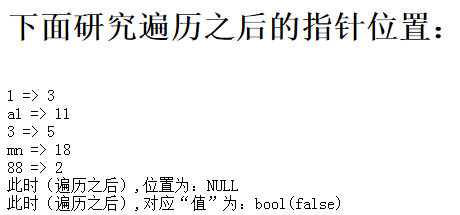

# 数组

## 数组基础
- 含义：

    数组就是一系列数据的集合体，他们按设定的顺序排列为一个“链的形状”。

    注意：php中的数组单元的顺序，跟下标无关！

## 数组定义（赋值）：

```php
$arr1 = array(3,  11,  5,  18,  2  );//这是最常见的数组，索引数组,下标为“默认下标”，就是从0开始的整数；
$arr2 = array(“a”=>3,  “bb”=>11,  “cc123”=>5,  ‘d1’=>18,  ‘xyz’=>2  ); //关联数组，下标为字符串，常见
$arr3 = array(1=>3,  10=>11,  3=>5,  0=>18,  88=>2  ); //下标可以人为给定；
$arr4 = array(1=>3,  ‘a1’=>11,  3=>5,  ‘mn’=>18,  88=>2  ); //下标可以数字和字符串混合使用；
$arr5 = array(5=>3,  11,  3=>5,  ‘mn’=>18,  2  ); //有指定下标，也有“自动下标”，
//此时下标为：5，6，3，”mn”, 7
//可见，自动下标为“前面最大数字下标+1”
$arr6 = array(5=>3,  7.7=>11,  3=>5,  ‘mn’=>18,  2  ); //此时下标为：5，7，3，”mn”, 8
$arr7 = array(5=>3,  true=>11,  false=>5,  ‘mn’=>18,  2  ); //此时下标为：5，1，0，”mn”, 6
$arr8 = array(1=>3,  3=>33,  true=>11,  ); //此时下标为：1，3,其对应值为：11, 33
//下标如果有重复，后面的值覆盖前面的值；
$arr9 = array(1=>3,  -3=>33,  11,  ); //此时下标为：1， -3， 2，注意：最后一个逗号“可以有”。
```

其他一些形式：
```php
$arr10[] = 3;
$arr10[] = 11;
$arr10[] = 5;        //该数组下标为0,1,2，常规情况
$arr11[‘a’] = 3;
$arr11[‘bb’] = 11;
$arr11[‘cc123’] = 5;    //该数组下标为’a’,’bb’,’cc123’，常规情况
$arr12[1] = 3;
$arr12[] = 11;      //此时下标为2
$arr13[‘cc123’] = 5;    //该数组下标为1,2,’cc123’
```

特别注意：php中，数组单元的顺序，是由其“放入”顺序决定，而不是下标。

## 数组取值：
```php
$v1 = $arr1[0];
$i = 3;
$v2 = $arr1[$i];  //取得数组下标为3的单元的值；
```
总体上，可以将取得一个数组的单元的值，看组取得一个变量的值完全一样！！！

# 数组的分类

## 1.按键值关系来分：

- 索引数组：通常认为，如果一个数组的下标是严格按照从0开始的连续的整数作为下标，则称其为索引数组——就是类似js数组的下标。例如：
```php
$arr1 = array(3,  11,  5,  18,  2  );//这是最常见的数组，下标为“默认下标”，就是从0开始的整数；
```

- 关联数组：通常认为，如果一个数组的下标都是一个“字符串”并一定程度上表名了该单元的“含义”，则称为关联数组，例如：
```php
$conf = array(
    ‘host’=>”localhost”  ,
    ‘port’=>3306  ,
    ‘username’=>’root’  ,
    ‘password’ => ‘123’  ,
);
```

- 混合数组：既有数字下标，也有字符下标的情况：
```php
$arr4 = array(1=>3,  ‘a1’=>11,  3=>5,  ‘mn’=>18,  88=>2  ); //下标可以数字和字符串混合使用；
```


## 2.按数组的维数（复杂程度）分：

- 一维数组：
```php
$a = array(1, 11, 111);
$b = array(2, 22, 222);
$c = array(3, 33, 333);
```

- 二维数组：
```php
$dd = array(
array(1, 11, 111),
array(2, 22, 222),
array(3, 33, 333)
);
```

- 多维数组：无非就是继续里面再用数组代替。

# 数组的基本使用

## 1.求一个一维数组的平均值：


## 2.求一个二维数组的平均值：


## 3.求一个一维数组的最大值：


## 4.求交换一个一维数组的最大值和最小值的位置：


有关数组的交换，再说两句：
```php
$a = array( 3,  11,  5,   7,  20,  18);                //下标是0,1,2,3,4,5
```

- 需求1：交换数组第0项和第3项：
    ```php
    $v1 = $a[0];
    $v2 = $a[3];
    $t = $v1;
    $v1 = $v2;
    $v2 = $t;              //这种做法根本不行，因为v1，v2只是2个变量，跟数组没有关系了！
    ```

    正确的做法是：

    ```php
    $t = $a[0];
    $a[0] = $a[3];
    $a[3] = $t;
    ```

- 需求2：交换数组首项和末项：
    ```php
    $pos1 = 0;                       //首项的下标
    $pos2 = count($a) - 1; //最后一项的下标
    $t = $a[$pos1];
    $a[$pos1] = $a[$pos2];
    $a[$pos2] = $t;
    ```

- 需求3：交换数组最大项和最小项：
    ```php
    $pos_max = ....;   //经过一番计算得到最大项的下标；
    $pos_min = ....;    //经过一番计算得到最小项的下标
    $t = $a[$pos_max];
    $a[$pos_max] = $a[$pos_min];
    $a[$pos_min] = $t;
    ```

# 数组的遍历

- foreach基本语法
    ```php
    foreach( $数组变量名  as   【$key =>】 $value ){
        //循环体；这里可以去“使用”$key 和 value；
        //$key 和 $value 就是该遍历语句一次次取得的数组的每一个单元（项）的下标和对应值。
        //而且，它总是从数组的开头往后按顺序取数据。
    }
    ```

- 数组的指针操作及遍历原理：

首先，看看数组的一个“形象图”：

$arr4 = array(1=>3,  ‘a1’=>11,  3=>5,  ‘mn’=>18,  88=>2  );

可以将其以视觉化的方式理解为：


<table class="MsoTableGrid" border="1" cellspacing="0" cellpadding="0" style="border-collapse:collapse;mso-table-layout-alt:fixed;border:none;
 mso-border-alt:solid windowtext .5pt;mso-padding-alt:0cm 5.4pt 0cm 5.4pt">
 <tbody><tr style="mso-yfti-irow:0;mso-yfti-firstrow:yes">
  <td width="83" valign="top" style="width:83.0pt;border:solid windowtext 1.0pt;
  mso-border-alt:solid windowtext .5pt;background:#FFCC99;padding:0cm 5.4pt 0cm 5.4pt">
  <p class="MsoNormal"><span style="font-family:宋体;mso-ascii-font-family:&quot;Times New Roman&quot;;
  mso-hansi-font-family:&quot;Times New Roman&quot;">数组下标：</span></p>
  </td>
  <td width="83" valign="top" style="width:83.0pt;border:solid windowtext 1.0pt;
  border-left:none;mso-border-left-alt:solid windowtext .5pt;mso-border-alt:
  solid windowtext .5pt;background:#FFCC99;padding:0cm 5.4pt 0cm 5.4pt">
  <p class="MsoNormal"><span lang="EN-US">1</span></p>
  </td>
  <td width="83" valign="top" style="width:83.0pt;border:solid windowtext 1.0pt;
  border-left:none;mso-border-left-alt:solid windowtext .5pt;mso-border-alt:
  solid windowtext .5pt;background:#FFCC99;padding:0cm 5.4pt 0cm 5.4pt">
  <p class="MsoNormal"><span lang="EN-US">“a1”</span></p>
  </td>
  <td width="83" valign="top" style="width:83.0pt;border:solid windowtext 1.0pt;
  border-left:none;mso-border-left-alt:solid windowtext .5pt;mso-border-alt:
  solid windowtext .5pt;background:#FFCC99;padding:0cm 5.4pt 0cm 5.4pt">
  <p class="MsoNormal"><span lang="EN-US">3</span></p>
  </td>
  <td width="83" valign="top" style="width:83.05pt;border:solid windowtext 1.0pt;
  border-left:none;mso-border-left-alt:solid windowtext .5pt;mso-border-alt:
  solid windowtext .5pt;background:#FFCC99;padding:0cm 5.4pt 0cm 5.4pt">
  <p class="MsoNormal"><span lang="EN-US">“mn”</span></p>
  </td>
  <td width="83" valign="top" style="width:83.05pt;border:solid windowtext 1.0pt;
  border-left:none;mso-border-left-alt:solid windowtext .5pt;mso-border-alt:
  solid windowtext .5pt;background:#FFCC99;padding:0cm 5.4pt 0cm 5.4pt">
  <p class="MsoNormal"><span lang="EN-US">88</span></p>
  </td>
 </tr>
 <tr style="mso-yfti-irow:1;mso-yfti-lastrow:yes">
  <td width="83" valign="top" style="width:83.0pt;border:solid windowtext 1.0pt;
  border-top:none;mso-border-top-alt:solid windowtext .5pt;mso-border-alt:solid windowtext .5pt;
  padding:0cm 5.4pt 0cm 5.4pt">
  <p class="MsoNormal"><span style="font-family:宋体;mso-ascii-font-family:&quot;Times New Roman&quot;;
  mso-hansi-font-family:&quot;Times New Roman&quot;">对应数据：</span></p>
  </td>
  <td width="83" valign="top" style="width:83.0pt;border-top:none;border-left:none;
  border-bottom:solid windowtext 1.0pt;border-right:solid windowtext 1.0pt;
  mso-border-top-alt:solid windowtext .5pt;mso-border-left-alt:solid windowtext .5pt;
  mso-border-alt:solid windowtext .5pt;padding:0cm 5.4pt 0cm 5.4pt">
  <p class="MsoNormal"><span lang="EN-US">8</span></p>
  </td>
  <td width="83" valign="top" style="width:83.0pt;border-top:none;border-left:none;
  border-bottom:solid windowtext 1.0pt;border-right:solid windowtext 1.0pt;
  mso-border-top-alt:solid windowtext .5pt;mso-border-left-alt:solid windowtext .5pt;
  mso-border-alt:solid windowtext .5pt;padding:0cm 5.4pt 0cm 5.4pt">
  <p class="MsoNormal"><span lang="EN-US">11</span></p>
  </td>
  <td width="83" valign="top" style="width:83.0pt;border-top:none;border-left:none;
  border-bottom:solid windowtext 1.0pt;border-right:solid windowtext 1.0pt;
  mso-border-top-alt:solid windowtext .5pt;mso-border-left-alt:solid windowtext .5pt;
  mso-border-alt:solid windowtext .5pt;padding:0cm 5.4pt 0cm 5.4pt">
  <p class="MsoNormal"><span lang="EN-US">5</span></p>
  </td>
  <td width="83" valign="top" style="width:83.05pt;border-top:none;border-left:
  none;border-bottom:solid windowtext 1.0pt;border-right:solid windowtext 1.0pt;
  mso-border-top-alt:solid windowtext .5pt;mso-border-left-alt:solid windowtext .5pt;
  mso-border-alt:solid windowtext .5pt;padding:0cm 5.4pt 0cm 5.4pt">
  <p class="MsoNormal"><span lang="EN-US">18</span></p>
  </td>
  <td width="83" valign="top" style="width:83.05pt;border-top:none;border-left:
  none;border-bottom:solid windowtext 1.0pt;border-right:solid windowtext 1.0pt;
  mso-border-top-alt:solid windowtext .5pt;mso-border-left-alt:solid windowtext .5pt;
  mso-border-alt:solid windowtext .5pt;padding:0cm 5.4pt 0cm 5.4pt">
  <p class="MsoNormal"><span lang="EN-US">2</span></p>
  </td>
 </tr>
</tbody></table>


其中，该箭头，就是数组内部的所谓“指针”——注意，不可见，不可输出，只是一种辅助理解的图形！

说明：
1. 该箭头，就是数组内部的所谓“指针”
2. 默认情况下，该指针指向数组的第一个单元。
3. 数组的有关单元的操作，如果没有指定下标，则就是针对该指针指向的单元的操作。
4. 所谓遍历，其实就是一次次取得当前单元的键和值，并放入对应的变量$key, $value,然后移动指针到下一个单元。

则，数组，作为一个“总体数据单位”，有如下指针操作函数可以使用：
1. $v1 = current($数组);              //获得数组的当做指针所在单元的“值”；
2. $v2 = key($数组);                                //获得数组的当做指针所在单元的“键”（下标）；
3. $v3 = next($数组);                              //先将数组的指针移向下（后）一个单元，然后取得该新单元的值；
4. $v4 = prev($数组);                              //先将数组的指针移向上（前）一个单元，然后取得该新单元的值；
5. $v5 = end($数组);                                //先将数组的指针直接移向最后一个单元，然后取得该新单元的值；
6. $v6 = reset($数组);                               //先将数组的指针直接移向第一个单元，然后取得该新单元的值；


- foreache遍历流程原理图：
```php
foreach( $数组变量名  as   $key => $value ){
    //循环体；这里可以去“使用”$key 和 value；
    //$key 和 $value 就是该遍历语句一次次取得的数组的每一个单元（项）的下标和对应值。
    //而且，它总是从数组的开头往后按顺序取数据。
}
```

其基本原理示意图如下：


输出结果为：



可见：遍历之后，指针已经超出数组合理位置了。

## 使用for和next遍历数组

注意：对php数组，往往不能单纯使用for循环进行遍历。

或者说：php中，使用for循环只能循环“下标为连续的纯整数数组”；


结果：


## each()函数的使用

each()函数的作用：先取得一个数组的“当前单元”的下标和值（并放入一个数组），然后将指针移到下一个单元。

使用形式：

$a  =  each($数组名);      //此时$a就是一个数组了


## list()“函数”的使用：

list()函数用于一次性取得一个数组中从0开始的数字下标的多个单元的值！

- 形式：

    list($变量1，$变量2，$变量3， .. ） = $数组；

- 作用：

    上述一行代码相当于如下代码：

    ```
    $变量1 = $数组[0];
    $变量2 = $数组[1];
    $变量3 = $数组[2];
    ........
    ```
注意：这里变量的个数，要跟该数组的数字下标的单元对应，如果某个变量对应的该数字下标不存在，就会报错！


## while+each()+list()遍历数组


## 数组变量的一些细节
- foreach也是正常的循环语法结构，可以有break和continue等操作。
- 遍历过程中值变量默认的传值方式是值传递。

    

    结果为：

    

- 遍历过程中值变量可以人为设定为引用传递：foreach($arr as $key => &$value){ ... }

    

    结果为：

    

- foreach默认是原数组上进行遍历。但如果在遍历过程中对数组进行了某种修改或某种指针性操作，则会复制数组后在复制的数组上继续遍历循环（原数组保持不变）。

    以下演示的是“foreach默认是原数组上进行遍历”的效果：

    

    然后，再演示：在某些情况下（修改或指针操作），不是在原数组身上进行遍历。

    

    结果为：

    

- foreach中如果值变量是引用传递，则无论如何都是在原数组上进行。

    

    


# 数组排序

- 排序函数简单演示（应用级别）：

    

    结果为：

    

    

    结果为：

    

- 更多排序函数，请查手册：

    - 手册》函数参考》与变量有关的扩展》数组》Sorting Arrays

    


# 冒泡排序算法

- 演示数组为：

    $a = array(9,  3,  5,  8,  2,  7);      //下标为0,1,2,3,4,5

- 演算过程描述：

    从数组的左边开始，依次两两比较相邻的2个数据的大小，如果发现左边的比右边的大，则将他们进行交换。这样进行“一趟”之后，必然可以确定最大的一个数据放在最右边。

    按此方式，对“剩余的数据”继续进行下一趟，则有会确定这些剩余数据耳朵最大值放在剩余位置的最右边。

演示：

<table class="MsoTableGrid" border="1" cellspacing="0" cellpadding="0" style="margin-left:-5.65pt;border-collapse:collapse;mso-table-layout-alt:fixed;
 border:none;mso-border-alt:solid windowtext .5pt;mso-padding-alt:0cm 5.4pt 0cm 5.4pt">
 <tbody><tr style="mso-yfti-irow:0;mso-yfti-firstrow:yes">
  <td width="71" valign="top" style="width:71.15pt;border:solid windowtext 1.0pt;
  mso-border-alt:solid windowtext .5pt;padding:0cm 5.4pt 0cm 5.4pt">
  <p class="MsoNormal"><span style="font-family:宋体;mso-ascii-font-family:&quot;Times New Roman&quot;;
  mso-hansi-font-family:&quot;Times New Roman&quot;">原始数组：</span></p>
  </td>
  <td width="71" valign="top" style="width:71.15pt;border:solid windowtext 1.0pt;
  border-left:none;mso-border-left-alt:solid windowtext .5pt;mso-border-alt:
  solid windowtext .5pt;padding:0cm 5.4pt 0cm 5.4pt">
  <p class="MsoNormal"><span lang="EN-US">9</span></p>
  </td>
  <td width="71" valign="top" style="width:71.15pt;border:solid windowtext 1.0pt;
  border-left:none;mso-border-left-alt:solid windowtext .5pt;mso-border-alt:
  solid windowtext .5pt;padding:0cm 5.4pt 0cm 5.4pt">
  <p class="MsoNormal"><span lang="EN-US">3</span></p>
  </td>
  <td width="71" valign="top" style="width:71.15pt;border:solid windowtext 1.0pt;
  border-left:none;mso-border-left-alt:solid windowtext .5pt;mso-border-alt:
  solid windowtext .5pt;padding:0cm 5.4pt 0cm 5.4pt">
  <p class="MsoNormal"><span lang="EN-US">5</span></p>
  </td>
  <td width="71" valign="top" style="width:71.15pt;border:solid windowtext 1.0pt;
  border-left:none;mso-border-left-alt:solid windowtext .5pt;mso-border-alt:
  solid windowtext .5pt;padding:0cm 5.4pt 0cm 5.4pt">
  <p class="MsoNormal"><span lang="EN-US">8</span></p>
  </td>
  <td width="71" valign="top" style="width:71.15pt;border:solid windowtext 1.0pt;
  border-left:none;mso-border-left-alt:solid windowtext .5pt;mso-border-alt:
  solid windowtext .5pt;padding:0cm 5.4pt 0cm 5.4pt">
  <p class="MsoNormal"><span lang="EN-US">2</span></p>
  </td>
  <td width="71" valign="top" style="width:71.2pt;border:solid windowtext 1.0pt;
  border-left:none;mso-border-left-alt:solid windowtext .5pt;mso-border-alt:
  solid windowtext .5pt;padding:0cm 5.4pt 0cm 5.4pt">
  <p class="MsoNormal"><span lang="EN-US">7</span></p>
  </td>
 </tr>
 <tr style="mso-yfti-irow:1">
  <td width="71" valign="top" style="width:71.15pt;border:solid windowtext 1.0pt;
  border-top:none;mso-border-top-alt:solid windowtext .5pt;mso-border-alt:solid windowtext .5pt;
  padding:0cm 5.4pt 0cm 5.4pt">
  <p class="MsoNormal"><span style="font-family:宋体;mso-ascii-font-family:&quot;Times New Roman&quot;;
  mso-hansi-font-family:&quot;Times New Roman&quot;">第</span><span lang="EN-US">1</span><span style="font-family:宋体;mso-ascii-font-family:&quot;Times New Roman&quot;;mso-hansi-font-family:
  &quot;Times New Roman&quot;">趟后：</span></p>
  </td>
  <td width="71" valign="top" style="width:71.15pt;border-top:none;border-left:
  none;border-bottom:solid windowtext 1.0pt;border-right:solid windowtext 1.0pt;
  mso-border-top-alt:solid windowtext .5pt;mso-border-left-alt:solid windowtext .5pt;
  mso-border-alt:solid windowtext .5pt;padding:0cm 5.4pt 0cm 5.4pt">
  <p class="MsoNormal"><span lang="EN-US">3</span></p>
  </td>
  <td width="71" valign="top" style="width:71.15pt;border-top:none;border-left:
  none;border-bottom:solid windowtext 1.0pt;border-right:solid windowtext 1.0pt;
  mso-border-top-alt:solid windowtext .5pt;mso-border-left-alt:solid windowtext .5pt;
  mso-border-alt:solid windowtext .5pt;padding:0cm 5.4pt 0cm 5.4pt">
  <p class="MsoNormal"><span lang="EN-US">5</span></p>
  </td>
  <td width="71" valign="top" style="width:71.15pt;border-top:none;border-left:
  none;border-bottom:solid windowtext 1.0pt;border-right:solid windowtext 1.0pt;
  mso-border-top-alt:solid windowtext .5pt;mso-border-left-alt:solid windowtext .5pt;
  mso-border-alt:solid windowtext .5pt;padding:0cm 5.4pt 0cm 5.4pt">
  <p class="MsoNormal"><span lang="EN-US">8</span></p>
  </td>
  <td width="71" valign="top" style="width:71.15pt;border-top:none;border-left:
  none;border-bottom:solid windowtext 1.0pt;border-right:solid windowtext 1.0pt;
  mso-border-top-alt:solid windowtext .5pt;mso-border-left-alt:solid windowtext .5pt;
  mso-border-alt:solid windowtext .5pt;padding:0cm 5.4pt 0cm 5.4pt">
  <p class="MsoNormal"><span lang="EN-US">2</span></p>
  </td>
  <td width="71" valign="top" style="width:71.15pt;border-top:none;border-left:
  none;border-bottom:solid windowtext 1.0pt;border-right:solid windowtext 1.0pt;
  mso-border-top-alt:solid windowtext .5pt;mso-border-left-alt:solid windowtext .5pt;
  mso-border-alt:solid windowtext .5pt;padding:0cm 5.4pt 0cm 5.4pt">
  <p class="MsoNormal"><span lang="EN-US">7</span></p>
  </td>
  <td width="71" valign="top" style="width:71.2pt;border-top:none;border-left:none;
  border-bottom:solid windowtext 1.0pt;border-right:solid windowtext 1.0pt;
  mso-border-top-alt:solid windowtext .5pt;mso-border-left-alt:solid windowtext .5pt;
  mso-border-alt:solid windowtext .5pt;background:#FFCC99;padding:0cm 5.4pt 0cm 5.4pt">
  <p class="MsoNormal"><span lang="EN-US">9</span></p>
  </td>
 </tr>
 <tr style="mso-yfti-irow:2">
  <td width="71" valign="top" style="width:71.15pt;border:solid windowtext 1.0pt;
  border-top:none;mso-border-top-alt:solid windowtext .5pt;mso-border-alt:solid windowtext .5pt;
  padding:0cm 5.4pt 0cm 5.4pt">
  <p class="MsoNormal"><span style="font-family:宋体;mso-ascii-font-family:&quot;Times New Roman&quot;;
  mso-hansi-font-family:&quot;Times New Roman&quot;">第</span><span lang="EN-US">2</span><span style="font-family:宋体;mso-ascii-font-family:&quot;Times New Roman&quot;;mso-hansi-font-family:
  &quot;Times New Roman&quot;">趟后：</span></p>
  </td>
  <td width="71" valign="top" style="width:71.15pt;border-top:none;border-left:
  none;border-bottom:solid windowtext 1.0pt;border-right:solid windowtext 1.0pt;
  mso-border-top-alt:solid windowtext .5pt;mso-border-left-alt:solid windowtext .5pt;
  mso-border-alt:solid windowtext .5pt;padding:0cm 5.4pt 0cm 5.4pt">
  <p class="MsoNormal"><span lang="EN-US">3</span></p>
  </td>
  <td width="71" valign="top" style="width:71.15pt;border-top:none;border-left:
  none;border-bottom:solid windowtext 1.0pt;border-right:solid windowtext 1.0pt;
  mso-border-top-alt:solid windowtext .5pt;mso-border-left-alt:solid windowtext .5pt;
  mso-border-alt:solid windowtext .5pt;padding:0cm 5.4pt 0cm 5.4pt">
  <p class="MsoNormal"><span lang="EN-US">5</span></p>
  </td>
  <td width="71" valign="top" style="width:71.15pt;border-top:none;border-left:
  none;border-bottom:solid windowtext 1.0pt;border-right:solid windowtext 1.0pt;
  mso-border-top-alt:solid windowtext .5pt;mso-border-left-alt:solid windowtext .5pt;
  mso-border-alt:solid windowtext .5pt;padding:0cm 5.4pt 0cm 5.4pt">
  <p class="MsoNormal"><span lang="EN-US">2</span></p>
  </td>
  <td width="71" valign="top" style="width:71.15pt;border-top:none;border-left:
  none;border-bottom:solid windowtext 1.0pt;border-right:solid windowtext 1.0pt;
  mso-border-top-alt:solid windowtext .5pt;mso-border-left-alt:solid windowtext .5pt;
  mso-border-alt:solid windowtext .5pt;padding:0cm 5.4pt 0cm 5.4pt">
  <p class="MsoNormal"><span lang="EN-US">7</span></p>
  </td>
  <td width="71" valign="top" style="width:71.15pt;border-top:none;border-left:
  none;border-bottom:solid windowtext 1.0pt;border-right:solid windowtext 1.0pt;
  mso-border-top-alt:solid windowtext .5pt;mso-border-left-alt:solid windowtext .5pt;
  mso-border-alt:solid windowtext .5pt;background:#FFCC99;padding:0cm 5.4pt 0cm 5.4pt">
  <p class="MsoNormal"><span lang="EN-US">8</span></p>
  </td>
  <td width="71" valign="top" style="width:71.2pt;border-top:none;border-left:none;
  border-bottom:solid windowtext 1.0pt;border-right:solid windowtext 1.0pt;
  mso-border-top-alt:solid windowtext .5pt;mso-border-left-alt:solid windowtext .5pt;
  mso-border-alt:solid windowtext .5pt;background:#FFCC99;padding:0cm 5.4pt 0cm 5.4pt">
  <p class="MsoNormal"><span lang="EN-US">9</span></p>
  </td>
 </tr>
 <tr style="mso-yfti-irow:3">
  <td width="71" valign="top" style="width:71.15pt;border:solid windowtext 1.0pt;
  border-top:none;mso-border-top-alt:solid windowtext .5pt;mso-border-alt:solid windowtext .5pt;
  padding:0cm 5.4pt 0cm 5.4pt">
  <p class="MsoNormal"><span style="font-family:宋体;mso-ascii-font-family:&quot;Times New Roman&quot;;
  mso-hansi-font-family:&quot;Times New Roman&quot;">第</span><span lang="EN-US">3</span><span style="font-family:宋体;mso-ascii-font-family:&quot;Times New Roman&quot;;mso-hansi-font-family:
  &quot;Times New Roman&quot;">趟后：</span></p>
  </td>
  <td width="71" valign="top" style="width:71.15pt;border-top:none;border-left:
  none;border-bottom:solid windowtext 1.0pt;border-right:solid windowtext 1.0pt;
  mso-border-top-alt:solid windowtext .5pt;mso-border-left-alt:solid windowtext .5pt;
  mso-border-alt:solid windowtext .5pt;padding:0cm 5.4pt 0cm 5.4pt">
  <p class="MsoNormal"><span lang="EN-US">3</span></p>
  </td>
  <td width="71" valign="top" style="width:71.15pt;border-top:none;border-left:
  none;border-bottom:solid windowtext 1.0pt;border-right:solid windowtext 1.0pt;
  mso-border-top-alt:solid windowtext .5pt;mso-border-left-alt:solid windowtext .5pt;
  mso-border-alt:solid windowtext .5pt;padding:0cm 5.4pt 0cm 5.4pt">
  <p class="MsoNormal"><span lang="EN-US">2</span></p>
  </td>
  <td width="71" valign="top" style="width:71.15pt;border-top:none;border-left:
  none;border-bottom:solid windowtext 1.0pt;border-right:solid windowtext 1.0pt;
  mso-border-top-alt:solid windowtext .5pt;mso-border-left-alt:solid windowtext .5pt;
  mso-border-alt:solid windowtext .5pt;padding:0cm 5.4pt 0cm 5.4pt">
  <p class="MsoNormal"><span lang="EN-US">5</span></p>
  </td>
  <td width="71" valign="top" style="width:71.15pt;border-top:none;border-left:
  none;border-bottom:solid windowtext 1.0pt;border-right:solid windowtext 1.0pt;
  mso-border-top-alt:solid windowtext .5pt;mso-border-left-alt:solid windowtext .5pt;
  mso-border-alt:solid windowtext .5pt;background:#FFCC99;padding:0cm 5.4pt 0cm 5.4pt">
  <p class="MsoNormal"><span lang="EN-US">7</span></p>
  </td>
  <td width="71" valign="top" style="width:71.15pt;border-top:none;border-left:
  none;border-bottom:solid windowtext 1.0pt;border-right:solid windowtext 1.0pt;
  mso-border-top-alt:solid windowtext .5pt;mso-border-left-alt:solid windowtext .5pt;
  mso-border-alt:solid windowtext .5pt;background:#FFCC99;padding:0cm 5.4pt 0cm 5.4pt">
  <p class="MsoNormal"><span lang="EN-US">8</span></p>
  </td>
  <td width="71" valign="top" style="width:71.2pt;border-top:none;border-left:none;
  border-bottom:solid windowtext 1.0pt;border-right:solid windowtext 1.0pt;
  mso-border-top-alt:solid windowtext .5pt;mso-border-left-alt:solid windowtext .5pt;
  mso-border-alt:solid windowtext .5pt;background:#FFCC99;padding:0cm 5.4pt 0cm 5.4pt">
  <p class="MsoNormal"><span lang="EN-US">9</span></p>
  </td>
 </tr>
 <tr style="mso-yfti-irow:4">
  <td width="71" valign="top" style="width:71.15pt;border:solid windowtext 1.0pt;
  border-top:none;mso-border-top-alt:solid windowtext .5pt;mso-border-alt:solid windowtext .5pt;
  padding:0cm 5.4pt 0cm 5.4pt">
  <p class="MsoNormal"><span style="font-family:宋体;mso-ascii-font-family:&quot;Times New Roman&quot;;
  mso-hansi-font-family:&quot;Times New Roman&quot;">第</span><span lang="EN-US">4</span><span style="font-family:宋体;mso-ascii-font-family:&quot;Times New Roman&quot;;mso-hansi-font-family:
  &quot;Times New Roman&quot;">趟后：</span></p>
  </td>
  <td width="71" valign="top" style="width:71.15pt;border-top:none;border-left:
  none;border-bottom:solid windowtext 1.0pt;border-right:solid windowtext 1.0pt;
  mso-border-top-alt:solid windowtext .5pt;mso-border-left-alt:solid windowtext .5pt;
  mso-border-alt:solid windowtext .5pt;padding:0cm 5.4pt 0cm 5.4pt">
  <p class="MsoNormal"><span lang="EN-US">2</span></p>
  </td>
  <td width="71" valign="top" style="width:71.15pt;border-top:none;border-left:
  none;border-bottom:solid windowtext 1.0pt;border-right:solid windowtext 1.0pt;
  mso-border-top-alt:solid windowtext .5pt;mso-border-left-alt:solid windowtext .5pt;
  mso-border-alt:solid windowtext .5pt;padding:0cm 5.4pt 0cm 5.4pt">
  <p class="MsoNormal"><span lang="EN-US">3</span></p>
  </td>
  <td width="71" valign="top" style="width:71.15pt;border-top:none;border-left:
  none;border-bottom:solid windowtext 1.0pt;border-right:solid windowtext 1.0pt;
  mso-border-top-alt:solid windowtext .5pt;mso-border-left-alt:solid windowtext .5pt;
  mso-border-alt:solid windowtext .5pt;background:#FFCC99;padding:0cm 5.4pt 0cm 5.4pt">
  <p class="MsoNormal"><span lang="EN-US">5</span></p>
  </td>
  <td width="71" valign="top" style="width:71.15pt;border-top:none;border-left:
  none;border-bottom:solid windowtext 1.0pt;border-right:solid windowtext 1.0pt;
  mso-border-top-alt:solid windowtext .5pt;mso-border-left-alt:solid windowtext .5pt;
  mso-border-alt:solid windowtext .5pt;background:#FFCC99;padding:0cm 5.4pt 0cm 5.4pt">
  <p class="MsoNormal"><span lang="EN-US">7</span></p>
  </td>
  <td width="71" valign="top" style="width:71.15pt;border-top:none;border-left:
  none;border-bottom:solid windowtext 1.0pt;border-right:solid windowtext 1.0pt;
  mso-border-top-alt:solid windowtext .5pt;mso-border-left-alt:solid windowtext .5pt;
  mso-border-alt:solid windowtext .5pt;background:#FFCC99;padding:0cm 5.4pt 0cm 5.4pt">
  <p class="MsoNormal"><span lang="EN-US">8</span></p>
  </td>
  <td width="71" valign="top" style="width:71.2pt;border-top:none;border-left:none;
  border-bottom:solid windowtext 1.0pt;border-right:solid windowtext 1.0pt;
  mso-border-top-alt:solid windowtext .5pt;mso-border-left-alt:solid windowtext .5pt;
  mso-border-alt:solid windowtext .5pt;background:#FFCC99;padding:0cm 5.4pt 0cm 5.4pt">
  <p class="MsoNormal"><span lang="EN-US">9</span></p>
  </td>
 </tr>
 <tr style="mso-yfti-irow:5;mso-yfti-lastrow:yes">
  <td width="71" valign="top" style="width:71.15pt;border:solid windowtext 1.0pt;
  border-top:none;mso-border-top-alt:solid windowtext .5pt;mso-border-alt:solid windowtext .5pt;
  padding:0cm 5.4pt 0cm 5.4pt">
  <p class="MsoNormal"><span style="font-family:宋体;mso-ascii-font-family:&quot;Times New Roman&quot;;
  mso-hansi-font-family:&quot;Times New Roman&quot;">第</span><span lang="EN-US">5</span><span style="font-family:宋体;mso-ascii-font-family:&quot;Times New Roman&quot;;mso-hansi-font-family:
  &quot;Times New Roman&quot;">趟后：</span></p>
  </td>
  <td width="71" valign="top" style="width:71.15pt;border-top:none;border-left:
  none;border-bottom:solid windowtext 1.0pt;border-right:solid windowtext 1.0pt;
  mso-border-top-alt:solid windowtext .5pt;mso-border-left-alt:solid windowtext .5pt;
  mso-border-alt:solid windowtext .5pt;padding:0cm 5.4pt 0cm 5.4pt">
  <p class="MsoNormal"><span lang="EN-US">2</span></p>
  </td>
  <td width="71" valign="top" style="width:71.15pt;border-top:none;border-left:
  none;border-bottom:solid windowtext 1.0pt;border-right:solid windowtext 1.0pt;
  mso-border-top-alt:solid windowtext .5pt;mso-border-left-alt:solid windowtext .5pt;
  mso-border-alt:solid windowtext .5pt;background:#FFCC99;padding:0cm 5.4pt 0cm 5.4pt">
  <p class="MsoNormal"><span lang="EN-US">3</span></p>
  </td>
  <td width="71" valign="top" style="width:71.15pt;border-top:none;border-left:
  none;border-bottom:solid windowtext 1.0pt;border-right:solid windowtext 1.0pt;
  mso-border-top-alt:solid windowtext .5pt;mso-border-left-alt:solid windowtext .5pt;
  mso-border-alt:solid windowtext .5pt;background:#FFCC99;padding:0cm 5.4pt 0cm 5.4pt">
  <p class="MsoNormal"><span lang="EN-US">5</span></p>
  </td>
  <td width="71" valign="top" style="width:71.15pt;border-top:none;border-left:
  none;border-bottom:solid windowtext 1.0pt;border-right:solid windowtext 1.0pt;
  mso-border-top-alt:solid windowtext .5pt;mso-border-left-alt:solid windowtext .5pt;
  mso-border-alt:solid windowtext .5pt;background:#FFCC99;padding:0cm 5.4pt 0cm 5.4pt">
  <p class="MsoNormal"><span lang="EN-US">7</span></p>
  </td>
  <td width="71" valign="top" style="width:71.15pt;border-top:none;border-left:
  none;border-bottom:solid windowtext 1.0pt;border-right:solid windowtext 1.0pt;
  mso-border-top-alt:solid windowtext .5pt;mso-border-left-alt:solid windowtext .5pt;
  mso-border-alt:solid windowtext .5pt;background:#FFCC99;padding:0cm 5.4pt 0cm 5.4pt">
  <p class="MsoNormal"><span lang="EN-US">8</span></p>
  </td>
  <td width="71" valign="top" style="width:71.2pt;border-top:none;border-left:none;
  border-bottom:solid windowtext 1.0pt;border-right:solid windowtext 1.0pt;
  mso-border-top-alt:solid windowtext .5pt;mso-border-left-alt:solid windowtext .5pt;
  mso-border-alt:solid windowtext .5pt;background:#FFCC99;padding:0cm 5.4pt 0cm 5.4pt">
  <p class="MsoNormal"><span lang="EN-US">9</span></p>
  </td>
 </tr>
</tbody></table>

规律描述：

1. 假设数组的数据有ｎ个。
2. 要进行比较的“趟数”为ｎ－１；
3. 每一趟要比较的数据个数都比前一趟少一个，第一趟要比较ｎ个（即比较ｎ－１次）
4. 每一次比较，如果发现“左边数据”大于“右边数据”，就对这两者进行交换位置。

代码演示如下：


- 演示数组为：
    $a = array(9,  3,  5,  8,  2,  7);      //下标为0,1,2,3,4,5
- 演算过程描述：

    求得一个数组的最大值的下标，并将这个最大值下标的单元跟最后一个单元进行交换；

    然后，继续从剩余数据中取得最大值的下标，并将这个最大值下标的单元跟剩余的最后一个单元交换

    以此类推，直到只剩下一个数据，就不用找了。

演示：

<table class="MsoTableGrid" border="1" cellspacing="0" cellpadding="0" style="margin-left:-5.65pt;border-collapse:collapse;mso-table-layout-alt:fixed;
 border:none;mso-border-alt:solid windowtext .5pt;mso-padding-alt:0cm 5.4pt 0cm 5.4pt">
 <tbody><tr style="mso-yfti-irow:0;mso-yfti-firstrow:yes">
  <td width="71" valign="top" style="width:71.15pt;border:solid windowtext 1.0pt;
  mso-border-alt:solid windowtext .5pt;padding:0cm 5.4pt 0cm 5.4pt">
  <p class="MsoNormal"><span style="font-family:宋体;mso-ascii-font-family:&quot;Times New Roman&quot;;
  mso-hansi-font-family:&quot;Times New Roman&quot;">原始数组：</span></p>
  </td>
  <td width="71" valign="top" style="width:71.15pt;border:solid windowtext 1.0pt;
  border-left:none;mso-border-left-alt:solid windowtext .5pt;mso-border-alt:
  solid windowtext .5pt;padding:0cm 5.4pt 0cm 5.4pt">
  <p class="MsoNormal"><span lang="EN-US">9</span></p>
  </td>
  <td width="71" valign="top" style="width:71.15pt;border:solid windowtext 1.0pt;
  border-left:none;mso-border-left-alt:solid windowtext .5pt;mso-border-alt:
  solid windowtext .5pt;padding:0cm 5.4pt 0cm 5.4pt">
  <p class="MsoNormal"><span lang="EN-US">3</span></p>
  </td>
  <td width="71" valign="top" style="width:71.15pt;border:solid windowtext 1.0pt;
  border-left:none;mso-border-left-alt:solid windowtext .5pt;mso-border-alt:
  solid windowtext .5pt;padding:0cm 5.4pt 0cm 5.4pt">
  <p class="MsoNormal"><span lang="EN-US">5</span></p>
  </td>
  <td width="71" valign="top" style="width:71.15pt;border:solid windowtext 1.0pt;
  border-left:none;mso-border-left-alt:solid windowtext .5pt;mso-border-alt:
  solid windowtext .5pt;padding:0cm 5.4pt 0cm 5.4pt">
  <p class="MsoNormal"><span lang="EN-US">8</span></p>
  </td>
  <td width="71" valign="top" style="width:71.15pt;border:solid windowtext 1.0pt;
  border-left:none;mso-border-left-alt:solid windowtext .5pt;mso-border-alt:
  solid windowtext .5pt;padding:0cm 5.4pt 0cm 5.4pt">
  <p class="MsoNormal"><span lang="EN-US">2</span></p>
  </td>
  <td width="71" valign="top" style="width:71.2pt;border:solid windowtext 1.0pt;
  border-left:none;mso-border-left-alt:solid windowtext .5pt;mso-border-alt:
  solid windowtext .5pt;padding:0cm 5.4pt 0cm 5.4pt">
  <p class="MsoNormal"><span lang="EN-US">7</span></p>
  </td>
 </tr>
 <tr style="mso-yfti-irow:1">
  <td width="71" valign="top" style="width:71.15pt;border:solid windowtext 1.0pt;
  border-top:none;mso-border-top-alt:solid windowtext .5pt;mso-border-alt:solid windowtext .5pt;
  padding:0cm 5.4pt 0cm 5.4pt">
  <p class="MsoNormal"><span style="font-family:宋体;mso-ascii-font-family:&quot;Times New Roman&quot;;
  mso-hansi-font-family:&quot;Times New Roman&quot;">第</span><span lang="EN-US">1</span><span style="font-family:宋体;mso-ascii-font-family:&quot;Times New Roman&quot;;mso-hansi-font-family:
  &quot;Times New Roman&quot;">趟后：</span></p>
  </td>
  <td width="71" valign="top" style="width:71.15pt;border-top:none;border-left:
  none;border-bottom:solid windowtext 1.0pt;border-right:solid windowtext 1.0pt;
  mso-border-top-alt:solid windowtext .5pt;mso-border-left-alt:solid windowtext .5pt;
  mso-border-alt:solid windowtext .5pt;padding:0cm 5.4pt 0cm 5.4pt">
  <p class="MsoNormal"><span lang="EN-US">7</span></p>
  </td>
  <td width="71" valign="top" style="width:71.15pt;border-top:none;border-left:
  none;border-bottom:solid windowtext 1.0pt;border-right:solid windowtext 1.0pt;
  mso-border-top-alt:solid windowtext .5pt;mso-border-left-alt:solid windowtext .5pt;
  mso-border-alt:solid windowtext .5pt;padding:0cm 5.4pt 0cm 5.4pt">
  <p class="MsoNormal"><span lang="EN-US">3</span></p>
  </td>
  <td width="71" valign="top" style="width:71.15pt;border-top:none;border-left:
  none;border-bottom:solid windowtext 1.0pt;border-right:solid windowtext 1.0pt;
  mso-border-top-alt:solid windowtext .5pt;mso-border-left-alt:solid windowtext .5pt;
  mso-border-alt:solid windowtext .5pt;padding:0cm 5.4pt 0cm 5.4pt">
  <p class="MsoNormal"><span lang="EN-US">5</span></p>
  </td>
  <td width="71" valign="top" style="width:71.15pt;border-top:none;border-left:
  none;border-bottom:solid windowtext 1.0pt;border-right:solid windowtext 1.0pt;
  mso-border-top-alt:solid windowtext .5pt;mso-border-left-alt:solid windowtext .5pt;
  mso-border-alt:solid windowtext .5pt;padding:0cm 5.4pt 0cm 5.4pt">
  <p class="MsoNormal"><span lang="EN-US">8</span></p>
  </td>
  <td width="71" valign="top" style="width:71.15pt;border-top:none;border-left:
  none;border-bottom:solid windowtext 1.0pt;border-right:solid windowtext 1.0pt;
  mso-border-top-alt:solid windowtext .5pt;mso-border-left-alt:solid windowtext .5pt;
  mso-border-alt:solid windowtext .5pt;padding:0cm 5.4pt 0cm 5.4pt">
  <p class="MsoNormal"><span lang="EN-US">2</span></p>
  </td>
  <td width="71" valign="top" style="width:71.2pt;border-top:none;border-left:none;
  border-bottom:solid windowtext 1.0pt;border-right:solid windowtext 1.0pt;
  mso-border-top-alt:solid windowtext .5pt;mso-border-left-alt:solid windowtext .5pt;
  mso-border-alt:solid windowtext .5pt;background:#FFCC99;padding:0cm 5.4pt 0cm 5.4pt">
  <p class="MsoNormal"><span lang="EN-US">9</span></p>
  </td>
 </tr>
 <tr style="mso-yfti-irow:2">
  <td width="71" valign="top" style="width:71.15pt;border:solid windowtext 1.0pt;
  border-top:none;mso-border-top-alt:solid windowtext .5pt;mso-border-alt:solid windowtext .5pt;
  padding:0cm 5.4pt 0cm 5.4pt">
  <p class="MsoNormal"><span style="font-family:宋体;mso-ascii-font-family:&quot;Times New Roman&quot;;
  mso-hansi-font-family:&quot;Times New Roman&quot;">第</span><span lang="EN-US">2</span><span style="font-family:宋体;mso-ascii-font-family:&quot;Times New Roman&quot;;mso-hansi-font-family:
  &quot;Times New Roman&quot;">趟后：</span></p>
  </td>
  <td width="71" valign="top" style="width:71.15pt;border-top:none;border-left:
  none;border-bottom:solid windowtext 1.0pt;border-right:solid windowtext 1.0pt;
  mso-border-top-alt:solid windowtext .5pt;mso-border-left-alt:solid windowtext .5pt;
  mso-border-alt:solid windowtext .5pt;padding:0cm 5.4pt 0cm 5.4pt">
  <p class="MsoNormal"><span lang="EN-US">7</span></p>
  </td>
  <td width="71" valign="top" style="width:71.15pt;border-top:none;border-left:
  none;border-bottom:solid windowtext 1.0pt;border-right:solid windowtext 1.0pt;
  mso-border-top-alt:solid windowtext .5pt;mso-border-left-alt:solid windowtext .5pt;
  mso-border-alt:solid windowtext .5pt;padding:0cm 5.4pt 0cm 5.4pt">
  <p class="MsoNormal"><span lang="EN-US">3</span></p>
  </td>
  <td width="71" valign="top" style="width:71.15pt;border-top:none;border-left:
  none;border-bottom:solid windowtext 1.0pt;border-right:solid windowtext 1.0pt;
  mso-border-top-alt:solid windowtext .5pt;mso-border-left-alt:solid windowtext .5pt;
  mso-border-alt:solid windowtext .5pt;padding:0cm 5.4pt 0cm 5.4pt">
  <p class="MsoNormal"><span lang="EN-US">5</span></p>
  </td>
  <td width="71" valign="top" style="width:71.15pt;border-top:none;border-left:
  none;border-bottom:solid windowtext 1.0pt;border-right:solid windowtext 1.0pt;
  mso-border-top-alt:solid windowtext .5pt;mso-border-left-alt:solid windowtext .5pt;
  mso-border-alt:solid windowtext .5pt;padding:0cm 5.4pt 0cm 5.4pt">
  <p class="MsoNormal"><span lang="EN-US">2</span></p>
  </td>
  <td width="71" valign="top" style="width:71.15pt;border-top:none;border-left:
  none;border-bottom:solid windowtext 1.0pt;border-right:solid windowtext 1.0pt;
  mso-border-top-alt:solid windowtext .5pt;mso-border-left-alt:solid windowtext .5pt;
  mso-border-alt:solid windowtext .5pt;background:#FFCC99;padding:0cm 5.4pt 0cm 5.4pt">
  <p class="MsoNormal"><span lang="EN-US">8</span></p>
  </td>
  <td width="71" valign="top" style="width:71.2pt;border-top:none;border-left:none;
  border-bottom:solid windowtext 1.0pt;border-right:solid windowtext 1.0pt;
  mso-border-top-alt:solid windowtext .5pt;mso-border-left-alt:solid windowtext .5pt;
  mso-border-alt:solid windowtext .5pt;background:#FFCC99;padding:0cm 5.4pt 0cm 5.4pt">
  <p class="MsoNormal"><span lang="EN-US">9</span></p>
  </td>
 </tr>
 <tr style="mso-yfti-irow:3">
  <td width="71" valign="top" style="width:71.15pt;border:solid windowtext 1.0pt;
  border-top:none;mso-border-top-alt:solid windowtext .5pt;mso-border-alt:solid windowtext .5pt;
  padding:0cm 5.4pt 0cm 5.4pt">
  <p class="MsoNormal"><span style="font-family:宋体;mso-ascii-font-family:&quot;Times New Roman&quot;;
  mso-hansi-font-family:&quot;Times New Roman&quot;">第</span><span lang="EN-US">3</span><span style="font-family:宋体;mso-ascii-font-family:&quot;Times New Roman&quot;;mso-hansi-font-family:
  &quot;Times New Roman&quot;">趟后：</span></p>
  </td>
  <td width="71" valign="top" style="width:71.15pt;border-top:none;border-left:
  none;border-bottom:solid windowtext 1.0pt;border-right:solid windowtext 1.0pt;
  mso-border-top-alt:solid windowtext .5pt;mso-border-left-alt:solid windowtext .5pt;
  mso-border-alt:solid windowtext .5pt;padding:0cm 5.4pt 0cm 5.4pt">
  <p class="MsoNormal"><span lang="EN-US">2</span></p>
  </td>
  <td width="71" valign="top" style="width:71.15pt;border-top:none;border-left:
  none;border-bottom:solid windowtext 1.0pt;border-right:solid windowtext 1.0pt;
  mso-border-top-alt:solid windowtext .5pt;mso-border-left-alt:solid windowtext .5pt;
  mso-border-alt:solid windowtext .5pt;padding:0cm 5.4pt 0cm 5.4pt">
  <p class="MsoNormal"><span lang="EN-US">3</span></p>
  </td>
  <td width="71" valign="top" style="width:71.15pt;border-top:none;border-left:
  none;border-bottom:solid windowtext 1.0pt;border-right:solid windowtext 1.0pt;
  mso-border-top-alt:solid windowtext .5pt;mso-border-left-alt:solid windowtext .5pt;
  mso-border-alt:solid windowtext .5pt;padding:0cm 5.4pt 0cm 5.4pt">
  <p class="MsoNormal"><span lang="EN-US">5</span></p>
  </td>
  <td width="71" valign="top" style="width:71.15pt;border-top:none;border-left:
  none;border-bottom:solid windowtext 1.0pt;border-right:solid windowtext 1.0pt;
  mso-border-top-alt:solid windowtext .5pt;mso-border-left-alt:solid windowtext .5pt;
  mso-border-alt:solid windowtext .5pt;background:#FFCC99;padding:0cm 5.4pt 0cm 5.4pt">
  <p class="MsoNormal"><span lang="EN-US">7</span></p>
  </td>
  <td width="71" valign="top" style="width:71.15pt;border-top:none;border-left:
  none;border-bottom:solid windowtext 1.0pt;border-right:solid windowtext 1.0pt;
  mso-border-top-alt:solid windowtext .5pt;mso-border-left-alt:solid windowtext .5pt;
  mso-border-alt:solid windowtext .5pt;background:#FFCC99;padding:0cm 5.4pt 0cm 5.4pt">
  <p class="MsoNormal"><span lang="EN-US">8</span></p>
  </td>
  <td width="71" valign="top" style="width:71.2pt;border-top:none;border-left:none;
  border-bottom:solid windowtext 1.0pt;border-right:solid windowtext 1.0pt;
  mso-border-top-alt:solid windowtext .5pt;mso-border-left-alt:solid windowtext .5pt;
  mso-border-alt:solid windowtext .5pt;background:#FFCC99;padding:0cm 5.4pt 0cm 5.4pt">
  <p class="MsoNormal"><span lang="EN-US">9</span></p>
  </td>
 </tr>
 <tr style="mso-yfti-irow:4">
  <td width="71" valign="top" style="width:71.15pt;border:solid windowtext 1.0pt;
  border-top:none;mso-border-top-alt:solid windowtext .5pt;mso-border-alt:solid windowtext .5pt;
  padding:0cm 5.4pt 0cm 5.4pt">
  <p class="MsoNormal"><span style="font-family:宋体;mso-ascii-font-family:&quot;Times New Roman&quot;;
  mso-hansi-font-family:&quot;Times New Roman&quot;">第</span><span lang="EN-US">4</span><span style="font-family:宋体;mso-ascii-font-family:&quot;Times New Roman&quot;;mso-hansi-font-family:
  &quot;Times New Roman&quot;">趟后：</span></p>
  </td>
  <td width="71" valign="top" style="width:71.15pt;border-top:none;border-left:
  none;border-bottom:solid windowtext 1.0pt;border-right:solid windowtext 1.0pt;
  mso-border-top-alt:solid windowtext .5pt;mso-border-left-alt:solid windowtext .5pt;
  mso-border-alt:solid windowtext .5pt;padding:0cm 5.4pt 0cm 5.4pt">
  <p class="MsoNormal"><span lang="EN-US">2</span></p>
  </td>
  <td width="71" valign="top" style="width:71.15pt;border-top:none;border-left:
  none;border-bottom:solid windowtext 1.0pt;border-right:solid windowtext 1.0pt;
  mso-border-top-alt:solid windowtext .5pt;mso-border-left-alt:solid windowtext .5pt;
  mso-border-alt:solid windowtext .5pt;padding:0cm 5.4pt 0cm 5.4pt">
  <p class="MsoNormal"><span lang="EN-US">3</span></p>
  </td>
  <td width="71" valign="top" style="width:71.15pt;border-top:none;border-left:
  none;border-bottom:solid windowtext 1.0pt;border-right:solid windowtext 1.0pt;
  mso-border-top-alt:solid windowtext .5pt;mso-border-left-alt:solid windowtext .5pt;
  mso-border-alt:solid windowtext .5pt;background:#FFCC99;padding:0cm 5.4pt 0cm 5.4pt">
  <p class="MsoNormal"><span lang="EN-US">5</span></p>
  </td>
  <td width="71" valign="top" style="width:71.15pt;border-top:none;border-left:
  none;border-bottom:solid windowtext 1.0pt;border-right:solid windowtext 1.0pt;
  mso-border-top-alt:solid windowtext .5pt;mso-border-left-alt:solid windowtext .5pt;
  mso-border-alt:solid windowtext .5pt;background:#FFCC99;padding:0cm 5.4pt 0cm 5.4pt">
  <p class="MsoNormal"><span lang="EN-US">7</span></p>
  </td>
  <td width="71" valign="top" style="width:71.15pt;border-top:none;border-left:
  none;border-bottom:solid windowtext 1.0pt;border-right:solid windowtext 1.0pt;
  mso-border-top-alt:solid windowtext .5pt;mso-border-left-alt:solid windowtext .5pt;
  mso-border-alt:solid windowtext .5pt;background:#FFCC99;padding:0cm 5.4pt 0cm 5.4pt">
  <p class="MsoNormal"><span lang="EN-US">8</span></p>
  </td>
  <td width="71" valign="top" style="width:71.2pt;border-top:none;border-left:none;
  border-bottom:solid windowtext 1.0pt;border-right:solid windowtext 1.0pt;
  mso-border-top-alt:solid windowtext .5pt;mso-border-left-alt:solid windowtext .5pt;
  mso-border-alt:solid windowtext .5pt;background:#FFCC99;padding:0cm 5.4pt 0cm 5.4pt">
  <p class="MsoNormal"><span lang="EN-US">9</span></p>
  </td>
 </tr>
 <tr style="mso-yfti-irow:5;mso-yfti-lastrow:yes">
  <td width="71" valign="top" style="width:71.15pt;border:solid windowtext 1.0pt;
  border-top:none;mso-border-top-alt:solid windowtext .5pt;mso-border-alt:solid windowtext .5pt;
  padding:0cm 5.4pt 0cm 5.4pt">
  <p class="MsoNormal"><span style="font-family:宋体;mso-ascii-font-family:&quot;Times New Roman&quot;;
  mso-hansi-font-family:&quot;Times New Roman&quot;">第</span><span lang="EN-US">5</span><span style="font-family:宋体;mso-ascii-font-family:&quot;Times New Roman&quot;;mso-hansi-font-family:
  &quot;Times New Roman&quot;">趟后：</span></p>
  </td>
  <td width="71" valign="top" style="width:71.15pt;border-top:none;border-left:
  none;border-bottom:solid windowtext 1.0pt;border-right:solid windowtext 1.0pt;
  mso-border-top-alt:solid windowtext .5pt;mso-border-left-alt:solid windowtext .5pt;
  mso-border-alt:solid windowtext .5pt;padding:0cm 5.4pt 0cm 5.4pt">
  <p class="MsoNormal"><span lang="EN-US">2</span></p>
  </td>
  <td width="71" valign="top" style="width:71.15pt;border-top:none;border-left:
  none;border-bottom:solid windowtext 1.0pt;border-right:solid windowtext 1.0pt;
  mso-border-top-alt:solid windowtext .5pt;mso-border-left-alt:solid windowtext .5pt;
  mso-border-alt:solid windowtext .5pt;background:#FFCC99;padding:0cm 5.4pt 0cm 5.4pt">
  <p class="MsoNormal"><span lang="EN-US">3</span></p>
  </td>
  <td width="71" valign="top" style="width:71.15pt;border-top:none;border-left:
  none;border-bottom:solid windowtext 1.0pt;border-right:solid windowtext 1.0pt;
  mso-border-top-alt:solid windowtext .5pt;mso-border-left-alt:solid windowtext .5pt;
  mso-border-alt:solid windowtext .5pt;background:#FFCC99;padding:0cm 5.4pt 0cm 5.4pt">
  <p class="MsoNormal"><span lang="EN-US">5</span></p>
  </td>
  <td width="71" valign="top" style="width:71.15pt;border-top:none;border-left:
  none;border-bottom:solid windowtext 1.0pt;border-right:solid windowtext 1.0pt;
  mso-border-top-alt:solid windowtext .5pt;mso-border-left-alt:solid windowtext .5pt;
  mso-border-alt:solid windowtext .5pt;background:#FFCC99;padding:0cm 5.4pt 0cm 5.4pt">
  <p class="MsoNormal"><span lang="EN-US">7</span></p>
  </td>
  <td width="71" valign="top" style="width:71.15pt;border-top:none;border-left:
  none;border-bottom:solid windowtext 1.0pt;border-right:solid windowtext 1.0pt;
  mso-border-top-alt:solid windowtext .5pt;mso-border-left-alt:solid windowtext .5pt;
  mso-border-alt:solid windowtext .5pt;background:#FFCC99;padding:0cm 5.4pt 0cm 5.4pt">
  <p class="MsoNormal"><span lang="EN-US">8</span></p>
  </td>
  <td width="71" valign="top" style="width:71.2pt;border-top:none;border-left:none;
  border-bottom:solid windowtext 1.0pt;border-right:solid windowtext 1.0pt;
  mso-border-top-alt:solid windowtext .5pt;mso-border-left-alt:solid windowtext .5pt;
  mso-border-alt:solid windowtext .5pt;background:#FFCC99;padding:0cm 5.4pt 0cm 5.4pt">
  <p class="MsoNormal"><span lang="EN-US">9</span></p>
  </td>
 </tr>
</tbody></table>


规律描述：
1. 假设数组的数据有ｎ个。
2. 要进行查找最大值单元并进行交换的“趟数”为ｎ－１；
3. 每一趟都要求出“剩余数据”中的最大值单元，并且，剩余数据的数量每一趟都少1个，第一趟有n个。
4. 每一趟找出最大值单元后，都要进行交换：最大值单元，跟剩余数据中的最后一个单元交换。

