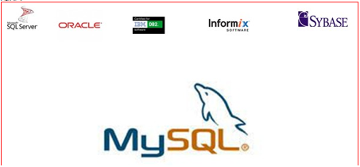
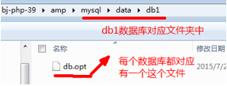
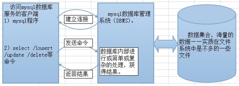
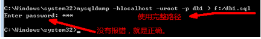

<html xmlns:v="urn:schemas-microsoft-com:vml"
xmlns:o="urn:schemas-microsoft-com:office:office"
xmlns:w="urn:schemas-microsoft-com:office:word"
xmlns:dt="uuid:C2F41010-65B3-11d1-A29F-00AA00C14882"
xmlns:m="http://schemas.microsoft.com/office/2004/12/omml"
xmlns:mv="http://macVmlSchemaUri" xmlns="http://www.w3.org/TR/REC-html40">

<head>
<meta name=标题 content="昨日回顾	2">
<meta name=关键词 content="">
<meta http-equiv=Content-Type content="text/html; charset=utf-8">
<meta name=ProgId content=Word.Document>
<meta name=Generator content="Microsoft Word 15">
<meta name=Originator content="Microsoft Word 15">
<link rel=File-List href="笔记8.fld/filelist.xml">
<link rel=Edit-Time-Data href="笔记8.fld/editdata.mso">
<!--[if !mso]>

<![endif]-->
<title>昨日回顾	2</title>
<!--[if gte mso 9]><xml>
 <o:DocumentProperties>
  <o:Author>Sky123.Org</o:Author>
  <o:LastAuthor>Microsoft Office 用户</o:LastAuthor>
  <o:Revision>2</o:Revision>
  <o:TotalTime>0</o:TotalTime>
  <o:Created>2016-12-02T04:23:00Z</o:Created>
  <o:LastSaved>2016-12-02T04:23:00Z</o:LastSaved>
  <o:Pages>12</o:Pages>
  <o:Words>1513</o:Words>
  <o:Characters>8626</o:Characters>
  <o:Company>Sky123.Org</o:Company>
  <o:Lines>71</o:Lines>
  <o:Paragraphs>20</o:Paragraphs>
  <o:CharactersWithSpaces>10119</o:CharactersWithSpaces>
  <o:Version>15.0</o:Version>
 </o:DocumentProperties>
 <o:CustomDocumentProperties>
  <o:KSOProductBuildVer dt:dt="string">2052-9.1.0.5133</o:KSOProductBuildVer>
 </o:CustomDocumentProperties>
 <o:OfficeDocumentSettings>
  <o:AllowPNG/>
 </o:OfficeDocumentSettings>
</xml><![endif]-->
<link rel=themeData href="笔记8.fld/themedata.thmx">
<!--[if gte mso 9]><xml>
 <w:WordDocument>
  <w:View>Print</w:View>
  <w:Zoom>120</w:Zoom>
  <w:TrackMoves>false</w:TrackMoves>
  <w:TrackFormatting/>
  <w:DrawingGridHorizontalSpacing>0 磅</w:DrawingGridHorizontalSpacing>
  <w:DrawingGridVerticalSpacing>7.8 磅</w:DrawingGridVerticalSpacing>
  <w:ValidateAgainstSchemas>false</w:ValidateAgainstSchemas>
  <w:SaveIfXMLInvalid>false</w:SaveIfXMLInvalid>
  <w:IgnoreMixedContent>false</w:IgnoreMixedContent>
  <w:AlwaysShowPlaceholderText>false</w:AlwaysShowPlaceholderText>
  <w:DoNotUnderlineInvalidXML/>
  <w:DoNotPromoteQF/>
  <w:LidThemeOther>EN-US</w:LidThemeOther>
  <w:LidThemeAsian>ZH-CN</w:LidThemeAsian>
  <w:LidThemeComplexScript>X-NONE</w:LidThemeComplexScript>
  <w:Compatibility>
   <w:SpaceForUL/>
   <w:BalanceSingleByteDoubleByteWidth/>
   <w:DoNotLeaveBackslashAlone/>
   <w:ULTrailSpace/>
   <w:DoNotExpandShiftReturn/>
   <w:AdjustLineHeightInTable/>
   <w:SnapToGridInCell/>
   <w:UseWord2010TableStyleRules/>
   <w:DontGrowAutofit/>
   <w:DontUseIndentAsNumberingTabStop/>
   <w:FELineBreak11/>
   <w:WW11IndentRules/>
   <w:DontAutofitConstrainedTables/>
   <w:AutofitLikeWW11/>
   <w:HangulWidthLikeWW11/>
   <w:UseNormalStyleForList/>
   <w:DontVertAlignCellWithSp/>
   <w:DontBreakConstrainedForcedTables/>
   <w:DontVertAlignInTxbx/>
   <w:Word11KerningPairs/>
   <w:CachedColBalance/>
   <w:UseFELayout/>
  </w:Compatibility>
  <m:mathPr>
   <m:mathFont m:val="Cambria Math"/>
   <m:brkBin m:val="before"/>
   <m:brkBinSub m:val="&#45;-"/>
   <m:smallFrac m:val="off"/>
   <m:dispDef/>
   <m:lMargin m:val="0"/>
   <m:rMargin m:val="0"/>
   <m:defJc m:val="centerGroup"/>
   <m:wrapIndent m:val="1440"/>
   <m:intLim m:val="subSup"/>
   <m:naryLim m:val="undOvr"/>
  </m:mathPr></w:WordDocument>
</xml><![endif]--><!--[if gte mso 9]><xml>
 <w:LatentStyles DefLockedState="false" DefUnhideWhenUsed="false"
  DefSemiHidden="false" DefQFormat="false" DefPriority="99"
  LatentStyleCount="380">
  <w:LsdException Locked="false" Priority="0" QFormat="true" Name="Normal"/>
  <w:LsdException Locked="false" Priority="9" QFormat="true" Name="heading 1"/>
  <w:LsdException Locked="false" Priority="9" QFormat="true" Name="heading 2"/>
  <w:LsdException Locked="false" Priority="9" QFormat="true" Name="heading 3"/>
  <w:LsdException Locked="false" Priority="9" SemiHidden="true"
   UnhideWhenUsed="true" QFormat="true" Name="heading 4"/>
  <w:LsdException Locked="false" Priority="9" SemiHidden="true"
   UnhideWhenUsed="true" QFormat="true" Name="heading 5"/>
  <w:LsdException Locked="false" Priority="9" SemiHidden="true"
   UnhideWhenUsed="true" QFormat="true" Name="heading 6"/>
  <w:LsdException Locked="false" Priority="9" SemiHidden="true"
   UnhideWhenUsed="true" QFormat="true" Name="heading 7"/>
  <w:LsdException Locked="false" Priority="9" SemiHidden="true"
   UnhideWhenUsed="true" QFormat="true" Name="heading 8"/>
  <w:LsdException Locked="false" Priority="9" SemiHidden="true"
   UnhideWhenUsed="true" QFormat="true" Name="heading 9"/>
  <w:LsdException Locked="false" SemiHidden="true" UnhideWhenUsed="true"
   Name="index 1"/>
  <w:LsdException Locked="false" SemiHidden="true" UnhideWhenUsed="true"
   Name="index 2"/>
  <w:LsdException Locked="false" SemiHidden="true" UnhideWhenUsed="true"
   Name="index 3"/>
  <w:LsdException Locked="false" SemiHidden="true" UnhideWhenUsed="true"
   Name="index 4"/>
  <w:LsdException Locked="false" SemiHidden="true" UnhideWhenUsed="true"
   Name="index 5"/>
  <w:LsdException Locked="false" SemiHidden="true" UnhideWhenUsed="true"
   Name="index 6"/>
  <w:LsdException Locked="false" SemiHidden="true" UnhideWhenUsed="true"
   Name="index 7"/>
  <w:LsdException Locked="false" SemiHidden="true" UnhideWhenUsed="true"
   Name="index 8"/>
  <w:LsdException Locked="false" SemiHidden="true" UnhideWhenUsed="true"
   Name="index 9"/>
  <w:LsdException Locked="false" Priority="39" UnhideWhenUsed="true"
   Name="toc 1"/>
  <w:LsdException Locked="false" Priority="39" UnhideWhenUsed="true"
   Name="toc 2"/>
  <w:LsdException Locked="false" Priority="39" UnhideWhenUsed="true"
   Name="toc 3"/>
  <w:LsdException Locked="false" Priority="39" UnhideWhenUsed="true"
   Name="toc 4"/>
  <w:LsdException Locked="false" Priority="39" UnhideWhenUsed="true"
   Name="toc 5"/>
  <w:LsdException Locked="false" Priority="39" UnhideWhenUsed="true"
   Name="toc 6"/>
  <w:LsdException Locked="false" Priority="39" UnhideWhenUsed="true"
   Name="toc 7"/>
  <w:LsdException Locked="false" Priority="39" UnhideWhenUsed="true"
   Name="toc 8"/>
  <w:LsdException Locked="false" Priority="39" UnhideWhenUsed="true"
   Name="toc 9"/>
  <w:LsdException Locked="false" SemiHidden="true" UnhideWhenUsed="true"
   Name="Normal Indent"/>
  <w:LsdException Locked="false" SemiHidden="true" UnhideWhenUsed="true"
   Name="footnote text"/>
  <w:LsdException Locked="false" SemiHidden="true" UnhideWhenUsed="true"
   Name="annotation text"/>
  <w:LsdException Locked="false" UnhideWhenUsed="true" Name="header"/>
  <w:LsdException Locked="false" UnhideWhenUsed="true" Name="footer"/>
  <w:LsdException Locked="false" SemiHidden="true" UnhideWhenUsed="true"
   Name="index heading"/>
  <w:LsdException Locked="false" Priority="35" SemiHidden="true"
   UnhideWhenUsed="true" QFormat="true" Name="caption"/>
  <w:LsdException Locked="false" SemiHidden="true" UnhideWhenUsed="true"
   Name="table of figures"/>
  <w:LsdException Locked="false" SemiHidden="true" UnhideWhenUsed="true"
   Name="envelope address"/>
  <w:LsdException Locked="false" SemiHidden="true" UnhideWhenUsed="true"
   Name="envelope return"/>
  <w:LsdException Locked="false" SemiHidden="true" UnhideWhenUsed="true"
   Name="footnote reference"/>
  <w:LsdException Locked="false" SemiHidden="true" UnhideWhenUsed="true"
   Name="annotation reference"/>
  <w:LsdException Locked="false" SemiHidden="true" UnhideWhenUsed="true"
   Name="line number"/>
  <w:LsdException Locked="false" SemiHidden="true" UnhideWhenUsed="true"
   Name="page number"/>
  <w:LsdException Locked="false" SemiHidden="true" UnhideWhenUsed="true"
   Name="endnote reference"/>
  <w:LsdException Locked="false" SemiHidden="true" UnhideWhenUsed="true"
   Name="endnote text"/>
  <w:LsdException Locked="false" SemiHidden="true" UnhideWhenUsed="true"
   Name="table of authorities"/>
  <w:LsdException Locked="false" SemiHidden="true" UnhideWhenUsed="true"
   Name="macro"/>
  <w:LsdException Locked="false" SemiHidden="true" UnhideWhenUsed="true"
   Name="toa heading"/>
  <w:LsdException Locked="false" SemiHidden="true" UnhideWhenUsed="true"
   Name="List"/>
  <w:LsdException Locked="false" SemiHidden="true" UnhideWhenUsed="true"
   Name="List Bullet"/>
  <w:LsdException Locked="false" SemiHidden="true" UnhideWhenUsed="true"
   Name="List Number"/>
  <w:LsdException Locked="false" SemiHidden="true" UnhideWhenUsed="true"
   Name="List 2"/>
  <w:LsdException Locked="false" SemiHidden="true" UnhideWhenUsed="true"
   Name="List 3"/>
  <w:LsdException Locked="false" SemiHidden="true" UnhideWhenUsed="true"
   Name="List 4"/>
  <w:LsdException Locked="false" SemiHidden="true" UnhideWhenUsed="true"
   Name="List 5"/>
  <w:LsdException Locked="false" SemiHidden="true" UnhideWhenUsed="true"
   Name="List Bullet 2"/>
  <w:LsdException Locked="false" SemiHidden="true" UnhideWhenUsed="true"
   Name="List Bullet 3"/>
  <w:LsdException Locked="false" SemiHidden="true" UnhideWhenUsed="true"
   Name="List Bullet 4"/>
  <w:LsdException Locked="false" SemiHidden="true" UnhideWhenUsed="true"
   Name="List Bullet 5"/>
  <w:LsdException Locked="false" SemiHidden="true" UnhideWhenUsed="true"
   Name="List Number 2"/>
  <w:LsdException Locked="false" SemiHidden="true" UnhideWhenUsed="true"
   Name="List Number 3"/>
  <w:LsdException Locked="false" SemiHidden="true" UnhideWhenUsed="true"
   Name="List Number 4"/>
  <w:LsdException Locked="false" SemiHidden="true" UnhideWhenUsed="true"
   Name="List Number 5"/>
  <w:LsdException Locked="false" Priority="10" QFormat="true" Name="Title"/>
  <w:LsdException Locked="false" SemiHidden="true" UnhideWhenUsed="true"
   Name="Closing"/>
  <w:LsdException Locked="false" SemiHidden="true" UnhideWhenUsed="true"
   Name="Signature"/>
  <w:LsdException Locked="false" Priority="1" UnhideWhenUsed="true"
   Name="Default Paragraph Font"/>
  <w:LsdException Locked="false" SemiHidden="true" UnhideWhenUsed="true"
   Name="Body Text"/>
  <w:LsdException Locked="false" SemiHidden="true" UnhideWhenUsed="true"
   Name="Body Text Indent"/>
  <w:LsdException Locked="false" SemiHidden="true" UnhideWhenUsed="true"
   Name="List Continue"/>
  <w:LsdException Locked="false" SemiHidden="true" UnhideWhenUsed="true"
   Name="List Continue 2"/>
  <w:LsdException Locked="false" SemiHidden="true" UnhideWhenUsed="true"
   Name="List Continue 3"/>
  <w:LsdException Locked="false" SemiHidden="true" UnhideWhenUsed="true"
   Name="List Continue 4"/>
  <w:LsdException Locked="false" SemiHidden="true" UnhideWhenUsed="true"
   Name="List Continue 5"/>
  <w:LsdException Locked="false" SemiHidden="true" UnhideWhenUsed="true"
   Name="Message Header"/>
  <w:LsdException Locked="false" Priority="11" QFormat="true" Name="Subtitle"/>
  <w:LsdException Locked="false" SemiHidden="true" UnhideWhenUsed="true"
   Name="Salutation"/>
  <w:LsdException Locked="false" SemiHidden="true" UnhideWhenUsed="true"
   Name="Date"/>
  <w:LsdException Locked="false" SemiHidden="true" UnhideWhenUsed="true"
   Name="Body Text First Indent"/>
  <w:LsdException Locked="false" SemiHidden="true" UnhideWhenUsed="true"
   Name="Body Text First Indent 2"/>
  <w:LsdException Locked="false" SemiHidden="true" UnhideWhenUsed="true"
   Name="Note Heading"/>
  <w:LsdException Locked="false" SemiHidden="true" UnhideWhenUsed="true"
   Name="Body Text 2"/>
  <w:LsdException Locked="false" SemiHidden="true" UnhideWhenUsed="true"
   Name="Body Text 3"/>
  <w:LsdException Locked="false" SemiHidden="true" UnhideWhenUsed="true"
   Name="Body Text Indent 2"/>
  <w:LsdException Locked="false" SemiHidden="true" UnhideWhenUsed="true"
   Name="Body Text Indent 3"/>
  <w:LsdException Locked="false" SemiHidden="true" UnhideWhenUsed="true"
   Name="Block Text"/>
  <w:LsdException Locked="false" UnhideWhenUsed="true" Name="Hyperlink"/>
  <w:LsdException Locked="false" SemiHidden="true" UnhideWhenUsed="true"
   Name="FollowedHyperlink"/>
  <w:LsdException Locked="false" Priority="22" QFormat="true" Name="Strong"/>
  <w:LsdException Locked="false" Priority="20" QFormat="true" Name="Emphasis"/>
  <w:LsdException Locked="false" SemiHidden="true" UnhideWhenUsed="true"
   Name="Document Map"/>
  <w:LsdException Locked="false" SemiHidden="true" UnhideWhenUsed="true"
   Name="Plain Text"/>
  <w:LsdException Locked="false" SemiHidden="true" UnhideWhenUsed="true"
   Name="E-mail Signature"/>
  <w:LsdException Locked="false" SemiHidden="true" UnhideWhenUsed="true"
   Name="HTML Top of Form"/>
  <w:LsdException Locked="false" SemiHidden="true" UnhideWhenUsed="true"
   Name="HTML Bottom of Form"/>
  <w:LsdException Locked="false" UnhideWhenUsed="true" Name="Normal (Web)"/>
  <w:LsdException Locked="false" SemiHidden="true" UnhideWhenUsed="true"
   Name="HTML Acronym"/>
  <w:LsdException Locked="false" SemiHidden="true" UnhideWhenUsed="true"
   Name="HTML Address"/>
  <w:LsdException Locked="false" SemiHidden="true" UnhideWhenUsed="true"
   Name="HTML Cite"/>
  <w:LsdException Locked="false" SemiHidden="true" UnhideWhenUsed="true"
   Name="HTML Code"/>
  <w:LsdException Locked="false" SemiHidden="true" UnhideWhenUsed="true"
   Name="HTML Definition"/>
  <w:LsdException Locked="false" SemiHidden="true" UnhideWhenUsed="true"
   Name="HTML Keyboard"/>
  <w:LsdException Locked="false" SemiHidden="true" UnhideWhenUsed="true"
   Name="HTML Preformatted"/>
  <w:LsdException Locked="false" SemiHidden="true" UnhideWhenUsed="true"
   Name="HTML Sample"/>
  <w:LsdException Locked="false" SemiHidden="true" UnhideWhenUsed="true"
   Name="HTML Typewriter"/>
  <w:LsdException Locked="false" SemiHidden="true" UnhideWhenUsed="true"
   Name="HTML Variable"/>
  <w:LsdException Locked="false" UnhideWhenUsed="true" Name="Normal Table"/>
  <w:LsdException Locked="false" SemiHidden="true" UnhideWhenUsed="true"
   Name="annotation subject"/>
  <w:LsdException Locked="false" SemiHidden="true" UnhideWhenUsed="true"
   Name="No List"/>
  <w:LsdException Locked="false" SemiHidden="true" UnhideWhenUsed="true"
   Name="Outline List 1"/>
  <w:LsdException Locked="false" SemiHidden="true" UnhideWhenUsed="true"
   Name="Outline List 2"/>
  <w:LsdException Locked="false" SemiHidden="true" UnhideWhenUsed="true"
   Name="Outline List 3"/>
  <w:LsdException Locked="false" SemiHidden="true" UnhideWhenUsed="true"
   Name="Table Simple 1"/>
  <w:LsdException Locked="false" SemiHidden="true" UnhideWhenUsed="true"
   Name="Table Simple 2"/>
  <w:LsdException Locked="false" SemiHidden="true" UnhideWhenUsed="true"
   Name="Table Simple 3"/>
  <w:LsdException Locked="false" SemiHidden="true" UnhideWhenUsed="true"
   Name="Table Classic 1"/>
  <w:LsdException Locked="false" SemiHidden="true" UnhideWhenUsed="true"
   Name="Table Classic 2"/>
  <w:LsdException Locked="false" SemiHidden="true" UnhideWhenUsed="true"
   Name="Table Classic 3"/>
  <w:LsdException Locked="false" SemiHidden="true" UnhideWhenUsed="true"
   Name="Table Classic 4"/>
  <w:LsdException Locked="false" SemiHidden="true" UnhideWhenUsed="true"
   Name="Table Colorful 1"/>
  <w:LsdException Locked="false" SemiHidden="true" UnhideWhenUsed="true"
   Name="Table Colorful 2"/>
  <w:LsdException Locked="false" SemiHidden="true" UnhideWhenUsed="true"
   Name="Table Colorful 3"/>
  <w:LsdException Locked="false" SemiHidden="true" UnhideWhenUsed="true"
   Name="Table Columns 1"/>
  <w:LsdException Locked="false" SemiHidden="true" UnhideWhenUsed="true"
   Name="Table Columns 2"/>
  <w:LsdException Locked="false" SemiHidden="true" UnhideWhenUsed="true"
   Name="Table Columns 3"/>
  <w:LsdException Locked="false" SemiHidden="true" UnhideWhenUsed="true"
   Name="Table Columns 4"/>
  <w:LsdException Locked="false" SemiHidden="true" UnhideWhenUsed="true"
   Name="Table Columns 5"/>
  <w:LsdException Locked="false" SemiHidden="true" UnhideWhenUsed="true"
   Name="Table Grid 1"/>
  <w:LsdException Locked="false" SemiHidden="true" UnhideWhenUsed="true"
   Name="Table Grid 2"/>
  <w:LsdException Locked="false" SemiHidden="true" UnhideWhenUsed="true"
   Name="Table Grid 3"/>
  <w:LsdException Locked="false" SemiHidden="true" UnhideWhenUsed="true"
   Name="Table Grid 4"/>
  <w:LsdException Locked="false" SemiHidden="true" UnhideWhenUsed="true"
   Name="Table Grid 5"/>
  <w:LsdException Locked="false" SemiHidden="true" UnhideWhenUsed="true"
   Name="Table Grid 6"/>
  <w:LsdException Locked="false" SemiHidden="true" UnhideWhenUsed="true"
   Name="Table Grid 7"/>
  <w:LsdException Locked="false" SemiHidden="true" UnhideWhenUsed="true"
   Name="Table Grid 8"/>
  <w:LsdException Locked="false" SemiHidden="true" UnhideWhenUsed="true"
   Name="Table List 1"/>
  <w:LsdException Locked="false" SemiHidden="true" UnhideWhenUsed="true"
   Name="Table List 2"/>
  <w:LsdException Locked="false" SemiHidden="true" UnhideWhenUsed="true"
   Name="Table List 3"/>
  <w:LsdException Locked="false" SemiHidden="true" UnhideWhenUsed="true"
   Name="Table List 4"/>
  <w:LsdException Locked="false" SemiHidden="true" UnhideWhenUsed="true"
   Name="Table List 5"/>
  <w:LsdException Locked="false" SemiHidden="true" UnhideWhenUsed="true"
   Name="Table List 6"/>
  <w:LsdException Locked="false" SemiHidden="true" UnhideWhenUsed="true"
   Name="Table List 7"/>
  <w:LsdException Locked="false" SemiHidden="true" UnhideWhenUsed="true"
   Name="Table List 8"/>
  <w:LsdException Locked="false" SemiHidden="true" UnhideWhenUsed="true"
   Name="Table 3D effects 1"/>
  <w:LsdException Locked="false" SemiHidden="true" UnhideWhenUsed="true"
   Name="Table 3D effects 2"/>
  <w:LsdException Locked="false" SemiHidden="true" UnhideWhenUsed="true"
   Name="Table 3D effects 3"/>
  <w:LsdException Locked="false" SemiHidden="true" UnhideWhenUsed="true"
   Name="Table Contemporary"/>
  <w:LsdException Locked="false" SemiHidden="true" UnhideWhenUsed="true"
   Name="Table Elegant"/>
  <w:LsdException Locked="false" SemiHidden="true" UnhideWhenUsed="true"
   Name="Table Professional"/>
  <w:LsdException Locked="false" SemiHidden="true" UnhideWhenUsed="true"
   Name="Table Subtle 1"/>
  <w:LsdException Locked="false" SemiHidden="true" UnhideWhenUsed="true"
   Name="Table Subtle 2"/>
  <w:LsdException Locked="false" SemiHidden="true" UnhideWhenUsed="true"
   Name="Table Web 1"/>
  <w:LsdException Locked="false" SemiHidden="true" UnhideWhenUsed="true"
   Name="Table Web 2"/>
  <w:LsdException Locked="false" SemiHidden="true" UnhideWhenUsed="true"
   Name="Table Web 3"/>
  <w:LsdException Locked="false" UnhideWhenUsed="true" Name="Balloon Text"/>
  <w:LsdException Locked="false" UnhideWhenUsed="true" Name="Table Grid"/>
  <w:LsdException Locked="false" SemiHidden="true" UnhideWhenUsed="true"
   Name="Table Theme"/>
  <w:LsdException Locked="false" SemiHidden="true" UnhideWhenUsed="true"
   Name="Note Level 1"/>
  <w:LsdException Locked="false" SemiHidden="true" UnhideWhenUsed="true"
   Name="Note Level 2"/>
  <w:LsdException Locked="false" Priority="60" Name="Note Level 3"/>
  <w:LsdException Locked="false" Priority="61" Name="Note Level 4"/>
  <w:LsdException Locked="false" Priority="62" Name="Note Level 5"/>
  <w:LsdException Locked="false" Priority="63" Name="Note Level 6"/>
  <w:LsdException Locked="false" Priority="64" Name="Note Level 7"/>
  <w:LsdException Locked="false" Priority="65" Name="Note Level 8"/>
  <w:LsdException Locked="false" Priority="66" Name="Note Level 9"/>
  <w:LsdException Locked="false" Priority="67" Name="Placeholder Text"/>
  <w:LsdException Locked="false" Priority="68" QFormat="true" Name="No Spacing"/>
  <w:LsdException Locked="false" Priority="69" Name="Light Shading"/>
  <w:LsdException Locked="false" Priority="70" Name="Light List"/>
  <w:LsdException Locked="false" Priority="71" Name="Light Grid"/>
  <w:LsdException Locked="false" Priority="72" Name="Medium Shading 1"/>
  <w:LsdException Locked="false" Priority="73" Name="Medium Shading 2"/>
  <w:LsdException Locked="false" Priority="60" Name="Medium List 1"/>
  <w:LsdException Locked="false" Priority="61" Name="Medium List 2"/>
  <w:LsdException Locked="false" Priority="62" Name="Medium Grid 1"/>
  <w:LsdException Locked="false" Priority="63" Name="Medium Grid 2"/>
  <w:LsdException Locked="false" Priority="64" Name="Medium Grid 3"/>
  <w:LsdException Locked="false" Priority="65" Name="Dark List"/>
  <w:LsdException Locked="false" Priority="34" QFormat="true"
   Name="Colorful List"/>
  <w:LsdException Locked="false" Priority="66" Name="Light List Accent 1"/>
  <w:LsdException Locked="false" Priority="67" Name="Light Grid Accent 1"/>
  <w:LsdException Locked="false" Priority="68" Name="Medium Shading 1 Accent 1"/>
  <w:LsdException Locked="false" Priority="69" Name="Medium Shading 2 Accent 1"/>
  <w:LsdException Locked="false" Priority="70" Name="Medium List 1 Accent 1"/>
  <w:LsdException Locked="false" Priority="71" Name="Revision"/>
  <w:LsdException Locked="false" Priority="72" QFormat="true"
   Name="List Paragraph"/>
  <w:LsdException Locked="false" Priority="73" QFormat="true" Name="Quote"/>
  <w:LsdException Locked="false" Priority="60" QFormat="true"
   Name="Intense Quote"/>
  <w:LsdException Locked="false" Priority="61" Name="Medium List 2 Accent 1"/>
  <w:LsdException Locked="false" Priority="62" Name="Medium Grid 1 Accent 1"/>
  <w:LsdException Locked="false" Priority="63" Name="Medium Grid 2 Accent 1"/>
  <w:LsdException Locked="false" Priority="64" Name="Medium Grid 3 Accent 1"/>
  <w:LsdException Locked="false" Priority="65" Name="Dark List Accent 1"/>
  <w:LsdException Locked="false" Priority="66" Name="Colorful Shading Accent 1"/>
  <w:LsdException Locked="false" Priority="67" Name="Colorful List Accent 1"/>
  <w:LsdException Locked="false" Priority="68" Name="Colorful Grid Accent 1"/>
  <w:LsdException Locked="false" Priority="69" Name="Light Shading Accent 2"/>
  <w:LsdException Locked="false" Priority="70" Name="Light List Accent 2"/>
  <w:LsdException Locked="false" Priority="71" Name="Light Grid Accent 2"/>
  <w:LsdException Locked="false" Priority="72" Name="Medium Shading 1 Accent 2"/>
  <w:LsdException Locked="false" Priority="73" Name="Medium Shading 2 Accent 2"/>
  <w:LsdException Locked="false" Priority="60" Name="Medium List 1 Accent 2"/>
  <w:LsdException Locked="false" Priority="61" Name="Medium List 2 Accent 2"/>
  <w:LsdException Locked="false" Priority="62" Name="Medium Grid 1 Accent 2"/>
  <w:LsdException Locked="false" Priority="63" Name="Medium Grid 2 Accent 2"/>
  <w:LsdException Locked="false" Priority="64" Name="Medium Grid 3 Accent 2"/>
  <w:LsdException Locked="false" Priority="65" Name="Dark List Accent 2"/>
  <w:LsdException Locked="false" Priority="66" Name="Colorful Shading Accent 2"/>
  <w:LsdException Locked="false" Priority="67" Name="Colorful List Accent 2"/>
  <w:LsdException Locked="false" Priority="68" Name="Colorful Grid Accent 2"/>
  <w:LsdException Locked="false" Priority="69" Name="Light Shading Accent 3"/>
  <w:LsdException Locked="false" Priority="70" Name="Light List Accent 3"/>
  <w:LsdException Locked="false" Priority="71" Name="Light Grid Accent 3"/>
  <w:LsdException Locked="false" Priority="72" Name="Medium Shading 1 Accent 3"/>
  <w:LsdException Locked="false" Priority="73" Name="Medium Shading 2 Accent 3"/>
  <w:LsdException Locked="false" Priority="60" Name="Medium List 1 Accent 3"/>
  <w:LsdException Locked="false" Priority="61" Name="Medium List 2 Accent 3"/>
  <w:LsdException Locked="false" Priority="62" Name="Medium Grid 1 Accent 3"/>
  <w:LsdException Locked="false" Priority="63" Name="Medium Grid 2 Accent 3"/>
  <w:LsdException Locked="false" Priority="64" Name="Medium Grid 3 Accent 3"/>
  <w:LsdException Locked="false" Priority="65" Name="Dark List Accent 3"/>
  <w:LsdException Locked="false" Priority="66" Name="Colorful Shading Accent 3"/>
  <w:LsdException Locked="false" Priority="67" Name="Colorful List Accent 3"/>
  <w:LsdException Locked="false" Priority="68" Name="Colorful Grid Accent 3"/>
  <w:LsdException Locked="false" Priority="69" Name="Light Shading Accent 4"/>
  <w:LsdException Locked="false" Priority="70" Name="Light List Accent 4"/>
  <w:LsdException Locked="false" Priority="71" Name="Light Grid Accent 4"/>
  <w:LsdException Locked="false" Priority="72" Name="Medium Shading 1 Accent 4"/>
  <w:LsdException Locked="false" Priority="73" Name="Medium Shading 2 Accent 4"/>
  <w:LsdException Locked="false" Priority="60" Name="Medium List 1 Accent 4"/>
  <w:LsdException Locked="false" Priority="61" Name="Medium List 2 Accent 4"/>
  <w:LsdException Locked="false" Priority="62" Name="Medium Grid 1 Accent 4"/>
  <w:LsdException Locked="false" Priority="63" Name="Medium Grid 2 Accent 4"/>
  <w:LsdException Locked="false" Priority="64" Name="Medium Grid 3 Accent 4"/>
  <w:LsdException Locked="false" Priority="65" Name="Dark List Accent 4"/>
  <w:LsdException Locked="false" Priority="66" Name="Colorful Shading Accent 4"/>
  <w:LsdException Locked="false" Priority="67" Name="Colorful List Accent 4"/>
  <w:LsdException Locked="false" Priority="68" Name="Colorful Grid Accent 4"/>
  <w:LsdException Locked="false" Priority="69" Name="Light Shading Accent 5"/>
  <w:LsdException Locked="false" Priority="70" Name="Light List Accent 5"/>
  <w:LsdException Locked="false" Priority="71" Name="Light Grid Accent 5"/>
  <w:LsdException Locked="false" Priority="72" Name="Medium Shading 1 Accent 5"/>
  <w:LsdException Locked="false" Priority="73" Name="Medium Shading 2 Accent 5"/>
  <w:LsdException Locked="false" Priority="60" Name="Medium List 1 Accent 5"/>
  <w:LsdException Locked="false" Priority="61" Name="Medium List 2 Accent 5"/>
  <w:LsdException Locked="false" Priority="62" Name="Medium Grid 1 Accent 5"/>
  <w:LsdException Locked="false" Priority="63" Name="Medium Grid 2 Accent 5"/>
  <w:LsdException Locked="false" Priority="64" Name="Medium Grid 3 Accent 5"/>
  <w:LsdException Locked="false" Priority="65" Name="Dark List Accent 5"/>
  <w:LsdException Locked="false" Priority="66" Name="Colorful Shading Accent 5"/>
  <w:LsdException Locked="false" Priority="67" Name="Colorful List Accent 5"/>
  <w:LsdException Locked="false" Priority="68" Name="Colorful Grid Accent 5"/>
  <w:LsdException Locked="false" Priority="69" Name="Light Shading Accent 6"/>
  <w:LsdException Locked="false" Priority="70" Name="Light List Accent 6"/>
  <w:LsdException Locked="false" Priority="71" Name="Light Grid Accent 6"/>
  <w:LsdException Locked="false" Priority="72" Name="Medium Shading 1 Accent 6"/>
  <w:LsdException Locked="false" Priority="73" Name="Medium Shading 2 Accent 6"/>
  <w:LsdException Locked="false" Priority="65" Name="Medium List 1 Accent 6"/>
  <w:LsdException Locked="false" Priority="66" Name="Medium List 2 Accent 6"/>
  <w:LsdException Locked="false" Priority="67" Name="Medium Grid 1 Accent 6"/>
  <w:LsdException Locked="false" Priority="68" Name="Medium Grid 2 Accent 6"/>
  <w:LsdException Locked="false" Priority="69" Name="Medium Grid 3 Accent 6"/>
  <w:LsdException Locked="false" Priority="70" Name="Dark List Accent 6"/>
  <w:LsdException Locked="false" Priority="71" Name="Colorful Shading Accent 6"/>
  <w:LsdException Locked="false" Priority="72" Name="Colorful List Accent 6"/>
  <w:LsdException Locked="false" Priority="73" Name="Colorful Grid Accent 6"/>
  <w:LsdException Locked="false" Priority="19" QFormat="true"
   Name="Subtle Emphasis"/>
  <w:LsdException Locked="false" Priority="21" QFormat="true"
   Name="Intense Emphasis"/>
  <w:LsdException Locked="false" Priority="31" QFormat="true"
   Name="Subtle Reference"/>
  <w:LsdException Locked="false" Priority="32" QFormat="true"
   Name="Intense Reference"/>
  <w:LsdException Locked="false" Priority="33" QFormat="true" Name="Book Title"/>
  <w:LsdException Locked="false" Priority="37" SemiHidden="true"
   UnhideWhenUsed="true" Name="Bibliography"/>
  <w:LsdException Locked="false" Priority="39" SemiHidden="true"
   UnhideWhenUsed="true" QFormat="true" Name="TOC Heading"/>
  <w:LsdException Locked="false" Priority="41" Name="Plain Table 1"/>
  <w:LsdException Locked="false" Priority="42" Name="Plain Table 2"/>
  <w:LsdException Locked="false" Priority="43" Name="Plain Table 3"/>
  <w:LsdException Locked="false" Priority="44" Name="Plain Table 4"/>
  <w:LsdException Locked="false" Priority="45" Name="Plain Table 5"/>
  <w:LsdException Locked="false" Priority="40" Name="Grid Table Light"/>
  <w:LsdException Locked="false" Priority="46" Name="Grid Table 1 Light"/>
  <w:LsdException Locked="false" Priority="47" Name="Grid Table 2"/>
  <w:LsdException Locked="false" Priority="48" Name="Grid Table 3"/>
  <w:LsdException Locked="false" Priority="49" Name="Grid Table 4"/>
  <w:LsdException Locked="false" Priority="50" Name="Grid Table 5 Dark"/>
  <w:LsdException Locked="false" Priority="51" Name="Grid Table 6 Colorful"/>
  <w:LsdException Locked="false" Priority="52" Name="Grid Table 7 Colorful"/>
  <w:LsdException Locked="false" Priority="46"
   Name="Grid Table 1 Light Accent 1"/>
  <w:LsdException Locked="false" Priority="47" Name="Grid Table 2 Accent 1"/>
  <w:LsdException Locked="false" Priority="48" Name="Grid Table 3 Accent 1"/>
  <w:LsdException Locked="false" Priority="49" Name="Grid Table 4 Accent 1"/>
  <w:LsdException Locked="false" Priority="50" Name="Grid Table 5 Dark Accent 1"/>
  <w:LsdException Locked="false" Priority="51"
   Name="Grid Table 6 Colorful Accent 1"/>
  <w:LsdException Locked="false" Priority="52"
   Name="Grid Table 7 Colorful Accent 1"/>
  <w:LsdException Locked="false" Priority="46"
   Name="Grid Table 1 Light Accent 2"/>
  <w:LsdException Locked="false" Priority="47" Name="Grid Table 2 Accent 2"/>
  <w:LsdException Locked="false" Priority="48" Name="Grid Table 3 Accent 2"/>
  <w:LsdException Locked="false" Priority="49" Name="Grid Table 4 Accent 2"/>
  <w:LsdException Locked="false" Priority="50" Name="Grid Table 5 Dark Accent 2"/>
  <w:LsdException Locked="false" Priority="51"
   Name="Grid Table 6 Colorful Accent 2"/>
  <w:LsdException Locked="false" Priority="52"
   Name="Grid Table 7 Colorful Accent 2"/>
  <w:LsdException Locked="false" Priority="46"
   Name="Grid Table 1 Light Accent 3"/>
  <w:LsdException Locked="false" Priority="47" Name="Grid Table 2 Accent 3"/>
  <w:LsdException Locked="false" Priority="48" Name="Grid Table 3 Accent 3"/>
  <w:LsdException Locked="false" Priority="49" Name="Grid Table 4 Accent 3"/>
  <w:LsdException Locked="false" Priority="50" Name="Grid Table 5 Dark Accent 3"/>
  <w:LsdException Locked="false" Priority="51"
   Name="Grid Table 6 Colorful Accent 3"/>
  <w:LsdException Locked="false" Priority="52"
   Name="Grid Table 7 Colorful Accent 3"/>
  <w:LsdException Locked="false" Priority="46"
   Name="Grid Table 1 Light Accent 4"/>
  <w:LsdException Locked="false" Priority="47" Name="Grid Table 2 Accent 4"/>
  <w:LsdException Locked="false" Priority="48" Name="Grid Table 3 Accent 4"/>
  <w:LsdException Locked="false" Priority="49" Name="Grid Table 4 Accent 4"/>
  <w:LsdException Locked="false" Priority="50" Name="Grid Table 5 Dark Accent 4"/>
  <w:LsdException Locked="false" Priority="51"
   Name="Grid Table 6 Colorful Accent 4"/>
  <w:LsdException Locked="false" Priority="52"
   Name="Grid Table 7 Colorful Accent 4"/>
  <w:LsdException Locked="false" Priority="46"
   Name="Grid Table 1 Light Accent 5"/>
  <w:LsdException Locked="false" Priority="47" Name="Grid Table 2 Accent 5"/>
  <w:LsdException Locked="false" Priority="48" Name="Grid Table 3 Accent 5"/>
  <w:LsdException Locked="false" Priority="49" Name="Grid Table 4 Accent 5"/>
  <w:LsdException Locked="false" Priority="50" Name="Grid Table 5 Dark Accent 5"/>
  <w:LsdException Locked="false" Priority="51"
   Name="Grid Table 6 Colorful Accent 5"/>
  <w:LsdException Locked="false" Priority="52"
   Name="Grid Table 7 Colorful Accent 5"/>
  <w:LsdException Locked="false" Priority="46"
   Name="Grid Table 1 Light Accent 6"/>
  <w:LsdException Locked="false" Priority="47" Name="Grid Table 2 Accent 6"/>
  <w:LsdException Locked="false" Priority="48" Name="Grid Table 3 Accent 6"/>
  <w:LsdException Locked="false" Priority="49" Name="Grid Table 4 Accent 6"/>
  <w:LsdException Locked="false" Priority="50" Name="Grid Table 5 Dark Accent 6"/>
  <w:LsdException Locked="false" Priority="51"
   Name="Grid Table 6 Colorful Accent 6"/>
  <w:LsdException Locked="false" Priority="52"
   Name="Grid Table 7 Colorful Accent 6"/>
  <w:LsdException Locked="false" Priority="46" Name="List Table 1 Light"/>
  <w:LsdException Locked="false" Priority="47" Name="List Table 2"/>
  <w:LsdException Locked="false" Priority="48" Name="List Table 3"/>
  <w:LsdException Locked="false" Priority="49" Name="List Table 4"/>
  <w:LsdException Locked="false" Priority="50" Name="List Table 5 Dark"/>
  <w:LsdException Locked="false" Priority="51" Name="List Table 6 Colorful"/>
  <w:LsdException Locked="false" Priority="52" Name="List Table 7 Colorful"/>
  <w:LsdException Locked="false" Priority="46"
   Name="List Table 1 Light Accent 1"/>
  <w:LsdException Locked="false" Priority="47" Name="List Table 2 Accent 1"/>
  <w:LsdException Locked="false" Priority="48" Name="List Table 3 Accent 1"/>
  <w:LsdException Locked="false" Priority="49" Name="List Table 4 Accent 1"/>
  <w:LsdException Locked="false" Priority="50" Name="List Table 5 Dark Accent 1"/>
  <w:LsdException Locked="false" Priority="51"
   Name="List Table 6 Colorful Accent 1"/>
  <w:LsdException Locked="false" Priority="52"
   Name="List Table 7 Colorful Accent 1"/>
  <w:LsdException Locked="false" Priority="46"
   Name="List Table 1 Light Accent 2"/>
  <w:LsdException Locked="false" Priority="47" Name="List Table 2 Accent 2"/>
  <w:LsdException Locked="false" Priority="48" Name="List Table 3 Accent 2"/>
  <w:LsdException Locked="false" Priority="49" Name="List Table 4 Accent 2"/>
  <w:LsdException Locked="false" Priority="50" Name="List Table 5 Dark Accent 2"/>
  <w:LsdException Locked="false" Priority="51"
   Name="List Table 6 Colorful Accent 2"/>
  <w:LsdException Locked="false" Priority="52"
   Name="List Table 7 Colorful Accent 2"/>
  <w:LsdException Locked="false" Priority="46"
   Name="List Table 1 Light Accent 3"/>
  <w:LsdException Locked="false" Priority="47" Name="List Table 2 Accent 3"/>
  <w:LsdException Locked="false" Priority="48" Name="List Table 3 Accent 3"/>
  <w:LsdException Locked="false" Priority="49" Name="List Table 4 Accent 3"/>
  <w:LsdException Locked="false" Priority="50" Name="List Table 5 Dark Accent 3"/>
  <w:LsdException Locked="false" Priority="51"
   Name="List Table 6 Colorful Accent 3"/>
  <w:LsdException Locked="false" Priority="52"
   Name="List Table 7 Colorful Accent 3"/>
  <w:LsdException Locked="false" Priority="46"
   Name="List Table 1 Light Accent 4"/>
  <w:LsdException Locked="false" Priority="47" Name="List Table 2 Accent 4"/>
  <w:LsdException Locked="false" Priority="48" Name="List Table 3 Accent 4"/>
  <w:LsdException Locked="false" Priority="49" Name="List Table 4 Accent 4"/>
  <w:LsdException Locked="false" Priority="50" Name="List Table 5 Dark Accent 4"/>
  <w:LsdException Locked="false" Priority="51"
   Name="List Table 6 Colorful Accent 4"/>
  <w:LsdException Locked="false" Priority="52"
   Name="List Table 7 Colorful Accent 4"/>
  <w:LsdException Locked="false" Priority="46"
   Name="List Table 1 Light Accent 5"/>
  <w:LsdException Locked="false" Priority="47" Name="List Table 2 Accent 5"/>
  <w:LsdException Locked="false" Priority="48" Name="List Table 3 Accent 5"/>
  <w:LsdException Locked="false" Priority="49" Name="List Table 4 Accent 5"/>
  <w:LsdException Locked="false" Priority="50" Name="List Table 5 Dark Accent 5"/>
  <w:LsdException Locked="false" Priority="51"
   Name="List Table 6 Colorful Accent 5"/>
  <w:LsdException Locked="false" Priority="52"
   Name="List Table 7 Colorful Accent 5"/>
  <w:LsdException Locked="false" Priority="46"
   Name="List Table 1 Light Accent 6"/>
  <w:LsdException Locked="false" Priority="47" Name="List Table 2 Accent 6"/>
  <w:LsdException Locked="false" Priority="48" Name="List Table 3 Accent 6"/>
  <w:LsdException Locked="false" Priority="49" Name="List Table 4 Accent 6"/>
  <w:LsdException Locked="false" Priority="50" Name="List Table 5 Dark Accent 6"/>
  <w:LsdException Locked="false" Priority="51"
   Name="List Table 6 Colorful Accent 6"/>
  <w:LsdException Locked="false" Priority="52"
   Name="List Table 7 Colorful Accent 6"/>
 </w:LatentStyles>
</xml><![endif]-->

<!--[if gte mso 10]>

<![endif]--><!--[if gte mso 9]><xml>
 <o:shapedefaults v:ext="edit" spidmax="1026" fillcolor="#9cbee0"
  strokecolor="#739cc3">
  <v:fill color="#9cbee0" color2="#bbd5f0" type="gradient">
   <o:fill v:ext="view" type="gradientUnscaled"/>
  </v:fill>
  <v:stroke color="#739cc3" weight="1.25pt"/>
 </o:shapedefaults></xml><![endif]--><!--[if gte mso 9]><xml>
 <o:shapelayout v:ext="edit">
  <o:idmap v:ext="edit" data="1"/>
 </o:shapelayout></xml><![endif]-->
</head>

<body lang=ZH-CN link=blue vlink="#954F72" style='tab-interval:21.0pt;
text-justify-trim:punctuation'>

<h1><a name="_Toc15144">昨日回顾</a></h1>

<a
href="#_Toc12449">数组基础</a>

php的数组就是一些数据的有序排列的集合。它们的顺序不由下标来决定，而是由其“放入”顺序来决定。

<a
href="#_Toc12739">数组定义（赋值）：</a>

可以设定整数数字下标，

也可以设定字符串下标，

还可以不设定下标，此时也可以称为“自动下标”：其实它是整数下标，其值为之前所用过的整数下标的最大值+1.

其他非常规情况的下标有自动转换能力：

7.7 --&gt;7

true --&gt;1

false --&gt;0

<a
href="#_Toc30154">数组取值：</a>

就是用中括号，再使用下标。

<a
href="#_Toc24990">数组的分类</a>

<a
href="#_Toc3038">按键值关系来分：</a>索引数组，关联数组，混合数组；

<a
href="#_Toc17305">按数组的维数（复杂程度）分：</a>一维，二维。。。

本质上：其实，php（和js），数组只有一维！！！

所谓，二维，无非是指一个一维数组的每一项，又是一个一维数组！

所谓二维，只是在“形状”上跟其他语言的二维数组有点类似：多行多列的数据而已。

$a = array(

array(11,12, 13),

array(21,22,.23, 24, 25),

array(31,32, 33),

41, 42

);

$v1 = $a[0];

$v2 = $a[3];

<a
href="#_Toc14821">数组的基本使用</a>

<a href="#_Toc31673">求一个一维数组的平均值：</a><o:p></o:p>

<a href="#_Toc4230">求一个二维数组的平均值：</a><o:p></o:p>

<a href="#_Toc10737">求一个一维数组的最大值：</a><o:p></o:p>

<a href="#_Toc25129">求交换一个一维数组的最大值和最小值的位置：</a><o:p></o:p>

<a
href="#_Toc18503">数组的遍历</a>

<a
href="#_Toc21776">foreach基本语法</a>：

foreach($数组名   as   【$key =&gt;】$value){

//循环体，这里可以处理数据：$key,
$value

}

<a
href="#_Toc28410">数组的指针操作及遍历原理：</a>

一个观念：一个数组内部，总是有一个指针用来只是“当前操作的单元”。

$v1 = current($a);         //取得当单元的值；

$v2 = key($a);    //取得当单元的键名；

$v3 = next($a);   //取得下一个单元的值：先移动到下一个，然后取得其值；

$v4 = prev($a);   //取得上一个单元的值；

$v5 = end($a);               //取得最后一个单元的值；

$v6 = reset($a);   //取得第一个单元的值；

<a
href="#_Toc22273">使用for和next遍历数组</a>

$len = count($a);

for($i = 0; $i &lt; $len; ++$i){

$key = key($a);

$value = current($a);

//这里可以处理数据：$key,
$value

next($a);

}

<a
href="#_Toc15389">each()函数的使用</a>：

           

可以将一个函数的一个单元的键和值都取得，并放入一个数组中，该数组形式类似这样：

$v1 =  each($a)；//则$v1为：

array(

1=&gt;取得的值，

‘value’ =&gt;取得的值，

0=&gt;取得的键，

‘key’=&gt;取得的键

)

<a
href="#_Toc30047">list()“函数”的使用：</a>可以将一个数组的从0开始的连续的数字下标的单元的值一次性取出来放入对应的多个变量中。

list($v1, $v2, $v3, .... ) = $数组；

其相当于如下语句而已：

$v1 = $数组[0];

$v2 = $数组[1];

$v3 = $数组[2];

........

<a
href="#_Toc461">while+each()+list()遍历数组</a>

while( list($key, $value) = each($要遍历的数组) ){

//这里可以处理数据：$key,
$value

}

<a
href="#_Toc7699">数组变量的一些细节</a>：

foreach($数组名   as   【$key =&gt;】$value){

//循环体，这里可以处理数据：$key,
$value

}

<o:p>&nbsp;</o:p>

1，foreach也是正常的循环语法结构，可以有break和continue等操作。

2，遍历过程中值变量默认的传值方式是值传递。

3，遍历过程中值变量可以人为设定为引用传递：foreach($arr as $key =&gt; &amp;$value){ ... }

4，foreach默认是原数组上进行遍历。但如果在遍历过程中对数组进行了某种修改或某种指针性操作，则会复制数组后在复制的数组上继续遍历循环。

5，foreach中如果值变量是引用传递，则无论如何都是在原数组上进行。

<a
href="#_Toc1533">数组排序</a>

<a
href="#_Toc21438">排序函数简单演示（应用级别）：</a>

<a
href="#_Toc26352">冒泡排序算法</a>：

一趟趟从左往右进行相邻单元的两两比较，凡是2个元素的顺序不是目标顺序，就将他们进行交换。

<a
href="#_Toc20779">选择排序：</a>

一趟趟从“现有剩余数据”中找出最大的单元，并每一趟之后将该单元，跟这一趟中的最后一个单元进行交换。

<o:p>&nbsp;</o:p>

<h1><a name="_Toc32664">数组的查找算法</a></h1>

所谓查找算法，大体主要是解决这样一个问题：找出某个数组中，是否存在某个值（数据）。

<h2><a name="_Toc27634">顺序查找</a></h2>

就是遍历该数组，一个一个判断，如果相等，就表示有，然后退出就ok。

<o:p>&nbsp;</o:p>

有个数组：

$a = array(11, 13,  1,
8,  9, 33, 34, 22,  14, 55, .......);

需求：

1，请找出该数组中是否有88？

2，请找出该数组中是否有33？

<o:p>&nbsp;</o:p>

<h2><a name="_Toc26769">二分查找算法</a></h2>

二分查找算法的前提：

1，针对的是索引数组；

2，针对的是已经排好序的数组；

<o:p>&nbsp;</o:p>

<!--[if gte vml 1]><v:shapetype id="_x0000_t75"
 coordsize="21600,21600" o:spt="75" o:preferrelative="t" path="m@4@5l@4@11@9@11@9@5xe"
 filled="f" stroked="f">
 <v:stroke joinstyle="miter"/>
 <v:formulas>
  <v:f eqn="if lineDrawn pixelLineWidth 0"/>
  <v:f eqn="sum @0 1 0"/>
  <v:f eqn="sum 0 0 @1"/>
  <v:f eqn="prod @2 1 2"/>
  <v:f eqn="prod @3 21600 pixelWidth"/>
  <v:f eqn="prod @3 21600 pixelHeight"/>
  <v:f eqn="sum @0 0 1"/>
  <v:f eqn="prod @6 1 2"/>
  <v:f eqn="prod @7 21600 pixelWidth"/>
  <v:f eqn="sum @8 21600 0"/>
  <v:f eqn="prod @7 21600 pixelHeight"/>
  <v:f eqn="sum @10 21600 0"/>
 </v:formulas>
 <v:path o:extrusionok="f" gradientshapeok="t" o:connecttype="rect"/>
 <o:lock v:ext="edit" aspectratio="t"/>
</v:shapetype><v:shape id="图片_x0020_1" o:spid="_x0000_i1025" type="#_x0000_t75"
 style='width:480pt;height:119pt;mso-wrap-style:square'>
 <v:imagedata src="笔记8.fld/image001.png" o:title=""/>
</v:shape><![endif]--><![if !vml]><![endif]>

<o:p>&nbsp;</o:p>

<!--[if gte vml 1]><v:shape id="图片_x0020_6"
 o:spid="_x0000_i1026" type="#_x0000_t75" style='width:487pt;height:319pt;
 mso-wrap-style:square'>
 <v:imagedata src="笔记8.fld/image003.png" o:title=""/>
</v:shape><![endif]--><![if !vml]><![endif]>

<o:p>&nbsp;</o:p>

测试代码：

<!--[if gte vml 1]><v:shape id="图片_x0020_3"
 o:spid="_x0000_i1027" type="#_x0000_t75" style='width:406pt;height:52pt;
 mso-wrap-style:square'>
 <v:imagedata src="笔记8.fld/image005.png" o:title=""/>
</v:shape><![endif]--><![if !vml]><![endif]>

结果：

<!--[if gte vml 1]><v:shape id="图片_x0020_4"
 o:spid="_x0000_i1028" type="#_x0000_t75" style='width:129pt;height:31pt;
 mso-wrap-style:square'>
 <v:imagedata src="笔记8.fld/image007.png" o:title=""/>
</v:shape><![endif]--><![if !vml]><![endif]>

<o:p>&nbsp;</o:p>

有关二分查找算法的效率（性能）问题的一点说明：

1000个数据，约10次找出；

100万个数据，约20次找出；

10亿个数据，约30次找出

40亿个数据，约32次找出；

<o:p>&nbsp;</o:p>

<o:p>&nbsp;</o:p>

<h1><a name="_Toc8607">数据库介绍</a></h1>

<h2><a name="_Toc19940">分类</a></h2>

<![if !supportLists]>o&nbsp;&nbsp; <![endif]>层次数据库

<![if !supportLists]>o&nbsp;&nbsp; <![endif]>网状数据库

<![if !supportLists]>o&nbsp;&nbsp; <![endif]>关系数据库

<h2><a name="_Toc22073">主流数据库：</a></h2>

<!--[if gte vml 1]><v:shape
 id="图片_x0020_7" o:spid="_x0000_i1029" type="#_x0000_t75" style='width:451pt;
 height:209pt;mso-wrap-style:square'>
 <v:imagedata src="笔记8.fld/image009.png" o:title=""/>
</v:shape><![endif]--><![if !vml]><![endif]>

<o:p>&nbsp;</o:p>

<o:p>&nbsp;</o:p>

<b>SQL</b><b>：这是关系数据库的“语言标准”，STRUCT  QUERY  LANGUAGE(</b><b>结构化查询语言）。<o:p></o:p></b>

<o:p>&nbsp;</o:p>

关系数据库的特点：表跟表之间的数据可以建立一定的“对应关系”。

<!--[if gte vml 1]><v:shape id="图片_x0020_8"
 o:spid="_x0000_i1030" type="#_x0000_t75" style='width:388pt;height:170pt;
 mso-wrap-style:square'>
 <v:imagedata src="笔记8.fld/image011.png" o:title=""/>
</v:shape><![endif]--><![if !vml]><![endif]>

<o:p>&nbsp;</o:p>

mysql数据库的各层次关系：

<!--[if gte vml 1]><v:shape id="图片_x0020_9"
 o:spid="_x0000_i1031" type="#_x0000_t75" style='width:487pt;height:263pt;
 mso-wrap-style:square'>
 <v:imagedata src="笔记8.fld/image013.png" o:title=""/>
</v:shape><![endif]--><![if !vml]><![endif]>

几个基本概念：

<![if !supportLists]>·&nbsp;&nbsp;&nbsp;&nbsp;&nbsp;&nbsp;&nbsp;&nbsp;&nbsp;&nbsp;&nbsp;&nbsp;&nbsp;
<![endif]>数据data：

<![if !supportLists]>·&nbsp;&nbsp;&nbsp;&nbsp;&nbsp;&nbsp;&nbsp;&nbsp;&nbsp;&nbsp;&nbsp;&nbsp;&nbsp;
<![endif]>数据库database：用于存储一个项目/产品/软件所使用的各种数据的一个逻辑单位。

<![if !supportLists]>·&nbsp;&nbsp;&nbsp;&nbsp;&nbsp;&nbsp;&nbsp;&nbsp;&nbsp;&nbsp;&nbsp;&nbsp;&nbsp;
<![endif]>数据库管理系统dbms：其实就是指一个具体的数据库软件产品：database  management  system

<![if !supportLists]>·&nbsp;&nbsp;&nbsp;&nbsp;&nbsp;&nbsp;&nbsp;&nbsp;&nbsp;&nbsp;&nbsp;&nbsp;&nbsp;
<![endif]>表（数据表）table：用于存储一种数据的“结构形式”，基本就是“行列对齐”的“外观样子”。

<![if !supportLists]>·&nbsp;&nbsp;&nbsp;&nbsp;&nbsp;&nbsp;&nbsp;&nbsp;&nbsp;&nbsp;&nbsp;&nbsp;&nbsp;
<![endif]>字段field，列column：一个数据表中的一个纵列，其有一个名字，又叫“字段”

<![if !supportLists]>·&nbsp;&nbsp;&nbsp;&nbsp;&nbsp;&nbsp;&nbsp;&nbsp;&nbsp;&nbsp;&nbsp;&nbsp;&nbsp;
<![endif]>行row，记录record：

<o:p>&nbsp;</o:p>

数据存储的“表现”：

我们通过代码（语句），可以对各种数据进行各种操作，但其实，在文件表现，其实只是几个文件名而已，具体在数据库的存储目录中：

1，每个数据库，会对应一个文件夹；

2，每个数据表，会对应一个或几个文件：

<!--[if gte vml 1]><v:shape id="图片_x0020_10"
 o:spid="_x0000_i1032" type="#_x0000_t75" style='width:315pt;height:59pt;
 mso-wrap-style:square'>
 <v:imagedata src="笔记8.fld/image015.png" o:title=""/>
</v:shape><![endif]--><![if !vml]><![endif]>

则对应数据库的存放目录中，就会多出一个文件夹：

<!--[if gte vml 1]><v:shape id="图片_x0020_11"
 o:spid="_x0000_i1033" type="#_x0000_t75" style='width:399pt;height:147pt;
 mso-wrap-style:square'>
 <v:imagedata src="笔记8.fld/image017.png" o:title=""/>
</v:shape><![endif]--><![if !vml]><![endif]>

<!--[if gte vml 1]><v:shape id="图片_x0020_12"
 o:spid="_x0000_i1034" type="#_x0000_t75" style='width:285pt;height:107pt;
 mso-wrap-style:square'>
 <v:imagedata src="笔记8.fld/image019.png" o:title=""/>
</v:shape><![endif]--><![if !vml]><![endif]>

然后，去进行简单的“建表工作”：

<!--[if gte vml 1]><v:shape id="图片_x0020_13"
 o:spid="_x0000_i1035" type="#_x0000_t75" style='width:376pt;height:44pt;
 mso-wrap-style:square'>
 <v:imagedata src="笔记8.fld/image021.png" o:title=""/>
</v:shape><![endif]--><![if !vml]><![endif]>

则：

<!--[if gte vml 1]><v:shape id="图片_x0020_14"
 o:spid="_x0000_i1036" type="#_x0000_t75" style='width:356pt;height:136pt;
 mso-wrap-style:square'>
 <v:imagedata src="笔记8.fld/image023.png" o:title=""/>
</v:shape><![endif]--><![if !vml]><![endif]>

<o:p>&nbsp;</o:p>

特别注意：

上述只是演示，我们的数据库的各种“操作”，可能会在文件夹系统中有所反应，但：绝对不要去手工对这些文件进行操作！！！<o:p></o:p>

<o:p>&nbsp;</o:p>

mysql数据库操作的基本模式（和流程）：

<![if !supportLists]>·&nbsp;&nbsp;&nbsp;&nbsp;&nbsp;&nbsp;&nbsp;&nbsp;&nbsp;&nbsp;&nbsp;&nbsp;&nbsp;
<![endif]>建立连接（认证身份）

<![if !supportLists]>·&nbsp;&nbsp;&nbsp;&nbsp;&nbsp;&nbsp;&nbsp;&nbsp;&nbsp;&nbsp;&nbsp;&nbsp;&nbsp;
<![endif]>客户端向服务器端发送sql命令

<![if !supportLists]>·&nbsp;&nbsp;&nbsp;&nbsp;&nbsp;&nbsp;&nbsp;&nbsp;&nbsp;&nbsp;&nbsp;&nbsp;&nbsp;
<![endif]>服务器端执行命令，并返回执行的结果

<![if !supportLists]>·&nbsp;&nbsp;&nbsp;&nbsp;&nbsp;&nbsp;&nbsp;&nbsp;&nbsp;&nbsp;&nbsp;&nbsp;&nbsp;
<![endif]>客户端接收结果（并显示）

<![if !supportLists]>·&nbsp;&nbsp;&nbsp;&nbsp;&nbsp;&nbsp;&nbsp;&nbsp;&nbsp;&nbsp;&nbsp;&nbsp;&nbsp;
<![endif]>断开连接

<!--[if gte vml 1]><v:shape id="图片_x0020_15"
 o:spid="_x0000_i1037" type="#_x0000_t75" style='width:487pt;height:174pt;
 mso-wrap-style:square'>
 <v:imagedata src="笔记8.fld/image025.png" o:title=""/>
</v:shape><![endif]--><![if !vml]><![endif]>

<o:p>&nbsp;</o:p>

<h1><a name="_Toc7035">mysql</a>数据库的系统级操作及基本语法规定</h1>

<h2><a name="_Toc24551">启动/</a>停止mysql数据库服务：</h2>

<![if !supportLists]>·&nbsp;&nbsp;&nbsp;&nbsp;&nbsp;&nbsp;&nbsp;&nbsp;&nbsp;&nbsp;&nbsp;&nbsp;&nbsp;
<![endif]>命令行模式（需要管理员身份）：

<![if !supportLists]>o&nbsp;&nbsp; <![endif]><strong>启动：net  start  mysql</strong>

<![if !supportLists]>o&nbsp;&nbsp; <![endif]><strong>停止：net  stop  mysql</strong>

<!--[if gte vml 1]><v:shape
 id="图片_x0020_16" o:spid="_x0000_i1038" type="#_x0000_t75" style='width:329pt;
 height:202pt;mso-wrap-style:square'>
 <v:imagedata src="笔记8.fld/image027.png" o:title=""/>
</v:shape><![endif]--><![if !vml]><![endif]>

<![if !supportLists]>·&nbsp;&nbsp;&nbsp;&nbsp;&nbsp;&nbsp;&nbsp;&nbsp;&nbsp;&nbsp;&nbsp;&nbsp;&nbsp;
<![endif]>服务模式：控制面板〉管理工具〉服务〉mysql
&gt;启动/停止

<h2><a name="_Toc2363">登录/</a>退出mysql系统</h2>

<![if !supportLists]>·&nbsp;&nbsp;&nbsp;&nbsp;&nbsp;&nbsp;&nbsp;&nbsp;&nbsp;&nbsp;&nbsp;&nbsp;&nbsp;
<![endif]>登录：<strong>mysql -h服务器地址 -u登录名 【-P端口号】 -p</strong>

<![if !supportLists]>·&nbsp;&nbsp;&nbsp;&nbsp;&nbsp;&nbsp;&nbsp;&nbsp;&nbsp;&nbsp;&nbsp;&nbsp;&nbsp;
<![endif]>或登录：<strong>mysql
--host=服务器地址 --user=用户名 --port=端口 --password</strong>

<![if !supportLists]>o&nbsp;&nbsp; <![endif]>前两个语法，可以使用的前提都是：设定好了环境变量；

<![if !supportLists]>·&nbsp;&nbsp;&nbsp;&nbsp;&nbsp;&nbsp;&nbsp;&nbsp;&nbsp;&nbsp;&nbsp;&nbsp;&nbsp;
<![endif]>退出：quit; 或 exit;——是指已经登录（进入）了mysql之后。

<![if !supportLists]>·&nbsp;&nbsp;&nbsp;&nbsp;&nbsp;&nbsp;&nbsp;&nbsp;&nbsp;&nbsp;&nbsp;&nbsp;&nbsp;
<![endif]>注意：登录数据库系统后，需要使用“<strong>set names 编码名；</strong>”来设定当前<b>连接数据库的“环境编码名”</b>，即当前跟数据库打交道的“客户端”本身的编码。通常来说：

<![if !supportLists]>o&nbsp;&nbsp; <![endif]>cmd客户端中是固定的gbk编码，

<![if !supportLists]>o&nbsp;&nbsp; <![endif]>而php网页中，是该网页文件的编码（现在主流都是utf8）。

<!--[if gte vml 1]><v:shape id="图片_x0020_17"
 o:spid="_x0000_i1039" type="#_x0000_t75" style='width:487pt;height:190pt;
 mso-wrap-style:square'>
 <v:imagedata src="笔记8.fld/image029.png" o:title=""/>
</v:shape><![endif]--><![if !vml]><![endif]>

<o:p>&nbsp;</o:p>

<o:p>&nbsp;</o:p>

<h2><a name="_Toc20458">数据库的备份和恢复：</a></h2>

<b>备份：就是将一个数据库，完整地“转换为”一个可以随时“携带和传送”的文件。<o:p></o:p></b>

<o:p>&nbsp;</o:p>

语法：

mysqldump  -h服务器地址  -u登录名
-p   数据库名 &gt; 文件名

<!--[if gte vml 1]><v:shape id="图片_x0020_18"
 o:spid="_x0000_i1040" type="#_x0000_t75" style='width:430pt;height:63pt;
 mso-wrap-style:square'>
 <v:imagedata src="笔记8.fld/image031.png" o:title=""/>
</v:shape><![endif]--><![if !vml]><![endif]>

<o:p>&nbsp;</o:p>

<b>恢复：
</b><b>就是讲一个备份的数据库文件，完整地还原为一个可以使用的数据库。<o:p></o:p></b>

语法：

mysql  -h服务器地址  -u登录名
-p   数据库名 &lt; 文件名

<!--[if gte vml 1]><v:shape id="图片_x0020_20"
 o:spid="_x0000_i1041" type="#_x0000_t75" style='width:419pt;height:70pt;
 mso-wrap-style:square'>
 <v:imagedata src="笔记8.fld/image033.png" o:title=""/>
</v:shape><![endif]--><![if !vml]><![endif]>

<o:p>&nbsp;</o:p>

注意：

1，这两个命令，都是在“没有登录mysql”的时候使用。

2，其中mysqldump命令还要求为管理员身份。

3，通常，恢复，就是指恢复原来数据库中的所有表数据信息及其他信息，而数据库名可以是原来的名字或新的名字。

<o:p>&nbsp;</o:p>

<h2><a name="_Toc138">基础语法规定</a></h2>

<h3><a name="_Toc14994">注释：</a></h3>

有如下3中注释：

1， 单行注释：    #注释内容

2， 单行注释：    -- 注释内容（注意：--后面有一个空格）

3， 多行注释：   /* 注释内容*/

<h3><a name="_Toc23283">语句行：</a></h3>

默认情况下，以一个英文分号作为一条语句的结束！

而且，常规的操作中，都是“一次执行一条语句”；

但：

mysql中，可以可以人为设定语句结束符，做法如下：

delimiter  新的结束符

此行之后
，就可以使用新的结束符了：

<o:p>&nbsp;</o:p>

<!--[if gte vml 1]><v:shape id="图片_x0020_21"
 o:spid="_x0000_i1042" type="#_x0000_t75" style='width:334pt;height:262pt;
 mso-wrap-style:square'>
 <v:imagedata src="笔记8.fld/image035.png" o:title=""/>
</v:shape><![endif]--><![if !vml]><![endif]>

<o:p>&nbsp;</o:p>

<o:p>&nbsp;</o:p>

<h3><a name="_Toc14285">大小写问题</a></h3>

1，mysql语言内部本身不区分大小写；

2，但，mysql的某些命令执行会生成文件(夹)，此时他们就可能会区分大小写：

2.1：在文件(夹)名称 区分大小 写的系统中，这些名字也会区分大小写，比如unix，linux系统；

2.2：在文件(夹)名称不区分大小写的系统中，他们同样不区分大小写，比如window系统。

<o:p>&nbsp;</o:p>

<h3><a name="_Toc11001">命名问题</a></h3>

<![if !supportLists]>·&nbsp;&nbsp;&nbsp;&nbsp;&nbsp;&nbsp;&nbsp;&nbsp;&nbsp;&nbsp;&nbsp;&nbsp;&nbsp;
<![endif]>可以自己命名的名字，称为标识符，包括：数据库名， 表名，字段名，视图名，函数名，过程名，变量名，用户名，，等等。

<![if !supportLists]>·&nbsp;&nbsp;&nbsp;&nbsp;&nbsp;&nbsp;&nbsp;&nbsp;&nbsp;&nbsp;&nbsp;&nbsp;&nbsp;
<![endif]>可以命名标识符的字符比常规的语言多，但特别建议只用：字母数字和下划线，并不用数字开头。

<![if !supportLists]>·&nbsp;&nbsp;&nbsp;&nbsp;&nbsp;&nbsp;&nbsp;&nbsp;&nbsp;&nbsp;&nbsp;&nbsp;&nbsp;
<![endif]>非常规字符或系统关键字虽然可以作为标识符使用，但最好要包在反引号（数字1左边那个反撇 ` ）中，并且不推荐。

<![if !supportLists]>·&nbsp;&nbsp;&nbsp;&nbsp;&nbsp;&nbsp;&nbsp;&nbsp;&nbsp;&nbsp;&nbsp;&nbsp;&nbsp;
<![endif]>对数据库名，表名，和视图名，在window系统中不区分大小写，而其他系统中区分，建议全使用小写，并采用下划线分割法。

<![if !supportLists]>·&nbsp;&nbsp;&nbsp;&nbsp;&nbsp;&nbsp;&nbsp;&nbsp;&nbsp;&nbsp;&nbsp;&nbsp;&nbsp;
<![endif]>对其他自己命名的标识符（字段名，函数名，过程名），不区分大小写，但也建议全使用小写，并采用下划线分割法

<h1><a name="_Toc10557">数据库定义语句</a></h1>

<h2><a name="_Toc2123">创建数据库：</a></h2>

形式：<o:p></o:p>

create   database
数据库名   【charset  字符编码名称】   【collate  排序规则】；<o:p></o:p>

说明：

1，字符编码名称是用于设定当前数据库中存储的字符内容以什么编码来存储。

2，collate排序规则用于设定其中的字符内容的“大小关系”（先后顺序）：

对于英文，基本没有任何问题，比如：

“abc”   “abd”：
后者大；

“d”;              “abc”：      前者大；

.....

所有的对于英文字符的比较，本质上都是“单个字符”的比较。

但，对于中文，就成问题了，比如：

“中国”，
“印度”： 谁大？<o:p></o:p>

<o:p>&nbsp;</o:p>

“中”，
“美”： 谁大？<o:p></o:p>

排序规则，就是用于设定类似这种字符的大小关系或先后顺序的一种规定！<o:p></o:p>

实际我们的代码中（应用级别），只是一个名字：排序规则名<o:p></o:p>

而且，通常每种字符编码（字符集），都有一个默认的排序规则，所以，通常都不写的。<o:p></o:p>

<o:p>&nbsp;</o:p>

显示mysql中的所有可用的字符编码（供共39种）：

<!--[if gte vml 1]><v:shape
 id="图片_x0020_22" o:spid="_x0000_i1043" type="#_x0000_t75" style='width:439pt;
 height:164pt;mso-wrap-style:square'>
 <v:imagedata src="笔记8.fld/image037.png" o:title=""/>
</v:shape><![endif]--><![if !vml]><![endif]>

显示mysql中的所有可用排序规则（共约200种）：

<!--[if gte vml 1]><v:shape
 id="图片_x0020_23" o:spid="_x0000_i1044" type="#_x0000_t75" style='width:445pt;
 height:217pt;mso-wrap-style:square'>
 <v:imagedata src="笔记8.fld/image039.png" o:title=""/>
</v:shape><![endif]--><![if !vml]><![endif]>

实际应用中，我们使用某个字符集（字符编码），然后可用的与之对应的排序规则其实可选项很少，通常只有2个。当然，我们一般也都不使用它。

举例：

<!--[if gte vml 1]><v:shape
 id="图片_x0020_24" o:spid="_x0000_i1045" type="#_x0000_t75" style='width:449pt;
 height:42pt;mso-wrap-style:square'>
 <v:imagedata src="笔记8.fld/image041.png" o:title=""/>
</v:shape><![endif]--><![if !vml]><![endif]>

<!--[if gte vml 1]><v:shape
 id="图片_x0020_25" o:spid="_x0000_i1046" type="#_x0000_t75" style='width:397pt;
 height:40pt;mso-wrap-style:square'>
 <v:imagedata src="笔记8.fld/image043.png" o:title=""/>
</v:shape><![endif]--><![if !vml]><![endif]>

<!--[if gte vml 1]><v:shape
 id="图片_x0020_26" o:spid="_x0000_i1047" type="#_x0000_t75" style='width:475pt;
 height:56pt;mso-wrap-style:square'>
 <v:imagedata src="笔记8.fld/image045.png" o:title=""/>
</v:shape><![endif]--><![if !vml]><![endif]>

<o:p>&nbsp;</o:p>

<h2><a name="_Toc31228">删除数据库：</a></h2>

形式

drop  database 【if  exists 】 数据库名；

说明：

1，if
exists 是用于一种“安全运行”的考虑。如果数据库不存在，也不会报错。否则会报错。

<o:p>&nbsp;</o:p>

<!--[if gte vml 1]><v:shape
 id="图片_x0020_27" o:spid="_x0000_i1048" type="#_x0000_t75" style='width:487pt;
 height:89pt;mso-wrap-style:square'>
 <v:imagedata src="笔记8.fld/image047.png" o:title=""/>
</v:shape><![endif]--><![if !vml]><![endif]>

<o:p>&nbsp;</o:p>

修改数据库（字符编码)：

基本上，就是修改数据库的“属性”而已：只有2个：

修改编码；

修改排序规则；

alter  database
数据库名   charset
新的编码名   collate
新的排序规则名

<o:p>&nbsp;</o:p>

显示所有数据库：

show databases；

<o:p>&nbsp;</o:p>

<h3><a name="_Toc25354">显示一个数据库的创建语句：</a></h3>

<o:p>&nbsp;</o:p>

形式：

show  create
database  数据库名；

<o:p>&nbsp;</o:p>

<!--[if gte vml 1]><v:shape id="图片_x0020_28"
 o:spid="_x0000_i1049" type="#_x0000_t75" style='width:487pt;height:117pt;
 mso-wrap-style:square'>
 <v:imagedata src="笔记8.fld/image049.png" o:title=""/>
</v:shape><![endif]--><![if !vml]><![endif]>

<o:p>&nbsp;</o:p>

<h3><a name="_Toc28016">“进入”（选择）某个数据库：</a></h3>

use  数据库名；

<o:p>&nbsp;</o:p>

<h1><a name="_Toc15800">字段类型（数据类型）</a></h1>

<h2><a name="_Toc32231">总览：</a></h2>

mysql中，数据类型主要分3大类：数字型，字符型，时间型；

<o:p>&nbsp;</o:p>

<!--[if gte vml 1]><v:shape id="图片_x0020_31"
 o:spid="_x0000_i1050" type="#_x0000_t75" style='width:487pt;height:5in;
 mso-wrap-style:square'>
 <v:imagedata src="笔记8.fld/image051.png" o:title=""/>
</v:shape><![endif]--><![if !vml]><![endif]>

数据类型，在mysql中，主要用于创建一个表的时候，设定字段的类型。

比如：

create  table  表名 （id  int，
f1  float,  f2
double,  f3  time,
f4  text)

<o:p>&nbsp;</o:p>

<o:p>&nbsp;</o:p>

<h2><a name="_Toc27644">整数类型</a></h2>

主要有：

int，
tinyint，  smallint，  mediumint，bigint

整数类型所占空间（字节）：

int：占4个字节，即32位；

tinyint：占1个字节，即8位；        最多能存储256个数字，默认范围是-128~127

bigint：占8个字节，即64位；

<o:p>&nbsp;</o:p>

<!--[if gte vml 1]><v:shape id="图片_x0020_32"
 o:spid="_x0000_i1051" type="#_x0000_t75" style='width:355pt;height:221pt;
 mso-wrap-style:square'>
 <v:imagedata src="笔记8.fld/image053.png" o:title=""/>
</v:shape><![endif]--><![if !vml]><![endif]>

<o:p>&nbsp;</o:p>

整数类型字段的设定形式：

类型名【(M)】【unsigned】 【zerofill】

说明：

1，M表示设定该整数的“显示长度”，即select输出的时候，123可能显示为000123（假设M为6)

2，unsigned用于设定该整数为“无符号数”，其实就是没有负数。

3，zerofill用于设定是否填充“0”到一个数字的左边，此时，需与设定的长度M配合使用。

4，如果设置了zerofill，则自动也就表示同时具备了unsigned修饰

<o:p>&nbsp;</o:p>

举例：

<!--[if gte vml 1]><v:shape id="图片_x0020_33"
 o:spid="_x0000_i1052" type="#_x0000_t75" style='width:448pt;height:50pt;
 mso-wrap-style:square'>
 <v:imagedata src="笔记8.fld/image055.png" o:title=""/>
</v:shape><![endif]--><![if !vml]><![endif]>

<!--[if gte vml 1]><v:shape id="图片_x0020_34"
 o:spid="_x0000_i1053" type="#_x0000_t75" style='width:393pt;height:105pt;
 mso-wrap-style:square'>
 <v:imagedata src="笔记8.fld/image057.png" o:title=""/>
</v:shape><![endif]--><![if !vml]><![endif]>

<o:p>&nbsp;</o:p>

<!--[if gte vml 1]><v:shape id="图片_x0020_35"
 o:spid="_x0000_i1054" type="#_x0000_t75" style='width:487pt;height:175pt;
 mso-wrap-style:square'>
 <v:imagedata src="笔记8.fld/image059.png" o:title=""/>
</v:shape><![endif]--><![if !vml]><![endif]>

<h2><a name="_Toc4294">小数类型</a></h2>

有3中：float， double，decimal。

<o:p>&nbsp;</o:p>

float：单精度浮点型，使用4个字节存储数据，其精度大约只有6-7个有效数字数位；

<o:p>&nbsp;</o:p>

double：双精度浮点型，使用8个字节存储数据，其精度大约只有15个有效数字数位；

<o:p>&nbsp;</o:p>

decimal：定点小数类型，整数部分最长可以有65位，小数部分最长可以有30位。一般设置格式为：decimal(总位数，小数部分位数）

<o:p>&nbsp;</o:p>

<!--[if gte vml 1]><v:shape id="图片_x0020_36"
 o:spid="_x0000_i1055" type="#_x0000_t75" style='width:398pt;height:226pt;
 mso-wrap-style:square'>
 <v:imagedata src="笔记8.fld/image061.png" o:title=""/>
</v:shape><![endif]--><![if !vml]><![endif]>

然后输出观察：

<!--[if gte vml 1]><v:shape id="图片_x0020_37"
 o:spid="_x0000_i1056" type="#_x0000_t75" style='width:307pt;height:159pt;
 mso-wrap-style:square'>
 <v:imagedata src="笔记8.fld/image063.png" o:title=""/>
</v:shape><![endif]--><![if !vml]><![endif]>

其中f1字段的值，其精度损失明显。

<o:p>&nbsp;</o:p>

<o:p>&nbsp;</o:p>

<h1><a name="_Toc9337">php</a>操作mysql数据库基本函数复习</h1>

通常，php网页中完成有关数据库的操作，首先，需要如下代码：

$link = mysql_connect(“数据库服务器地址”,”用户名”,”密码”); //连接数据库系统 
mysql_query(“set  names  网页文件编码名”);            //设定“连接编码”；

//也可以这样做：mysql_set_charset(“网页文件编码名”);

mysql_query(“use  数据库名”);                     //选定要使用的数据库

//也可以这样做：mysql_select_db(“数据库名”);

<o:p>&nbsp;</o:p>

然后，才开始正式执行要完成的数据库操作任务（语句）：

$result
=  mysql_query(“select /  delete
/update  / insert  /  desc  /
show  tables  /drop
.......”);

<!--[if gte vml 1]><v:shape id="图片_x0020_38"
 o:spid="_x0000_i1057" type="#_x0000_t75" style='width:487pt;height:184pt;
 mso-wrap-style:square'>
 <v:imagedata src="笔记8.fld/image065.png" o:title=""/>
</v:shape><![endif]--><![if !vml]><![endif]>

<o:p>&nbsp;</o:p>

其他个别补充：

mysql_error()：获取mysql执行失败时的错误信息。它通常应用与如下场合：

$result  =
mysql_query(“select / delete / update / insert / create / dropt ....所有sql语句”);

if( $result ===
false){

echo “语句执行失败，请参考提示信息：” . mysql_error();

}

else{

//这里是成功的情况，那就后续处理。。。

}

<!--[if gte vml 1]><v:shape id="图片_x0020_39"
 o:spid="_x0000_i1058" type="#_x0000_t75" style='width:484pt;height:153pt;
 mso-wrap-style:square'>
 <v:imagedata src="笔记8.fld/image067.png" o:title=""/>
</v:shape><![endif]--><![if !vml]><![endif]>

<o:p>&nbsp;</o:p>

对于mysql_query()这个函数，可以执行“几乎任何sql语句”，在应用中，通常需要区分为2情况：

情况1：执行没有数据返回的语句，比如：insert,  update,  delete, create table,  create database ,drop ...

这种语句，使用mysql_query()函数，执行的结果只有true和false返回：

返回true：表示执行成功；

返回false：表示执行失败；

情况2：执行有数据返回的语句：select， show  tables， show  databases， desc  表名（显示表结构）；

此时，使用mysql_query()函数，返回的结果分为：

如果失败：返回的是false；

如果成功：返回的是“结果集”——“数据集”——就是一行一行数据，就是有字段的一个“表结构”。它需要我们进一步去“取出”数据，才能使用其中的数据，其基本模式为：

$result = mysql_query(“select ... “);          //执行有返回数据的语句

while (  $rec  =
mysql_fetch_array( $result
)  ){

//mysql_fetch_array()会取出该结果集中的“一行数据”，并取得该行数据后赋值给$rec；

//此$rec就是一个数组，其下标就是字段名；

//在此while循环中，mysql_fetch_array()会一次次（一行行）取出结果集中的所有数据；

然后，在这里就可以处理该数组$rec了：

}

示例如下：

<!--[if gte vml 1]><v:shape
 id="图片_x0020_40" o:spid="_x0000_i1059" type="#_x0000_t75" style='width:473pt;
 height:146pt;mso-wrap-style:square'>
 <v:imagedata src="笔记8.fld/image069.png" o:title=""/>
</v:shape><![endif]--><![if !vml]><![endif]>

<!--[if gte vml 1]><v:shape
 id="图片_x0020_41" o:spid="_x0000_i1060" type="#_x0000_t75" style='width:487pt;
 height:286pt;mso-wrap-style:square'>
 <v:imagedata src="笔记8.fld/image071.png" o:title=""/>
</v:shape><![endif]--><![if !vml]><![endif]>

<o:p>&nbsp;</o:p>

“fetch函数”的3种形式的辨析：

假设mysql_query(“select  id,  age,
name ”)执行的结果集为$result，其该表中的数据类似这样：

<table class=MsoTableGrid border=1 cellspacing=0 cellpadding=0
 style='margin-left:-5.65pt;border-collapse:collapse;mso-table-layout-alt:fixed;
 border:none;mso-border-alt:solid windowtext .5pt;mso-padding-alt:0cm 5.4pt 0cm 5.4pt'>
 <tr style='mso-yfti-irow:0;mso-yfti-firstrow:yes'>
  <td width=166 valign=top style='width:166.0pt;border:solid windowtext 1.0pt;
  mso-border-alt:solid windowtext .5pt;background:#FF9900;padding:0cm 5.4pt 0cm 5.4pt'>
  
id

  </td>
  <td width=166 valign=top style='width:166.05pt;border:solid windowtext 1.0pt;
  border-left:none;mso-border-left-alt:solid windowtext .5pt;mso-border-alt:
  solid windowtext .5pt;background:#FF9900;padding:0cm 5.4pt 0cm 5.4pt'>
  
name

  </td>
  <td width=166 valign=top style='width:166.05pt;border:solid windowtext 1.0pt;
  border-left:none;mso-border-left-alt:solid windowtext .5pt;mso-border-alt:
  solid windowtext .5pt;background:#FF9900;padding:0cm 5.4pt 0cm 5.4pt'>
  
age

  </td>
 </tr>
 <tr style='mso-yfti-irow:1'>
  <td width=166 valign=top style='width:166.0pt;border:solid windowtext 1.0pt;
  border-top:none;mso-border-top-alt:solid windowtext .5pt;mso-border-alt:solid windowtext .5pt;
  padding:0cm 5.4pt 0cm 5.4pt'>
  
1

  </td>
  <td width=166 valign=top style='width:166.05pt;border-top:none;border-left:
  none;border-bottom:solid windowtext 1.0pt;border-right:solid windowtext 1.0pt;
  mso-border-top-alt:solid windowtext .5pt;mso-border-left-alt:solid windowtext .5pt;
  mso-border-alt:solid windowtext .5pt;padding:0cm 5.4pt 0cm 5.4pt'>
  
user1

  </td>
  <td width=166 valign=top style='width:166.05pt;border-top:none;border-left:
  none;border-bottom:solid windowtext 1.0pt;border-right:solid windowtext 1.0pt;
  mso-border-top-alt:solid windowtext .5pt;mso-border-left-alt:solid windowtext .5pt;
  mso-border-alt:solid windowtext .5pt;padding:0cm 5.4pt 0cm 5.4pt'>
  
18

  </td>
 </tr>
 <tr style='mso-yfti-irow:2'>
  <td width=166 valign=top style='width:166.0pt;border:solid windowtext 1.0pt;
  border-top:none;mso-border-top-alt:solid windowtext .5pt;mso-border-alt:solid windowtext .5pt;
  padding:0cm 5.4pt 0cm 5.4pt'>
  
2

  </td>
  <td width=166 valign=top style='width:166.05pt;border-top:none;border-left:
  none;border-bottom:solid windowtext 1.0pt;border-right:solid windowtext 1.0pt;
  mso-border-top-alt:solid windowtext .5pt;mso-border-left-alt:solid windowtext .5pt;
  mso-border-alt:solid windowtext .5pt;padding:0cm 5.4pt 0cm 5.4pt'>
  
张三

  </td>
  <td width=166 valign=top style='width:166.05pt;border-top:none;border-left:
  none;border-bottom:solid windowtext 1.0pt;border-right:solid windowtext 1.0pt;
  mso-border-top-alt:solid windowtext .5pt;mso-border-left-alt:solid windowtext .5pt;
  mso-border-alt:solid windowtext .5pt;padding:0cm 5.4pt 0cm 5.4pt'>
  
28

  </td>
 </tr>
 <tr style='mso-yfti-irow:3;mso-yfti-lastrow:yes'>
  <td width=166 valign=top style='width:166.0pt;border:solid windowtext 1.0pt;
  border-top:none;mso-border-top-alt:solid windowtext .5pt;mso-border-alt:solid windowtext .5pt;
  padding:0cm 5.4pt 0cm 5.4pt'>
  
4

  </td>
  <td width=166 valign=top style='width:166.05pt;border-top:none;border-left:
  none;border-bottom:solid windowtext 1.0pt;border-right:solid windowtext 1.0pt;
  mso-border-top-alt:solid windowtext .5pt;mso-border-left-alt:solid windowtext .5pt;
  mso-border-alt:solid windowtext .5pt;padding:0cm 5.4pt 0cm 5.4pt'>
  
user4

  </td>
  <td width=166 valign=top style='width:166.05pt;border-top:none;border-left:
  none;border-bottom:solid windowtext 1.0pt;border-right:solid windowtext 1.0pt;
  mso-border-top-alt:solid windowtext .5pt;mso-border-left-alt:solid windowtext .5pt;
  mso-border-alt:solid windowtext .5pt;padding:0cm 5.4pt 0cm 5.4pt'>
  
38

  </td>
 </tr>
</table>

$result = mysql_query(“select  id,  age,
name ”);

mysql_fetch_assoc($result):得到的数组类似这样：

array(“id” =&gt; 1,  “name” =&gt;
“user1”,  “age”=&gt;18);

<o:p>&nbsp;</o:p>

mysql_fetch_row($result):得到的数组类似这样：

array(0=&gt; 1,  1=&gt; “user1”,  2=&gt;18);

<o:p>&nbsp;</o:p>

mysql_fetch_array($result):得到的数组类似这样：

array(“id” =&gt; 1,  “name”
=&gt; “user1”,  “age”=&gt;18,  0=&gt; 1,
1=&gt; “user1”,  2=&gt;18);

<o:p>&nbsp;</o:p>

<h2><a name="_Toc13722">扩展php</a>中操作mysql数据的几个函数：</h2>

$n1 = mysql_num_rows(结果集);         //获得该结果集的数据行数；

$n2 = mysql_num_fields(结果集);         //获得该结果集的数据列数；

$name = mysql_field_name(结果集, $i );        //获得结果集的第i个字段的名字！i从0开始算起

<o:p>&nbsp;</o:p>

<o:p>&nbsp;</o:p>

<o:p>&nbsp;</o:p>

<!--[if gte vml 1]><v:shape id="图片_x0020_42"
 o:spid="_x0000_i1061" type="#_x0000_t75" style='width:487pt;height:179pt;
 mso-wrap-style:square'>
 <v:imagedata src="笔记8.fld/image073.png" o:title=""/>
</v:shape><![endif]--><![if !vml]><![endif]>

<!--[if gte vml 1]><v:shape id="图片_x0020_43"
 o:spid="_x0000_i1062" type="#_x0000_t75" style='width:487pt;height:298pt;
 mso-wrap-style:square'>
 <v:imagedata src="笔记8.fld/image075.png" o:title=""/>
</v:shape><![endif]--><![if !vml]><![endif]>

<o:p>&nbsp;</o:p>

<o:p>&nbsp;</o:p>

<o:p>&nbsp;</o:p>

<o:p>&nbsp;</o:p>

<o:p>&nbsp;</o:p>

<o:p>&nbsp;</o:p>

<o:p>&nbsp;</o:p>

<o:p>&nbsp;</o:p>

<o:p>&nbsp;</o:p>

<o:p>&nbsp;</o:p>

<o:p>&nbsp;</o:p>

<o:p>&nbsp;</o:p>

<o:p>&nbsp;</o:p>

<o:p>&nbsp;</o:p>

<o:p>&nbsp;</o:p>

<o:p>&nbsp;</o:p>

<o:p>&nbsp;</o:p>

<o:p>&nbsp;</o:p>

</body>

</html>
